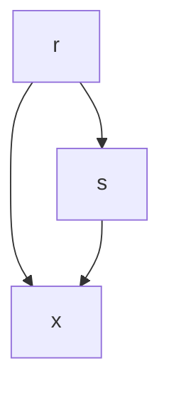
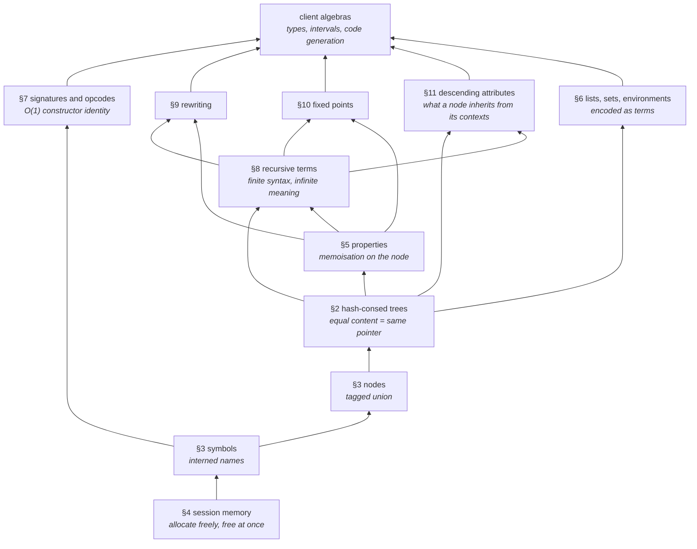

# Introduction

TLIB is the tree library at the heart of the [Faust](https://faust.grame.fr)
compiler. This document explains what it is made of, in the order in which its
concepts depend on one another — not in the order in which they were written.
It is addressed to a C++ programmer who knows compilers by practice rather than
by theory, and it introduces the small amount of algebra needed to see why the
library has the shape it has.

::: toc+
- **How to read this document** — the six fixed sections, the reading paths, the forward references.
- **Signatures and algebras** — one traversal, many interpretations: why a fold is the unit of work, and what it demands of everything below.
- **Hash-consing and maximal sharing** — one object per distinct term, so that structural equality becomes pointer equality.
- **Nodes and symbols** — what a node may hold, and interning as the base case of the same idea.
- **The session memory model** — allocate freely, free everything at once, and why that suits a compiler.
- **Properties** — attaching computed facts to shared terms: memoisation as the library's central service.
- **Lists, sets and environments** — derived structures encoded as terms, and so shared for free.
- **Signatures and opcodes** — constant-time constructor identity, the mechanism §1 assumed.
- **Recursive terms** — finite syntax for infinite trees: de Bruijn and symbolic forms, and canonical sharing modulo alpha-equivalence.
- **Rewriting** — bottom-up transformation of shared and cyclic terms, where memoisation becomes a termination argument.
- **Fixed points** — computing attributes over recursive terms: Kleene ascent, widening and narrowing.
- **Descending attributes** — the other direction: what a node inherits from its contexts, and why sharing makes that a question rather than a lookup.
- **Optional modules** — boolean conditions, and what it takes for a module to stay.
- **The stack, in one picture** — what TLIB is, and what it deliberately never knows.
:::

## How to read this document

Each concept is presented in six fixed sections, always in the same order, so
that a section can be skipped without losing the thread:

| Section | What it gives you |
| :--- | :--- |
| **The idea** | an intuitive, informal picture of the concept |
| **Its role in TLIB** | why the library needs it, and what would break without it |
| **More precisely** | the concise mathematical statement, once the intuition is in place |
| **In the code** | how it is realised in C++, with pointers to the source |
| **Invariants and non-goals** | what must stay true, and what the concept deliberately does not do |
| **Origins** | where the idea comes from, and what to read about it |

Three reading paths follow from this. *The idea* + *Its role* alone give a
complete informal tour. Adding *More precisely* gives the theoretical account.
Adding *In the code* gives the implementer's account.

Each concept ends with the commit its source references were checked against.
Line numbers drift; that stamp is what tells you how much history separates the
text from the code, and turns re-verification into a targeted diff rather than a
full re-read. The behaviours the tour finds surprising are not merely described
either — they live as running checks in
[tour-examples.cpp](tour-examples.cpp), wired into `ctest`, so a claim that
stops being true breaks a test instead of quietly becoming fiction.

Cross-references are written **§n**, counting the concepts in the order they
appear: §1 is *Signatures and algebras*, §2 *Hash-consing and maximal sharing*,
and so on to §13, *The stack, in one picture*. This section is not one of them.

The concepts are ordered by dependency: each one is introduced before the
sections that rest on it. The order is not a strict layering, though, and it
would be dishonest to pretend otherwise — the first concept needs a `Tree` to
talk about at all, and mentions symbols and hash-consing well before their own
chapters.

Such forward references are signposts. A term used before its own chapter is
defined on the spot in a **framed definition**, giving enough to follow the
current argument and naming the section that develops it properly. Nothing in
an argument depends on what such a box defers, so a reader can take the
thumbnail and move on, or jump ahead to resolve the term first. Footnotes are
reserved for genuine asides — an etymology, a citation.


# Signatures and algebras

## The idea

Take an ordinary compiler task. You have an expression language with four
operations — add, subtract, multiply, divide — and numbers as leaves. In C++
you would represent an expression as a tree, and then write passes over it: an
evaluator that computes a number, a type checker that computes a type, an
interval analysis that computes a range of possible values, a printer that
computes a string.

Write those four passes by hand and you notice they are the same program four
times. Each one walks the tree the same way, recurses into the children first,
and then does something at the current node that depends only on *which
operation* the node holds. The only thing that changes from pass to pass is
what "something" means:

| Pass | at a node `Add(x, y)` |
| :--- | :--- |
| evaluate | `x + y` on doubles |
| type-check | join of the types of `x` and `y` |
| interval | `[lo(x)+lo(y), hi(x)+hi(y)]` |
| print | `"(" + x + " + " + y + ")"` |

Universal algebra gives names to the three things at play here, and the names
are worth learning because the whole library is organised around them.

The **signature** is the list of operations of the language, each with the
number of arguments it takes: `Add` takes 2, `Div` takes 2, a numeric literal
takes 0. That is all a signature is — a vocabulary of constructors with their
arities. It says nothing about what they mean.

An **algebra** is one interpretation of that vocabulary. You choose a C++ type
— the *carrier* — and you supply one function per constructor, with matching
arity, over that type. Carrier `double` with `+`, `-`, `*`, `/` is one algebra.
Carrier `Interval` with interval arithmetic is another. Carrier `std::string`
with string concatenation is a third. Each row of the table above is an
algebra.

The **fold** is the one traversal shared by all of them: interpret the children
recursively, then apply the operation of the chosen algebra that corresponds to
the constructor at this node. Once the fold is written, every new pass over the
language costs exactly one new algebra — for the language above, a class with
five short methods, one per constructor — and no new traversal code.

The last piece is the observation that makes the whole thing click. Trees are
themselves one of the algebras. Take the carrier `Tree`, and for `Add` supply
the function that *builds* the node `Add(x, y)` instead of adding numbers.
Folding a tree into that algebra rebuilds the same tree. That sounds useless,
and it is exactly the point: the tree representation is not a privileged,
special thing that all the other interpretations are computed *from*. It is one
interpretation among the others — the one that happens to throw nothing away.
That is what "syntax" means, made precise. And because it throws nothing away,
every other interpretation can be obtained from it, in exactly one way.

::: definition [Tree]
TLIB's one tree type: a pointer to a `CTree`, which holds a **node** and a
vector of child trees. The node carries either a value — an integer, a
floating-point number — or a symbol, which is how a constructor such as `Add`
is written. A leaf is a tree with no children; `Add(x, y)` is a tree whose node
is the symbol `Add` and whose two children are `x` and `y`. Developed in §3.
:::

## Its role in TLIB

This is the organising principle of the library, and it is worth being explicit
about where the boundary falls.

TLIB provides the material a syntax algebra is built from, and nothing above
it: a universal carrier of terms, and the machinery that operates on that
carrier — building, sharing, comparing, annotating, traversing, rewriting,
taking fixed points. It does not define any particular syntax algebra. In the
example of §1 it is the *client* that declares the four constructors, writes
the typed interface that fixes their arities, and writes the fold. TLIB knows
nothing about Faust signals, about types, about intervals, about audio; those
live in client libraries, which declare their own signatures and write their
own algebras.

So the deal between TLIB and its clients is: *you bring the vocabulary and the
meanings, I bring the term representation and the machinery that operates on
it, generically.* Every later concept in this document is a piece of that
machinery, and each one is justified by a demand the fold makes:

- the fold must get from a constructor to its operation **in constant time**,
  whatever the size of the signature — hence interned symbols carrying dense
  constructor opcodes (§3, §7);
- the interpretation of a term must depend **only on the term**, never on how
  or when it was built — hence hash-consing (§2), which makes structurally
  equal terms literally the same object;
- since the value depends only on the term, a shared subterm need be
  interpreted **only once** — hence properties (§5), which memoise a fold's
  results on the nodes themselves and bring a traversal back down to the size
  of the shared graph rather than of the term it denotes;
- and terms in a real compiler are recursive, which the definitions above do
  not cover at all — hence recursive terms (§8) and fixed points (§10).

Four of those words are used here before their own chapters:

::: definition [Interning, opcode, memoisation, recursive term]
**Interning** keeps one canonical object per distinct value in a table and
hands out pointers to it — as compilers do for identifiers, so that comparing
two names costs one pointer comparison (§3, and §2 where it is applied to whole
trees under the name hash-consing).

An **opcode** is a small integer identifying a constructor, so that a fold can
dispatch through a jump table instead of comparing names. What makes them
usable is that they are *dense* and *disjoint* — consecutive within a language,
never shared between two (§7).

**Memoisation**[^memo] caches a function's results so a repeated call with the
same argument returns the stored value. It is valid only for a function whose
result depends on its argument alone, which is why §1's uniqueness and §2's
pointer identity have to come first (§5).

A **recursive term** refers to itself, as in $x = 1 + x$: a finite piece of
syntax denoting an infinite tree, and every feedback loop in a Faust program is
one. It breaks the definitions of this section twice over — no base case for a
fold to stop at, and a value no longer determined by the signature alone but by
a choice of *fixed point* (§8 for the terms, §10 for their attributes).
:::

[^memo]: The term and the technique are Donald Michie's, *Memo functions and machine learning*, Nature 218, 1968.

If you keep one sentence from this section: **TLIB is a high-performance
carrier for syntax algebras, and everything else in it exists to make folds
over those algebras correct and fast.**

## More precisely

A **signature** $Σ$ is a finite set of constructor symbols, each with an arity
in $ℕ$. The example above stretches that slightly, and it is worth noticing
where: `Add`, `Sub`, `Mul` and `Div` are the four registered constructors, but
`Number` stands for the *whole family* of numeric literals — one nullary
constructor per value, which is an infinite family, and which TLIB supplies as
atoms (§3) rather than as members of the signature. Read `Number` as an
operation parameterised by a data domain; the finiteness below concerns the
constructors proper.

A **$Σ$-algebra** $𝒜 = (A, (c_𝒜)_{c ∈ Σ})$ has two components: a carrier set
$A$, and, for every constructor $c ∈ Σ$ of arity $n$, a function
$c_𝒜 : Aⁿ → A$.

The **term algebra** $T_Σ$ is the $Σ$-algebra whose carrier is the set of
finite terms built from $Σ$, and whose operation for $c$ is the construction of
the term $c(t₁, …, tₙ)$.

A **homomorphism** $h : 𝒜 → ℬ$ between two $Σ$-algebras is a function
$h : A → B$ on their carriers that commutes with every operation:
$h(c_𝒜(x₁, …, xₙ)) = c_ℬ(h\,x₁, …, h\,xₙ)$.

$T_Σ$ is **initial**: for every $Σ$-algebra $𝒜$ there exists exactly *one*
homomorphism $⟦·⟧_𝒜 : T_Σ → 𝒜$, given by

```math
⟦c(t₁, …, tₙ)⟧_𝒜 = c_𝒜(⟦t₁⟧_𝒜, …, ⟦tₙ⟧_𝒜)
```

— to interpret a constructor applied to some subterms, interpret each subterm
first, then apply the operation that $𝒜$ gives to that constructor. The
right-hand side mentions nothing else: not where the node sits in the term, not
what was built before it, not any state carried down the traversal. That
absence is the whole content of the equation.

That homomorphism is the fold — a *catamorphism*[^cata], in the vocabulary of
functional programming, where the same construction over lists is the familiar
`fold`.

[^cata]: From the Greek *κατά*, "downwards": a catamorphism collapses a structure into a value, following its shape. The name is Meijer, Fokkinga and Paterson's, *Bananas, Lenses, Envelopes and Barbed Wire*, FPCA 1991.

Two consequences are worth stating separately, because they are what the rest
of the library is built on.

**Existence** is the guarantee that writing one operation per constructor is
always enough to define a pass. You never need to know how a subterm was built
in order to interpret it; supplying the $c_𝒜$ is a complete specification. This
is what makes "one algebra per analysis" a viable architecture rather than a
slogan.

**Uniqueness** is the guarantee that the pass is well defined — there is no
second, different interpretation consistent with the same operations. In
particular the identity is the unique homomorphism $T_Σ → T_Σ$, which is the
formal content of "folding a tree into the tree algebra rebuilds the tree".
Uniqueness is also what licenses memoisation: if $⟦t⟧$ is a function of $t$
alone, caching it is not an optimisation that might change behaviour, it is
forced.

Both consequences are stated for *finite* terms. Recursive terms need a fixed
point semantics, which the signature alone does not determine; §8 and §10
return to this.

## In the code

The two assertions to look for in the executable example are these, from
`checkArithmeticSignatureFold()` in [tests.cpp:255](tests.cpp#L255):

```cpp
ArithmeticTreeAlgebra syntax;      // carrier: Tree
ArithmeticEvalAlgebra evaluation;  // carrier: double

Tree expression =
    syntax.Mul(syntax.Add(syntax.Number(2), syntax.Number(3)),
               syntax.Number(4));

CHECK(syntax.fold(expression, syntax) == expression);      // initiality
CHECK(syntax.fold(expression, evaluation) == 20);          // interpretation
```

The first assertion is initiality made testable: the unique homomorphism into
the term algebra is the identity. Note that it is written with `==` on `Tree`,
which is pointer comparison — the rebuilt term is not merely equal to the
original, it *is* the original object. That is hash-consing (§2) showing
through, and it is the reason the assertion can be written this way at all.

The interface an algebra must implement, and its two realisations, are in the
same file: [tests.cpp:177](tests.cpp#L177) for the abstract
`ArithmeticAlgebra<T>`, [tests.cpp:193](tests.cpp#L193) for the tree algebra,
[tests.cpp:244](tests.cpp#L244) for the evaluator. The C++ shape is worth a
remark: the carrier is the template parameter `T`, and the arity of each
constructor is encoded in the arity of the corresponding virtual method. Since
`Add` is declared `T Add(T x, T y)`, an algebra that gets the arity wrong does
not compile. This is where the arity in the signature lives — in the C++ type
system, not in a TLIB data structure.

Constructor symbols are declared by grouping them into a signature:

```cpp
Signature fSignature = signature("Arithmetic");
Sym fAdd = fSignature.add("Arithmetic.Add");
Sym fSub = fSignature.add("Arithmetic.Sub");
```

`signature(name)` ([symbol.hh:260](tlib/symbol.hh#L260)) returns a copyable
handle ([symbol.hh:165](tlib/symbol.hh#L165)) to an interned signature, and
`add(name)` interns a constructor symbol into it. Each signature owns a
disjoint range of 256 opcodes and assigns dense local positions inside it, so
that a fold can dispatch on `tag.localOpcode()` with a jump table instead of
comparing names:

```cpp
Sym constructor;
SymbolTag tag;
if (!isSym(expression->node(), &constructor) ||
    !getSymbolTag(constructor, tag) ||
    tag.signature != fSignature.identity() ||
    expression->arity() != 2) {
    tlib::error("invalid arithmetic expression");
}

auto x = fold(expression->branch(0), algebra);
auto y = fold(expression->branch(1), algebra);

switch (tag.localOpcode()) {
    case 0: return algebra.Add(x, y);
    ...
}
```

The mechanism itself — opcode ranges, tags, the guarantee that a symbol belongs
to at most one signature — is the subject of §7, once symbols (§3) have been
introduced properly. What matters here is only the shape: the `switch` is the
fold's dispatch, and it is O(1) in the number of constructors. The full
specification is [SIGNATURE-SPEC.md](SIGNATURE-SPEC.md); the API is
[symbol.hh:56-83](tlib/symbol.hh#L56-L83) and
[symbol.hh:165-280](tlib/symbol.hh#L165-L280).

Note finally what the fold checks before dispatching: that the node carries a
symbol, that the symbol belongs to *this* algebra's signature, and that its
arity is the expected one. TLIB trees are not intrinsically well-typed terms of
a signature — see below.

## Invariants and non-goals

**TLIB does not enforce arity.** The `Signature` class records which symbols
are constructors of which language; it does not record how many arguments each
takes. Arity is expressed by the client's algebra interface and checked on each
occurrence during the fold, as in the example above. This is a deliberate
trade: it keeps the TLIB API minimal and puts the check where the C++ compiler
can do most of the work.

**A TLIB tree is not, by construction, a term of a signature.** TLIB provides
one universal space of trees: any node, any arity, unregistered symbols and
numeric atoms all coexist. A signature is a *convention* about a subset of that
space, and conformance is established by the fold, not by the constructor. If a
client hands you a tree, you know it is a well-formed tree; that it is a
well-formed arithmetic expression is something your fold discovers.

**A symbol belongs to at most one signature, permanently.** Once
`S.add("name")` has signed a symbol, the association and its opcode are
immutable for the whole session, and adding the same symbol to a second
signature fails without disturbing the first. Constructor identity is therefore
a property of the symbol, readable from any tree that uses it, at no cost per
tree.

**Signatures say nothing about meaning.** Nothing in TLIB relates a constructor
to an operation; that relation exists only inside a client's algebra, in the
body of its fold. The same term may be interpreted by any number of algebras,
and TLIB has no opinion about which one is "the" meaning.

::: definition [Session]
The interval between `tlib::init()` and `tlib::cleanup()` — for a compiler, one
compilation. Every symbol and every tree belongs to the session that built it,
nothing is reclaimed before it ends, and at `cleanup()` everything goes at
once. Pointers do not survive it. Developed in §4.
:::

**Signatures partition one global namespace, they do not create their own.**
Symbols are interned by name for the whole session (§3), and a symbol belongs
to at most one signature. Two languages therefore cannot both register a
constructor called `Add`: the first `add("Add")` claims that symbol, and the
second fails. This is why the example above names its constructors
`Arithmetic.Add`, `Arithmetic.Sub`, … — qualifying constructor names by their
language is the convention that keeps independent clients out of each other's
way. What signatures make disjoint is the *opcode space*, not the *name space*.

*Code references verified at `f45665e`.*

## Origins

The framework is that of **universal algebra**, whose modern form dates from
Garrett Birkhoff's *On the structure of abstract algebras* (1935): study
algebraic structures by their signatures and identities rather than one
structure at a time.

Its arrival in computing came in the 1970s, with the observation that an
abstract data type is exactly an initial algebra — the specification says which
operations exist and which terms are equal, and initiality says there is
therefore *one* implementation up to isomorphism, and one interpretation into
any model. The reference is Joseph Goguen, James Thatcher, Eric Wagner and
Jesse Wright (the "ADJ group"), *Initial Algebra Semantics and Continuous
Algebras*, JACM 24(1), 1977. The phrase this document borrows from that
tradition — *no junk, no confusion* (§2) — is Burstall and Goguen's.

The programming-language side of the same idea, folds as the canonical way to
consume an inductive structure, is Meijer, Fokkinga and Paterson (1991), cited
in the footnote above. A reader who wants only one paper should take the ADJ
one for the *why* and the *bananas* one for the *how*.


# Hash-consing and maximal sharing

## The idea

You already know this trick in its simplest form. In a compiler, you do not
store identifiers as strings scattered through the AST; you intern them in a
symbol table, so that every occurrence of `frequency` in the source points to
the same `Symbol` object. Comparing two identifiers then costs one pointer
comparison instead of a `strcmp`, and you can hang information on the symbol
itself rather than in a side map keyed by string.

**Hash-consing[^hashcons] is that same trick applied to trees rather than to
strings** — recursively, at every node. Instead of allocating a node whenever asked, the
library keeps a table of every node that already exists. When you ask for
$Add(x, y)$, it looks up the table; if a node with that operator and those two
children is already there, you get a pointer to it. Otherwise it allocates one,
records it, and gives you that. Two trees with the same content are never two
objects — they are one object, pointed to twice.

[^hashcons]: The name is Lisp's: `cons` builds a pair, and *hash-consing* is consing through a hash table. Goto's term for the resulting property was *monocopy*.

The consequences are larger than they look.

**Equality becomes pointer comparison.** Not "pointer comparison as an
optimisation for the common case", but pointer comparison as the *definition*.
If two `Tree` pointers differ, the trees differ; comparing two arbitrarily deep
terms costs one instruction. This is what made the assertion in §1 —
`syntax.fold(expression, syntax) == expression` — meaningful.

**Sharing happens whether or not you plan for it.** Nothing in the code above
says "share this subterm". You write the obvious constructor calls, and
identical subterms coalesce because there is no way for them not to. A tree
built by an unrelated pass, hours later in the compilation, will land on the
same node if it has the same content. What you get is not a tree at all but a
**DAG**, and it can be dramatically smaller than the tree it represents.
Consider:

```cpp
Tree t = tree(symbol("x"));
for (int i = 0; i < 30; i++) t = tree(symbol("Add"), t, t);
```

As a term, `t` has more than a billion leaves. As a hash-consed structure, it
is 31 nodes — `CHECK(dagSize(t) == 31)` in
[tour-examples.cpp:81](tour-examples.cpp#L81). Better still, rebuilding the
same thing later from scratch does not allocate anything: the independent
reconstruction lands on the very same object
([tour-examples.cpp:89](tour-examples.cpp#L89)). Any compiler that duplicates
subexpressions — inlining, substitution, unrolling — produces this shape
constantly, in milder form.

**Trees become immutable, and this is forced, not chosen.** If two parts of the
compiler hold the same node because it has the same content, one of them cannot
be allowed to modify it: the modification would silently reach the other. So a
node's content is fixed at construction, forever. Everything mutable has to
move elsewhere — which is why annotations live in property lists (§5) rather
than in fields.

## Its role in TLIB

§1 said the fold demands that the interpretation of a term depend only on the
term. Hash-consing is what turns that demand into a mechanical fact rather than
a discipline: the term *is* the pointer, so a table keyed by pointer is a table
keyed by term. Memoisation, which would otherwise require a hash of the whole
structure at every lookup, costs one map access on an integer-sized key. That
is the whole basis of §5, and through it, of every analysis Faust runs.

It also fixes what the layers below and above must provide. Below: the atoms
carried by nodes must themselves have decidable, cheap equality, since node
comparison is part of the lookup — hence interned symbols (§3). Also below:
ownership becomes diffuse, since a node is reachable from an unknown number of
parents and from the construction table itself. Reference counting or a garbage
collector could resolve that, at a cost paid on every operation; TLIB instead
takes the session model (§4) — allocate freely, free everything at once. The
sharing does not *force* that choice, but it is what makes it the cheap one.
Above: because equality is
now free but *structural*, anything that should identify terms up to a richer
equivalence has to be arranged by construction, by building a canonical
form whose sharing then does the work. That is exactly the strategy §8 uses
to make alpha-equivalent recursive terms be the same pointer.

::: definition [Canonical form, alpha-equivalence]
A **canonical form** is one chosen representative per equivalence class,
computed by a function mapping every member of a class to that same
representative. Its point here: once terms are canonicalised, the coarser
equivalence is decided by the structural equality of this section — by
comparing two pointers.

Two terms are **alpha-equivalent** when they differ only in the names of their
bound variables: $λx.x$ and $λy.y$ are the same function written twice, and
`rec(f, f+1)` and `rec(g, g+1)` the same recursion. Those names carry no
meaning, so a compiler treating them as different terms duplicates work and
misses sharing. Both are put to work in §8.
:::

One thing hash-consing does *not* buy is worth stating here, because it is the
most common misunderstanding. Sharing the *storage* of a subterm does not share
the *work* of traversing it. A fold written the obvious way over the 31-node
DAG above still recurses into both branches of every node, and still performs
its billion operations — the sharing is invisible to a traversal that does not
look for it. Hash-consing makes memoisation possible and cheap; it does not
perform it. §5 is where the exponent actually disappears.

## More precisely

Let $T_Σ$ be the term algebra of §1. Hash-consing implements a function
$⌜·⌝ : T_Σ → \mathrm{Addr}$ from terms to machine addresses which is
**injective**: $⌜s⌝ = ⌜t⌝$ if and only if $s = t$. Structural equality on terms
is thereby *decided* by equality on addresses.

Equivalently, in the vocabulary of abstract data types, the pointers realise
$T_Σ$ **faithfully**, in the two senses that characterise initiality:

- **no junk** — every live address was produced by a constructor application,
  `CTree::make` being the only way the API offers to obtain one, so every value
  denotes a term;
- **no confusion** — distinct terms are never identified: $s ≠ t$ implies
  $⌜s⌝ ≠ ⌜t⌝$.

Hash-consing adds to *no confusion* its converse in the strong, computational
form: equal terms are not merely "equal by some recursive test" but represented
by the *same* object. The unique-representative property is maintained
inductively from the leaves: a node is looked up by its operator and by the
**addresses** of its children, which is sound precisely because the children
already satisfy the property. Constructing a term of size $n$ therefore costs
$O(n)$ lookups amortised, each of them $O(\mathrm{arity})$, rather than
anything proportional to the size of the subterms.

The representation of a term is a DAG whose node count is the number of
**distinct subterms** of the term, which may be exponentially smaller than the
term's size — as in the example above, where $n$ constructor calls denote a
term with $2ⁿ$ leaves. Note the asymmetry that motivates §5: the DAG is
exponentially smaller, but the *unfolded* traversal of it is not.

Finally, one property is deliberately *not* claimed. Terms are identified up to
structural equality and nothing more. Any coarser equivalence — commutativity,
neutral elements, arithmetic identities — is a different relation, and if a
client wants terms to be shared modulo that relation, it must build a canonical
form and let structural sharing apply to *it*.

## In the code

The whole mechanism is `CTree::make` in
[tree.cpp:374](tlib/tree.cpp#L374):

```cpp
size_t hk = calcTreeHash(n, ar, tbl);
Tree   t  = gHashTable[hk % gHashTableSize];
/* … */
while (t && !t->equiv(n, ar, tbl)) {
    t = t->fNext;
}

if (t) { statsTreeReused();  return t; }      // the term already exists
else   { statsTreeCreated(); /* grow if needed, then allocate */ }
```

Everything else is detail around those seven lines. `CTree` itself is defined
at [tree.hh:159](tlib/tree.hh#L159) (forward-declared at
[tree.hh:108](tlib/tree.hh#L108)); the public constructors `tree(n)`,
`tree(n, a)`, … `tree(n, br)` at
[tree.hh:377-416](tlib/tree.hh#L377-L416) are thin wrappers over `make`. The
`CTree` constructors are protected, so no caller can bypass the table and
produce an unregistered node; a derived class still could, and *no junk* is
therefore an invariant of the API as it is meant to be used rather than one the
type system enforces outright.

Two details in those lines matter more than their size suggests.

`equiv` ([tree.cpp:336](tlib/tree.cpp#L336)) compares the node and then the
children **by pointer**, not recursively:

```cpp
if (fNode != n || fBranch.size() != size_t(ar)) return false;
for (int i = 0; i < ar; ++i) {
    if (fBranch[i] != br[i]) return false;
}
```

This is the induction of the previous section made concrete. A structural
comparison here would make construction quadratic; pointer comparison is legal
only because every child was itself obtained from `make`.

`calcTreeHash` ([tree.cpp:363](tlib/tree.cpp#L363)) combines the raw bits of
the node with the *stored hash keys* of the children — again not by traversing
them — so hashing a node is $O(\mathrm{arity})$ regardless of depth. The hash
is only a bucket index: correctness rests entirely on `equiv`, and a collision
costs a walk down `fNext`, never a wrong answer.

Beyond the sharing itself, `CTree` stores three things derived from the term
that are worth knowing about now, since later sections rely on them.

**`fSerial`** ([tree.hh:287](tlib/tree.hh#L287)) is a counter incremented at
each construction, and the named comparator `treeorder`
([tree.hh:123](tlib/tree.hh#L123)) compares on it, so that an ordered container
of trees — spelled `TreeSet` or `TreeMap<V>`
([tree.hh:140-142](tlib/tree.hh#L140-L142)) — iterates in a defined order
instead of address order. Determinism of the compiler output
depends on this: addresses vary from run to run for reasons no one controls,
whereas a serial is a function of construction order alone — so a deterministic
program fed the same input reproduces the same serials. The order is history-
dependent by nature: build the same trees in a different order and every serial
changes.

The rule has a converse, and one case from the compiler states it better than
the rule does. Faust's scheduler groups the nodes of a graph by **shape**: for
each node it builds a *shape tree* — the computation with its data forgotten,
operands replaced by holes, the operator kept literal so that a multiplication
and an addition do not share a shape — and that tree, being built through
`tree(node, br)`, is hash-consed. Two nodes of one shape are therefore one
pointer, and that shape tree is the node's **colour** — the scheduler groups
instances of one colour onto common ranks, the banks a vectoriser can pack.
The pointer *is* the colour's identity, so using it as an identity was right.
Using it as a **key** was not: the colour was handed over as its pointer cast to
an integer, the schedulers filed the colours in a `std::map` under that key,
then enumerated that map — so the sequence handed to the sort came out in
increasing order of the key, which was address order, which was that run's
heap — and sorted it by decreasing frequency with a comparator reading the
frequency alone. Three runs of one binary on one program produced three
different loop bodies.

Nothing there *meant* to depend on an address. The colour entered no canonical
ordering by intention; it entered one through the container that received it,
and then through a comparator unable to separate two classes of equal
frequency. That is the shape of it, and it is worth stating without any appeal
to the sort's stability — which is not the point, and here not even available,
`std::sort` offering none: **a comparator that does not distinguish two
elements leaves their order to the input sequence**, so the result is a
function of the data *and* of how the data arrived. The
fix is one word — the shape tree's `serial()` in place of its address (Faust
`bd8aa6fd9`, `compiler/generator/compile_scal.cpp`) — and it buys exactly what a
serial can buy: determinism per binary. Two binaries built by *different* C++
compilers still construct the same trees in different orders, so their serials
differ; that is a separate problem, and the reason `fCanonHash` exists.

**`fCanonHash`** ([tree.hh:290](tlib/tree.hh#L290)) exists for the cases where
that is not good enough. It is a structural hash synthesised at construction
from the node's canonical hash and the children's — and the way the children
are combined ([tree.cpp:229](tlib/tree.cpp#L229)) is worth a second look,
because the obvious formula is wrong here:

```cpp
h ^= br[i]->canonHash() + 0x9e3779b97f4a7c15ULL + (h << 12) + (h >> 4);
```

The addition is what matters. Write the combine the tempting way, as
`h = h * F ^ child`, and it becomes **XOR-linear**: two identical children
contribute the same value twice and cancel each other out. Terms with repeated
identical subterms — a stereo output whose two channels are equal, two equal
definitions in one recursive group — would then hash to a constant, and
collapse together in any name derived from the hash. Mixing an addition in
breaks the linearity, so cancellation cannot happen. The same flaw existed in
Faust's associative-commutative judge and was fixed there too; the pattern is
now banned in both.

`canonicalTreeLess`
([tree.cpp:280](tlib/tree.cpp#L280)) uses it as the primary key of a total
order derived from *values only* — symbols compared by name, ties broken
structurally. Two processes that build the same term values order them
identically, whatever their construction history, which is what canonical forms
need. One case has to be handled explicitly, and its history is the best warning
this chapter can give. A node carrying a **raw pointer** payload has no value
to hash. The library therefore keeps a **registry**
([node.hh:77-83](tlib/node.hh#L77-L83), implemented at
[tree.cpp:112-126](tlib/tree.cpp#L112-L126)): a pointer whose *name* was
declared at creation hashes by that name — value-derived, identical across
builds — and only an unregistered pointer falls back to its address. A
diagnostic goes with it: with `TLIB_DBJ_POINTER_CENSUS=1` set, a de Bruijn form
about to be named from its hash is walked and every unregistered pointer payload
reported with the head symbol of its parent
([recursive-tree.cpp:483-507](tlib/recursive-tree.cpp#L483-L507)) — the two
facts that identify which creator forgot to register.

The registry exists because the obvious reassurance was false. The header used
to say that such nodes never enter the canonical orderings, so their
non-canonical hash could not matter. But `fCanonHash` is **frozen into every
ancestor** at construction (§2's own synthesised-attribute discipline), so one
unregistered pointer deep in a term contaminates the canonical hash of
everything above it — and the content-derived names of recursive groups (§8),
being minted from that hash, then differed from build to build. A value that
"never enters" an ordering can still reach it through what was computed from
it; a synthesised attribute propagates its own unsoundness upward, silently and
by construction.

**`fAperture` and `fContains`** ([tree.hh:208-209](tlib/tree.hh#L208-L209)) are
synthesised attributes: small facts about the whole subterm — how many free de
Bruijn levels it has, whether it contains a recursive node — computed once in
the constructor and read in $O(1)$ ever after. They are the degenerate case of
the memoisation idea: an attribute that is a function of the term can simply
live in the node.

Half of `fContains` is TLIB's own; the other half is reserved for whatever a
client wants to propagate the same way, declared with its constructors and
folded by the same union. §7 describes that arrangement, which is worth reading
as the exception it is — the general answer for a client's attributes remains
§5.

::: definition [de Bruijn representation, aperture]
The **de Bruijn** representation removes the names of bound variables: a
variable is written as the number of binders standing between it and the one
that binds it, so $λx.λy.x$ becomes $λ.λ.2$. The payoff is exactly what §2 is
about — alpha-equivalent terms become *syntactically identical*, hence the same
hash-consed pointer, with no renaming pass. A term's **aperture** is how many
of its de Bruijn references still point outside it, which is what makes it
*open* or *closed*. Developed in §8.
:::

Two measurements on real Faust programs give the practical scale: about 72% of
constructed trees never receive a single property
([tree.hh:183](tlib/tree.hh#L183)), which is why property lists are allocated
lazily rather than being an inline member; and most insertions land on an empty
bucket, which is why the load-factor check runs only when the bucket was
already occupied ([tree.cpp:393](tlib/tree.cpp#L393)).

## Invariants and non-goals

**Structural equality is pointer equality — in both directions.** For any two
live trees, `p == q` if and only if they have the same node and the same
branches. This is the single invariant the whole library rests on, and every
other component is written assuming it.

**A tree is never modified after construction.** Node and branches are fixed;
the only mutable state on a `CTree` is annotation (properties, type slot, visit
stamp), and §5 states the condition annotations must satisfy to stay sound.
There is no API to change a branch, and adding one would break every other
holder of the same node.

**Sharing is structural, never semantic.** $Add(1, 2)$ and $Add(2, 1)$ are
different trees. $Mul(x, 1)$ and $x$ are different trees. TLIB has no notion of
which constructors are commutative, associative or neutral, and will not
normalise anything on your behalf. Normalisation is a client's fold or rewrite
(§9), and its output is shared just like any other term.

**Ordered containers of trees must name their comparator.** A bare
`std::set<Tree>` or `std::map<Tree, V>` falls back to address order and loses
determinism, so `TreeSet` and `TreeMap<V>` exist and should always be used. The
guarantee reaches past the standard library too: `DirectedGraph`'s ordering
customisation point resolves to the same serial order for trees
([tree.hh:132-135](tlib/tree.hh#L132-L135)), so a graph built over trees — and
every algorithm that iterates one — is ordered by creation rather than by
address.
This was once arranged by specialising `std::less<CTree*>` instead — which is
undefined behaviour, since the standard reserves the pointer specialisation for
the implementation's own pointer order. The latitude went unexploited for two
decades and then was not: libc++ 20 rewrites a literal `std::less<T>` to the
transparent `std::less<>` on a tree's *insert* path but not on its *lookup*
path, so a container was built in one order and queried in another, and lookups
began missing elements that were present — intermittently, depending on malloc
addresses. A named comparator is not pattern-matched, both paths agree, and the
undefined behaviour is gone.

**Pointer values are meaningless outside the session.** Addresses vary between
runs; `fSerial` is reproducible only for a given construction history; only
`canonHash`-based orders are reproducible across processes, and then only for
terms free of raw pointer payloads. Whenever an ordering must survive a change
in construction history — canonical forms, term normalisation — use
`CanonicalTreeLess` ([tree.hh:527](tlib/tree.hh#L527)), not the default.

**Hash-consing does not make traversals cheap.** It removes duplicate storage,
not duplicate work. An unmemoised fold costs the size of the *term*, not of the
DAG, and the gap between the two is unbounded — exponential in the worst case,
as in the example above. Memoisation is what closes it; see §5.

**Nothing is freed individually.** Every tree ever built stays reachable from
the construction table, and a node shared by an unknown number of parents has
no obvious owner to release it. The library does not attempt reclamation during
a session at all — see §4 for what it does instead, and why that suits a
compiler.

*Code references verified at `f45665e`.*

## Origins

The technique is older than it looks. A. P. Ershov, *On programming of
arithmetic operations* (CACM 1(8), 1958), used a hash table to recognise
identical subexpressions while compiling arithmetic — common-subexpression
elimination, and already the whole idea: hash the operands, find the
expression, reuse it. The name came later, from Eiichi Goto's work on symbolic
manipulation in Lisp (*Monocopy and associative algorithms in extended Lisp*,
University of Tokyo, 1974), which made the property global rather than local to
one expression.

The most spectacular demonstration of what maximal sharing plus memoisation
buys is Randal Bryant's *Graph-Based Algorithms for Boolean Function
Manipulation* (IEEE Trans. Computers, 1986). A reduced ordered BDD is precisely
a maximally shared DAG of a decision term, and its central operations combine
that canonical DAG with memoised recursive traversal — `Apply`, for instance,
recurses on both arguments and keeps a table of the pairs it has already
handled. That combination turned Boolean function manipulation from intractable
into routine, and it is architecturally what §2 and §5 describe here.

For the engineering rather than the theory, Jean-Christophe Filliâtre and
Sylvain Conchon's *Type-Safe Modular Hash-Consing* (ML Workshop, 2006) is the
short, practical reference: the same design questions TLIB answers — the table,
the collisions, the memory model, the interaction with memoisation — worked
through in a different language.


# Nodes and symbols

## The idea

A TLIB tree is a **node** plus a list of child trees, and nothing else:

```tree svg "the term (2 + 3) * 4, with the content of each node"
Sym(Arithmetic.Mul)
  Sym(Arithmetic.Add)
    Int(2)
    Int(3)
  Int(4)
```

So the whole question of this section is: *what can a node hold?* And the
answer is settled almost entirely by one constraint inherited from §2. Every
single call to `tree(…)` compares a candidate node against the nodes already in
the table. Node equality is therefore on the hottest path in the library, and
it must be **exact** — an approximate answer would merge two different terms —
and **constant-time**.

That immediately rules out the obvious representation. A node cannot hold a
`std::string`: comparing two would cost a `strcmp`, and every tree construction
would pay it. It cannot hold a polymorphic object either, since comparing two
of those costs a virtual call at least.

What it holds instead is a **tagged union** of five fixed-size payloads — a
32-bit integer, a 64-bit integer, a double, a symbol, or a raw pointer — so
that comparing two nodes is comparing a tag and one machine word.

The interesting case is the fourth. A **symbol** is an interned name: TLIB
keeps a table of every name ever requested, and `symbol("Arithmetic.Add")`
always returns the same `Symbol` object. Two symbols are equal exactly when
their names are, and the test costs one pointer comparison.

Notice what just happened. The trick of §2 — keep a table, hand out one shared
object per distinct value, let pointer equality decide — is being applied a
second time, one level down, to strings instead of trees. **TLIB is essentially
that one idea at two scales**: symbols are interned names, trees are interned
nodes-with-children, and each level makes the level above it cheap. Symbols are
the base case; without them, tree construction would have no fast, exact node
comparison to build on.

A node plays two roles, and TLIB does not distinguish them. At an internal node
a symbol is a **constructor name**; at a leaf, an integer or a double is an
**atom**, a value in its own right. Both are just nodes, and a symbol with no
children is a perfectly good leaf too. The distinction that matters to a fold —
which symbols are constructors of *my* language — is the business of signatures
(§7), not of nodes.

## Its role in TLIB

Three things rest on this section.

**It closes the induction of §2.** Hash-consing compares a node and then the
children by pointer; the children are cheap because they are hash-consed, and
the node is cheap because it is a word and a tag. The recursion bottoms out
here, and the whole $O(\mathrm{arity})$ cost of construction depends on it
bottoming out in constant time.

**It is what makes the term universe universal.** §1 said TLIB carries any
client's syntax algebra without knowing anything about it. That is possible
precisely because a constructor is nothing but a symbol, and any name can be
interned. A new language costs no new type, no new node kind, no change to
TLIB: it is a set of names, and its terms live in the same universe as
everybody else's.

**It is where per-constructor data can live.** A symbol is unique per name, so
anything true of a *name* can be stored once, on the symbol, and read from
every tree that uses it. That is exactly how §7 attaches a signature and an
opcode to a constructor: not one field per tree — which would cost memory on
millions of nodes — but one field per symbol, reached through the node the tree
already holds. Interning enables annotation, which is the same argument that
returns in §5 for trees and properties.

Two smaller consequences are worth flagging, because later sections rely on
them. Because symbols have *names*, a hash derived from the name rather than
the address is available, which is what lets §2's `canonHash` be reproducible
across processes — the recursion bottoms out in a value, not in an address.
And because names can be *generated*, TLIB can mint fresh symbols on
demand, which is how §5 gives each property a private key and how §9 names the
variables it introduces.

::: definition [Generated symbol]
`unique("W")` returns a symbol named `W0`, `W1`, `W2`, … guaranteed not to
collide with any existing one. The need is as old as Lisp macros, where the
same operator is called `gensym`: a program that generates a binding must be
able to name it without capturing a name the user chose. TLIB uses it for the
fresh variables introduced by rewriting (§9) and — less obviously — to give
every `property` object a private key (§5).
:::

## More precisely

Write $\mathrm{Sym}$ for the set of interned symbols. The set of nodes is a
disjoint sum, with decidable equality:

```math
N = \mathbb{Z}_{32} ⊎ \mathbb{Z}_{64} ⊎ \mathbb{D} ⊎ \mathrm{Sym} ⊎ \mathrm{Ptr}
```

— a node is exactly one of five things: a 32-bit integer, a 64-bit integer, a
double, a symbol, or a raw pointer. The sum is *disjoint*, which is the part
that matters in practice: the tag is carried along with the value, so an
integer node is never confused with a double node whatever the bits happen to
say, and equality can always begin by comparing tags.

The type of trees is then given by a single recursive definition:

```math
\mathrm{Tree} = N × \mathrm{Tree}^{*}
```

— a node paired with a finite sequence of subtrees. The equation is to be read
*inductively*: of its several solutions we take the smallest, the trees of
finite depth, which is the one §1's folds need if they are to reach a leaf and
stop. It is also, in the vocabulary of §1, the initial one.

This carrier never changes. §8 does not replace it by something infinite: it
adds two ordinary constructors — a binder and a reference to it — so that a
*finite* tree can denote an infinite unfolding. The trees stay finite, their
meaning need not, and that gap is what makes §8 and §10 delicate. It is also
why the notation $μ$ is kept in reserve here: there it will denote recursion
*inside* a term, a different thing from the recursion of the definition above.

This equation is the precise content of "TLIB provides a universal carrier".
There is exactly **one** tree type, not
one per language: any signature $Σ$ of §1 embeds into it through an injection
$Σ → \mathrm{Sym}$, and its term algebra $T_Σ$ appears as the subset of
$\mathrm{Tree}$ whose nodes are in the image of that injection and whose
arities agree. Well-formedness with respect to $Σ$ is a *predicate on* the
universe, not a property of the type — which is why §1 concluded that
conformance is something a fold checks rather than something a constructor
guarantees.

Interning is the statement that naming is a bijection. Writing
$\mathrm{sym} : \mathrm{String} → \mathrm{Sym}$ and
$\mathrm{name} : \mathrm{Sym} → \mathrm{String}$:

```math
\mathrm{name}(\mathrm{sym}(s)) = s
\qquad
\mathrm{sym}(\mathrm{name}(q)) = q
\qquad
p ≠ q ⟺ \mathrm{name}(p) ≠ \mathrm{name}(q)
```

The first two equations say that interning and naming are inverse to each
other: intern a name and read it back, you get the name; read a symbol's name
and intern it, you get the same symbol. The third is the one everything rests
on — two symbols differ exactly when their names differ — and it is what makes
`p == q` a legitimate test of "same name".

The first equation holds for names already in normal form; TLIB normalises
control characters on the way in, as the invariants below record.

## In the code

`Node` is at [node.hh:85](tlib/node.hh#L85), and it is exactly the tagged union
described above:

```cpp
class Node : public Garbageable {
    int fType;                     // kIntNode, kInt64Node, kDoubleNode, kSymNode, kPointerNode
    union { int i; double f; Sym s; void* p; int64_t v; } fData;
```

Equality ([node.hh:191](tlib/node.hh#L191)) is the one line the rest of the
library leans on:

```cpp
bool operator==(const Node& n) const { return fType == n.fType && payload() == n.payload(); }
```

`payload()` ([node.hh:101](tlib/node.hh#L101)) reads the union as one opaque
64-bit word, whatever member was actually written — the comparison is on the
payload's *bits*, not on its value. It is spelled with `memcpy` (the C++17
spelling of `std::bit_cast`, which compiles to a single load) rather than by
reading an inactive union member, which every mainstream compiler supports but
the standard does not.

This explains a detail that would otherwise look superstitious: the narrower
constructors write `fData.f = 0.0` *before* storing their value
([node.hh:145-177](tlib/node.hh#L145-L177)). Zeroing the widest member first
makes the unused bits deterministic, so that two nodes built from the same
`int` compare equal — which is what makes a whole-word comparison exact for
payloads narrower than the word.

Comparing floating-point payloads by bits rather than with `==` is not merely a
shortcut, it is necessary. IEEE equality is not reflexive: a `NaN` is not equal
to itself. A hash-consing table built on it would fail to find a `NaN` node it
had just inserted, and would keep allocating new ones forever. Bitwise
comparison restores reflexivity and makes node equality a genuine equivalence
relation, which §2 needs it to be. The price is a surprise in the other
direction: `+0.0` and `-0.0` have different bit patterns, so they are different
nodes. Both halves are checked in
[tour-examples.cpp:114-122](tour-examples.cpp#L114-L122), next to the IEEE
behaviour they depart from.

Pattern matching is a family of predicates rather than a `switch` on the tag —
`isInt(n, &i)`, `isDouble(n, &d)`, `isSym(n, &s)`
([node.hh:227](tlib/node.hh#L227) onwards), each testing the tag and extracting
the payload in one call. Their tree-level counterparts `tree2int`, `tree2str`
and friends ([tree.hh:419](tlib/tree.hh#L419) onwards) do the same one level
up, raising a TLIB error instead of returning false.

Symbols are in [symbol.hh:88](tlib/symbol.hh#L88) and
[symbol.cpp:130](tlib/symbol.cpp#L130). `Symbol::get` is the same shape as
`CTree::make` — hash the name, walk the bucket chain, return the existing entry
or allocate one — which is the code-level form of "the same idea at two
scales". Each `Symbol` then carries, besides its name:

- `fData`, a free `void*` slot for the client (`getUserData` / `setUserData`);
- `fSignature` and `fOpcode`, the constructor identity of §7, written once by
  `Signature::add` and immutable thereafter;
- `fHash`, the name hash used for the table, and `fCanonKey`
  ([symbol.cpp:248](tlib/symbol.cpp#L248)), a second, *canonical* key which is
  the same thing except for names of the form `R<instance>_<k>`, where the
  instance number is stripped. Those names are generated by §8's
  canonicalisation, and stripping the instance is what lets orders derived from
  the key be independent of how many times canonicalisation has run in the
  session.

`unique(prefix)` is `Symbol::prefix` ([symbol.cpp:188](tlib/symbol.cpp#L188)):
a per-prefix counter, a check that the name really is new, and a hard failure
after 10 000 attempts.

One detail in `Symbol::get` is easy to miss and shows up in the invariants
below: every character below 32 is replaced by a space before the name is
hashed ([symbol.cpp:136-138](tlib/symbol.cpp#L136-L138)). Names are normalised, so
`symbol("a\nb")` and `symbol("a b")` are the *same* symbol
([tour-examples.cpp:132](tour-examples.cpp#L132)).

## Invariants and non-goals

**One symbol per name, for the whole session.** $p ≠ q$ if and only if the
names differ. Symbol pointers are stable for the session and are never freed
before it ends (§4).

**Names are normalised on the way in.** Control characters become spaces, so
two names differing only in such characters denote one symbol. This is
deliberate — it keeps generated and printed names well behaved — but it means
`name(symbol(s)) == s` holds only for names already in normal form.

**Node equality is on representation, not on numeric value.** `Node(1)` and
`Node(1.0)` are different nodes, since the tags differ. `+0.0` and `-0.0` are
different nodes. Two `NaN`s with the same bit pattern are the *same* node.
TLIB compares what is stored, never what it might mean; numeric coercion is a
client's business.

**Nothing constrains which node kinds may have children.** `tree(Node(3), a, b)`
is accepted: an integer node with two branches. Treating numbers as leaves is a
convention of every sane client, not a rule TLIB enforces — the same
permissiveness as §1's "a tree is not, by construction, a term of a signature".

**The pointer payload is opaque and non-canonical.** TLIB never dereferences
it, never frees it, and hashes it by address, so terms containing pointer nodes
fall outside the cross-process guarantees of §2. It is an escape hatch for
foreign data — in Faust, boxed primitives — and its lifetime is the client's
problem.

**Generated names depend on session history.** `unique("R")` numbers its
results from a counter, so the same computation run twice in one session
produces different names, and two sessions agree only if they generate the same
names in the same order. Anything that must be canonical cannot be built on
`unique()`; §8 derives names from *content* instead, which is what makes
alpha-equivalent recursive terms land on the same pointer.

**The set of payload kinds is closed.** Adding a sixth kind means editing
`Node`, its equality, its canonical hash and its predicates. The pointer
payload exists precisely so that this is rarely necessary.

*Code references verified at `f45665e`.*

## Origins

The shape of the data is John McCarthy's, in the paper that started the field:
*Recursive Functions of Symbolic Expressions and Their Computation by Machine,
Part I* (CACM 3(4), 1960). An S-expression is an atom or a pair of
S-expressions — TLIB's node and its branches — and structures are shared rather
than copied. The paper also gives atomic symbols a **property list**, a place
to attach facts about a name rather than about an occurrence: that is the
ancestor of the signature and opcode fields §7 stores on a `Symbol`, and, one
level up, of the tree properties of §5.

Interning as a *global* mechanism — one table holding every symbol, so that
reading the same name twice yields the same object and `eq` decides equality in
one instruction — belongs to the implementations rather than to the 1960 paper;
the object list is documented in the *LISP 1.5 Programmer's Manual* (McCarthy
et al., MIT Press, 1962) and became standard equipment afterwards. It is worth
keeping the two apart: TLIB's symbol table descends from the object list, while
TLIB's per-symbol and per-tree annotations descend from property lists.

For the table itself, the reference is Knuth's *The Art of Computer
Programming*, volume 3, §6.4 — separate chaining, load factors and rehashing
are exactly what `Symbol::get` and `CTree::make` implement.


# The session memory model

## The idea

Ask the obvious question about §2 and you get an uncomfortable answer. A tree
is reachable from every parent that contains it, from the construction table
that produced it, and from any property list that mentions it — and none of
those knows about the others. So: **who deletes it?**

The classic answers all fit badly here.

*Reference counting* is the reflex, but the construction table holds a
reference to every tree that exists, so no count ever reaches zero. You would
have to make the table's reference special, then decide when to sweep it,
which is a garbage collector wearing a disguise.

*Garbage collection* would work, at the price of knowing the roots, scanning,
and — the awkward part — removing dead entries from the hash table as it goes.

*Individual deletion* is not even expressible: no piece of code is in a
position to know that it holds the last use of a subterm, because sharing is
precisely the property that hides that information.

TLIB takes the fourth answer: **nobody deletes anything, until everything is
deleted at once**. A **session** is the interval between `tlib::init()` and
`tlib::cleanup()` — for a compiler, one compilation. During the session,
allocation is free and reclamation does not happen. At `cleanup()`, every tree,
every symbol and every property table goes in one sweep, and the library is
immediately ready for the next session.

A C++ programmer will recognise the arena, or region, pattern: group objects
with a common lifetime and release them together. The twist is the choice of
region. Here there is exactly one, and it is the whole library for the whole
compilation.

This looks like a shortcut and it is worth insisting that it is not. Freeing a
tree individually would not merely be difficult — it would be **unsound**,
because it would break §2. Suppose a tree were freed and the allocator later
handed the same address back for an unrelated term. Some pointer obtained
earlier would then compare equal to a tree it has nothing to do with, and
"pointer equality is structural equality" would silently become false. The
session model is what makes that impossible: within a session, an address is
handed out once and means the same term forever.

## Its role in TLIB

The memory model is not a service TLIB offers on the side; it is the condition
under which the previous two sections are true at all.

**It makes the construction table harmless.** §2's table keeps a pointer to
every tree ever built. Under any reclamation scheme that would be a leak to
manage or a weak-reference mechanism to design. Under the session model it is
simply not a question.

**It makes annotation safe.** §5 attaches computed facts to trees, keyed by
tree pointers. That is only meaningful if a tree outlives every table that
mentions it, which here is automatic: nothing outlives the session and nothing
dies before it.

**It makes memoisation valid across an entire compilation.** A fold's result
cached during an early pass is still attached to the right node in a later
pass, because the node has not moved and cannot have been recycled.

And it fixes the shape of the contract with the host application. `Tree` and
`Sym` are not owning handles; they are borrowed pointers whose validity is the
session's. A batch compiler never notices. A hosted compiler — `libfaust`
compiling one program after another — must call `cleanup()` between them, and
must not keep a `Tree` across the boundary.

## More precisely

This is **region-based memory management** in its simplest form: lifetime is a
property of a *region*, not of an object. Allocation puts an object in the
region; nothing is deallocated individually; the region is released as a whole.
TLIB has exactly one region per session.

The property that matters is stronger than "memory is eventually reclaimed".
Write $⌜·⌝$ for §2's map from terms to addresses. §2 claimed it is injective.
What the session model adds is that it is also **stable**:

> Within a session, $⌜t⌝$ is defined once and never changes, and no address is
> ever reused for a different term.

Without stability, injectivity would only hold instant by instant, and every
pointer held across a deallocation would be suspect. With it, a `Tree` obtained
at any point in the session remains a valid, exact name for its term until
`cleanup()`. This is what licenses pointer-keyed tables (§5), pointer equality
as term equality (§2), and serial numbers as a stable order (§2). The boundary
itself is exercised in [tour-examples.cpp:151](tour-examples.cpp#L151): a term,
then `cleanup()`, then the same term rebuilt in a fresh session — with the
comment marking the exact line past which the earlier pointer must not be
touched.

The cost is stated just as simply: peak memory is the **total** allocated
during the session, not the live set at any moment. There is no reuse. The
model is therefore sound exactly when sessions are bounded — which is the case
for a compilation, and is not the case for a long-running interactive process
that never calls `cleanup()`.

## In the code

Everything hangs on one base class, [garbageable.hh:54](tlib/garbageable.hh#L54):

```cpp
class TLIB_API Garbageable {
   public:
    static void* operator new(std::size_t size);
    static void  operator delete(void* ptr);
    static void  cleanup();   ///< delete every Garbageable allocated since the last cleanup
};
```

`CTree`, `Symbol` and `Node` all derive from it — though only the first two
matter in practice, since a `Node` almost always lives *by value* inside a
`CTree` or a client's structure, and a subobject never passes through
`Garbageable::operator new`. The inheritance only takes effect for a `Node`
allocated on its own, which does not happen. `operator new`
([garbageable.cpp:79](tlib/garbageable.cpp#L79)) allocates normally and then
records the pointer in a global list; `cleanup()`
([garbageable.cpp:51](tlib/garbageable.cpp#L51)) walks that list and deletes
every entry.

It is worth being precise about what this is and is not. It is a **registry**,
not an arena: allocation still goes through `::operator new`, plus one list
node per object. The win is not allocation speed — a bump allocator would be
faster — but ownership: no code anywhere has to decide whether it holds the
last use of anything. A flag, `gHeapCleanup`
([garbageable.cpp:49](tlib/garbageable.cpp#L49)), tells individual deletes to
skip the registry while the sweep is running, which is what keeps `cleanup()`
linear instead of quadratic.

The registry supports individual deletion mechanically — `operator delete`
removes the pointer from the list ([garbageable.cpp:95](tlib/garbageable.cpp#L95))
— but that is a property of the allocator, not a licence. **An interned tree or
symbol must never be deleted individually.** `CTree::~CTree`
([tree.cpp:325](tlib/tree.cpp#L325)) deliberately does not remove the node from
the construction table, so deleting one leaves a dangling entry that the next
lookup will dereference. The same holds for `Symbol` and its table. Individual
deletion is for ordinary `Garbageable` objects that no table points at — and
even for those it costs a `std::list::remove`, a linear scan of every live
object, so doing it in a loop makes the session quadratic.

The registries are function-local statics
([garbageable.cpp:35](tlib/garbageable.cpp#L35)) rather than file-scope ones —
construct-on-first-use. A `Garbageable` may well be allocated from another
translation unit's static initialiser, and C++ leaves the relative order of
those unspecified; a function-local static is initialised on first call,
whatever the order.

`tlib::init()` and `tlib::cleanup()` ([tlib.cpp:50](tlib/tlib.cpp#L50)) are the
session boundary, and `cleanup()` does two things rather than one:

```cpp
void cleanup()
{
    Garbageable::cleanup();   // free every tree, symbol, property table
    resetInternals();         // and reset the tables and internal caches
}
```

The second line is the subtle one. TLIB itself holds a few lazily interned
symbols and cached key trees — the list `cons`/`nil`, the recursion symbols,
the property keys of `recursive-tree.cpp`. Those die with everything else in
the first line, so the static variables pointing at them must be cleared too,
or the next session would start with pointers into freed memory. That is what
`tlibResetListInternals()` and `tlibResetRecInternals()`
([tlib.cpp:31-32](tlib/tlib.cpp#L31-L32)) exist for. The rule generalises: a
cache holding `Tree` values is session state, and must be reset when the
session is.

One platform difference is worth knowing before it surprises you. On Windows
([garbageable.cpp:55-63](tlib/garbageable.cpp#L55-L63)), `cleanup()` frees the
memory of each object without invoking its destructor, because an object using
virtual inheritance from `Garbageable` may not have the same complete-object
address as the stored pointer. The outer object's storage is reclaimed either
way, but **anything a destructor owns is not** — `CTree::~CTree` is what deletes
a node's property map, and `Symbol` holds a `std::string`. For a process that
runs one session and exits this is invisible; for a host that compiles one
program after another it is a cumulative leak.

## Invariants and non-goals

**Every `Tree` and every `Sym` is invalid after `cleanup()`.** They are
borrowed pointers, not handles, and their lifetime is exactly the session's.
Storing one in a structure that outlives the session is the one truly fatal
mistake this design allows.

**Nothing is reclaimed during a session.** Memory grows monotonically with the
number of *distinct* terms built. Maximal sharing is what makes this
affordable: what grows is the number of distinct subterms, not the number of
times they are used.

**A session is single-threaded.** The construction table, the symbol table and
the allocation registries are global mutable state with no synchronisation
anywhere in the library. Two threads building trees concurrently corrupt them.
The one concession is diagnostic: the printer's context
([recursive-print.cpp:41](tlib/recursive-print.cpp#L41)) is `thread_local`, so
several threads may print concurrently to distinct streams *provided* the term
graph and its properties stay read-only throughout.

**`Garbageable` is not a general-purpose allocator.** It is a registry of
objects with a single common lifetime. Using it for objects that should die
early converts them into leaks-until-cleanup, and deleting them by hand costs
a linear scan.

**Never delete an interned tree or symbol.** The construction tables are not
updated by the destructors, so an individual delete leaves a dangling entry
that a later lookup will follow. Only `cleanup()` may end a tree's life.

**There is no reference counting, and a raw `Tree` needs no wrapper.** The
session model is the whole storage story: a raw pointer is valid for the whole
session, which is the longest anything lives. `P<T>`
([smartpointer.hh:22-26](tlib/smartpointer.hh#L22-L26)) looks like an owning
smart pointer and is not one — it is a null-checking wrapper with an empty
destructor, unused by the library itself but still live downstream, where
Faust's audio types are `Type = P<AudioType>`. Read it as a null-safety
convenience, never as ownership.

*Code references verified at `f45665e`.*

## Origins

The technique is old and has been rediscovered under several names — arenas,
regions, zones, pools. The classic engineering reference is David Hanson's
*Fast allocation and deallocation of memory based on object lifetimes*
(Software: Practice and Experience 20(1), 1990), which makes the case exactly
as this section does: group objects whose lifetimes coincide, allocate
cheaply, and free the group in one operation instead of tracking objects
individually.

The theoretical development is Mads Tofte and Jean-Pierre Talpin's
*Region-Based Memory Management* (Information and Computation 132(2), 1997),
where a type-and-effect system *infers* the regions rather than leaving them to
the programmer. TLIB does not need the inference — it has one region — but the
paper is where the notion that lifetime can be a property of a region rather
than of an object is worked out properly.

The pattern is also standard practice in compilers built since: LLVM's
`BumpPtrAllocator` and the per-pass arenas of most modern compiler
infrastructures rest on the same observation, that a compilation is a bounded
batch process whose peak memory is bounded by its input.


# Properties

## The idea

Everything so far has been building up to this one. §1 showed that a pass over
a term is a fold. §2 made structurally equal terms be the same object. §4 made
that object's address stable for the whole compilation. Put the three together
and the conclusion is immediate: **the result of a fold can be cached on the
node itself, and looked up by pointer.**

Why it must be cached at all is worth re-deriving, because the numbers are
brutal. Take the 31-node DAG of §2, the one denoting a term with 2³⁰ leaves. A
fold written the obvious way recurses into both children of every node, so it
performs a billion operations on a structure of 31 nodes. It re-computes the
value of the *same shared subterm* over and over — and §1's uniqueness theorem
says that value cannot possibly differ between visits. Every recomputation is
provably redundant. Memoise, and the same fold performs 31 operations.

So a pass needs a table from tree to result. The obvious C++ answer is a
`std::unordered_map<Tree, P>` living in the pass. TLIB offers something else:
the table is turned inside out and **distributed over the nodes themselves**.
Each `CTree` carries a small map, and an annotation is stored there:

```cpp
property<int> depth;          // one pass's annotation
depth.set(t, 3);              // stored on t itself
int d; depth.get(t, d);       // read back from t
```

Two things make this work. First, a lookup no longer searches anything global —
you already hold `t`, so you are already at the table. Second, and less
obviously, the cache inherits the lifetime of what it annotates: the annotation
dies with the node, at `cleanup()`, and no pass ever has to remember to clear
its table.

The remaining question is how one node distinguishes the annotations of a dozen
different passes. The answer is a small trick with a large payoff: a property's
key is itself a **tree**, built from a freshly generated symbol (§3), minted
when the `property` object is constructed. Two `property<int>` objects created
by two unrelated passes therefore have different keys and cannot collide — with
no registry of property names, no enum to extend, and no coordination between
passes that do not know about each other.

## Its role in TLIB

This is the service the whole library exists to provide. Sections 1 to 4 each
established one of its preconditions, and none of them is dispensable:

| Precondition | From | Without it |
| :--- | :--- | :--- |
| the value depends only on the term | §1 (uniqueness) | the cache returns wrong answers |
| equal terms are one object | §2 (hash-consing) | the cache misses every shared subterm |
| addresses are stable and unique | §4 (session) | a cached entry can migrate to another term |
| the annotation outlives no one | §4 (session) | dangling entries, or manual invalidation |

Turn any one of them off and memoisation stops being sound, cheap, or safe.
That is why this concept comes fifth rather than first: it is not a feature
bolted on, it is what the four preceding decisions were *for*.

Its practical role is equally direct. A Faust compilation is a sequence of
passes over the same shared graph — typing, interval analysis, occurrence
counting, code generation — and each is a fold whose results are properties.
Properties are also how passes communicate: one pass annotates, a later pass
reads. The tree is the blackboard.

## More precisely

A property is a **partial function** $Tree ⇀ P$, represented not as one table
but distributed: the graph of the function is scattered across the nodes it is
defined on.

The condition under which caching it is legitimate is exactly §1's uniqueness,
and it deserves stating as an obligation on the *caller* rather than a property
of the library:

> A value may be memoised on a tree only if it is a function of that tree
> alone.

Anything else — a value depending on the path taken to reach the node, on a
surrounding environment, on a mutable compiler flag — is not a function of the
tree, and storing it on the tree makes the second reader of that node get an
answer computed for someone else. This is the one way to use properties
incorrectly, and the library cannot detect it.

The interesting case is a function of *two* arguments, $f(a, b)$, which is
common in practice: evaluating a box in an environment, substituting in a
context. Such a function is not memoisable on $a$ alone. Either the pair
$(a, b)$ becomes the key — the compound-key approach — or the table nests,
$a ↦ (b ↦ P)$. §5's `property2` is the second, and the reason is measured
rather than aesthetic; see below.

The complexity statement is the payoff. For a fold with memoisation over a
hash-consed term:

```math
\text{cost} = O(\#\{\text{distinct subterms}\}) \quad\text{instead of}\quad O(\#\{\text{subterms}\})
```

— the cost becomes the size of the DAG rather than the size of the term it
denotes, and §2 showed the gap between the two is unbounded.

## In the code

The mechanism on the node is four short methods on `CTree`
([tree.hh:334-363](tlib/tree.hh#L334-L363)):

```cpp
typedef std::map<Tree, Tree> plist;   // both key and value are Trees
void setProperty(Tree key, Tree value);
Tree getProperty(Tree key);           // nullptr when absent
```

Everything is a tree, including the key — which is what makes the mechanism
untyped and universal. `plist` is allocated **lazily**
([tree.hh:183-190](tlib/tree.hh#L183-L190)): about 72% of nodes never receive a
property, so an always-present member would be paid for by three nodes out of
four for nothing. The comment there also records why it is a `std::map` rather
than a flat scanned buffer: one real Faust file has a single node carrying tens
of thousands of properties, and a linear scan made the whole compilation
quadratic.

`property<P>` ([property.hh:31](tlib/property.hh#L31)) is the typed façade over
that untyped mechanism, and the key line is its constructor:

```cpp
property() : fKey(tree(Node(unique("property_")))) {}
```

A fresh symbol per property object (§3's `gensym`), turned into a tree, used as
the key. There is also a named form, `property("some-name")`, for the rarer
case where two parts of a program must deliberately share one annotation.

For `P = Tree`, `int` and `double` there are specialisations
([property.hh:85](tlib/property.hh#L85) onwards) that store the value directly
in a node — the value *is* a tree, or fits in one. For any other `P`, the
generic template boxes the value in a `GarbageablePtr<P>` and stores the
pointer in a node, which costs an allocation and an indirection but works for
arbitrary C++ types.

Which pointer, exactly, is a §4 question wearing §5's clothes
([property.hh:34-38](tlib/property.hh#L34-L38)). What the node holds is the
**owning wrapper**, never the payload it wraps: the wrapper is the registered
`Garbageable`, so it is what frees the payload — at `cleanup()`, or
individually when `clear()` deletes it, which also unregisters it. Storing the
payload's own address instead would read identically at every use site and leave
two owners for one object, with the second free arriving at session end. One
owner per payload is the rule; the indirection through the wrapper is how it is
kept.

Two refinements are where the engineering shows, and both are worth reading in
the source because both record what was measured.

**A fast-path slot that no longer exists** is worth one paragraph, because its
disappearance argues the chapter's thesis better than its presence did. `CTree`
used to carry a single dedicated field bypassing the map entirely, reserved for
one caller-chosen hot property — in Faust, the propagation memo, some 20% of
all property traffic when it was measured. That claimant then moved out to a
plain table keyed by ordinary C++ data, for a reason established by measurement
rather than taste: on large parallel structures the dominant cost was not the
map lookup the slot avoided but *building the hash-consed key*, a cons list of
hundreds of entries per call, paid on cache hits too. Once orphaned, the field
was deleted, and `sizeof(CTree)` fell from 120 bytes to 112 across every node
of every session. A memoisation mechanism is judged by the access pattern it
serves; when the pattern goes, so should the mechanism.

**`property2`** ([property.hh:169](tlib/property.hh#L169) and its `Tree`
specialisation at [property.hh:268](tlib/property.hh#L268)) memoises the binary
functions described above, and its two long comment blocks are a rare thing in
a library: a written record of three designs that were tried and rejected on
measurement.

- The naive approach folds $b$ into a freshly hash-consed compound key on every
  call. Every distinct $b$ then mints both a new tree and a new property entry
  piled on the same $a$; one real case reached **56 000+ entries on a single
  node**.
- Nesting a container under $a$ instead fixes that, but the container has to
  reach `setProperty` wrapped in a brand-new `CTree` — 100+ bytes, never
  shareable, one per annotated node. Two attempts along this line regressed
  memory, worst on files where most nodes need several distinct $b$ (about 89%
  of boxes in `piano1.dsp`).
- Falling back to the compound key after the second $b$ fixed memory and
  regressed time: every access then paid a global hash-consing lookup on top of
  the local one.

The design that survived, for the case that is actually used, does the opposite
of everything this section has advocated: `property2<Tree>` keeps its table in
**its own** `std::unordered_map<Tree, Entry>`, keyed directly by the `a`
pointer, and never touches `CTree`'s property list at all. The first
$(b, value)$ pair lives inline in the entry; a second distinct $b$ promotes it to a
small nested map. That the library's most-used memo table abandoned the
per-node scheme is not an embarrassment — it is the honest answer to a
different access pattern, and the reasoning is preserved in the code precisely
so that nobody re-derives the three rejected designs.

One detail in that specialisation connects back to §2. Keying by raw pointer in
an `unordered_map` makes iteration order depend on addresses, which vary
between runs — exactly the non-determinism §2 warned about. The code notes why
it is harmless here: the map is only ever point-queried by $(a, b)$ and never
iterated, so its order cannot leak into generated output.

## Invariants and non-goals

**A memoised value must be a function of the tree alone.** The library cannot
check this, and violating it produces wrong results rather than crashes — the
worst kind. If a value depends on a context, the context belongs in the key
(`property2`), not in your assumptions.

**Properties never go stale within a session, and this is structural.** A tree
is immutable (§2), so the input to a memoised function cannot change under its
cached result. There is no invalidation protocol because there is nothing to
invalidate. What *can* go stale is a value depending on state outside the
trees — a compiler option, a target — which is a violation of the invariant
above, not a limitation of the mechanism.

**Everything is session state.** Properties die at `cleanup()` with the nodes
they annotate (§4). A `property` object that outlives a session must not be
reused across the boundary: its key tree belonged to the old session.

**Distinct `property` objects are independent; identically named ones are
not.** The default constructor guarantees isolation through a fresh symbol.
The named constructor deliberately gives that up, and two components using the
same name share one annotation, whether or not they intended to.

**There is no fast path.** Every property goes through the node's map. The
dedicated slot described above was removed once it had no claimant, so a
consumer that wants to beat the map's cost must do what the propagation memo
did: keep its own table, keyed by whatever is actually cheap for it.

**`property2<Tree>` is not part of a tree's property list.** It keeps its own
table, so `clearProperties()` on a node does not clear it, and a debugging pass
that dumps a node's properties will not show it.

**The generic `property<P>` does not free its boxed values before cleanup.**
`set` allocates a `GarbageablePtr<P>`; overwriting reuses it, but the storage
is only reclaimed at the end of the session, like everything else.

**None of this is thread-safe.** Properties are ordinary mutable state on
shared nodes, and §4's single-thread rule covers them.

*Code references verified at `f45665e`.*

## Origins

The idea of hanging computed facts on the nodes of a syntax tree, and of
defining a pass by what it computes at each construct rather than by how it
walks, is Donald Knuth's *Semantics of Context-Free Languages* (Mathematical
Systems Theory 2(2), 1968) — attribute grammars. A property in the sense of
this section is a **synthesized attribute**: a value computed from a node's
children and stored at the node. The **inherited** attributes of the same paper
are the other half, and they are exactly what must *not* be stored this way — a
value flowing down from a parent is not a function of the subtree, so it has no
business being keyed by the subtree. `property2` is the pragmatic answer when
the context is a single extra tree; §11 is the general one, and it returns its
results in an explicit map for precisely the reason this section gives.

The storage mechanism is older still and was met in §3: the property lists that
McCarthy's 1960 Lisp attached to atomic symbols. `setProperty`/`getProperty` is
that device, moved from symbols to trees.

For memoisation itself the reference remains Michie's 1968 memo functions,
cited in §1 — and it is worth noticing that Knuth's attribute grammars and
Michie's memo functions appeared in the same year, independently, as two views
of one idea: compute a value from a structure, once, and keep it.


# Lists, sets and environments

## The idea

A compiler needs more than trees. It needs lists of arguments, sets of free
variables, environments mapping names to values. The reflex is to reach for
`std::vector`, `std::set`, `std::map`.

TLIB does something else, and the whole chapter follows from it: **these
structures are not new types, they are terms**. A list is a tree built from two
constructors, `cons` and `nil`, exactly as Lisp builds one:

```tree svg "the list (1, 2, 3) as an ordinary term"
Sym(cons)
  Int(1)
  Sym(cons)
    Int(2)
    Sym(cons)
      Int(3)
      Sym(nil)
```

Nothing in `list.cpp` allocates anything but trees. `cons(a, b)` *is*
`tree(gConsSym, a, b)`.

The payoff is that everything the previous chapters established applies to
lists without a line of extra code:

- **Two equal lists are the same pointer.** Comparing two argument lists of any
  length costs one instruction, and a list can be a property key, a set
  element, or a node of another tree.
- **Tails are shared automatically.** `cons(x, l)` allocates one node and
  reuses `l` — the classic persistent list, obtained here not by careful
  design but because hash-consing leaves no alternative. Two lists ending in
  the same suffix share that suffix even if they were built by unrelated
  passes hours apart.
- **Lists are immutable**, so an environment captured in a closure cannot be
  mutated behind its holder's back.

Sets and environments are then built on lists, and each adds exactly one idea.

A **set** is a list that is *ordered and duplicate-free*. That is a canonical
form in the sense of §2: every set of the same elements is the same list, hence
the same pointer, so set equality is again pointer equality and identical sets
computed by different analyses coalesce.

An **environment** is a stack of key-value pairs, searched from the top. Pushing
a binding does not modify the environment; it builds a new one that shares the
old as its tail. Lexical scoping and shadowing fall out of list structure, and
an inner scope costs one node.

## Its role in TLIB

This chapter is the demonstration that §1's claim of a *universal carrier* was
not rhetorical. The one tree type absorbs the auxiliary data structures of a
compiler, and they inherit sharing, constant-time equality, immutability,
memoisability and session lifetime — five properties that would each have to be
re-engineered for a `std::vector`.

It is also what lets the rest of the library stay small. `property` keys are
trees; environments passed to `property2` are trees; the free-variable sets an
analysis computes are trees, so they can themselves be memoised on the nodes
they describe. A set of symbols returned by a fold is a value in the same
universe as the term it came from, and §9's rewriting traverses environments
with the same machinery as terms.

The price is stated plainly in the non-goals: these are *functional* structures
with functional costs. `nth` is linear, `addElement` is linear, and a list used
where an array is wanted will disappoint.

## More precisely

Lists extend the signature of §1 with two constructors:

```math
Σ_{list} = \{\, \mathrm{nil}^{(0)},\; \mathrm{cons}^{(2)} \,\}
```

— and nothing more, so a list *is* a term of the universal carrier and every
statement of §2 to §5 applies to it unchanged.

Sets are the interesting case, because they are a **quotient**: the set
$\{a, b\}$ has many list representations, and TLIB picks one. Write $\prec$ for
the total order on trees. A list $[e_1, …, e_n]$ is the canonical form of a set
when

```math
e_1 ≺ e_2 ≺ … ≺ e_n
```

— strictly increasing, so ordered *and* duplicate-free in one condition. Every
set operation preserves that form, `list2set` establishes it, and the
consequence is the one §2 promised: because the representative is unique, and
because equal terms are one object, **set equality is pointer equality** —
inserting the same three elements in two different orders yields one object
([tour-examples.cpp:171](tour-examples.cpp#L171)).
Sorted representatives also make union, intersection and difference linear
merges rather than quadratic scans.

The order used is the one on serial numbers (§2), which is worth remembering
precisely: it is a total order, reproducible for a given construction history,
but *not* derived from values. Two sessions that build the same elements in a
different order will canonicalise the same set to the same *pointer* within
each session, but the element order — and so the printed representation — may
differ between them. `CanonicalTreeLess` exists for the cases where that is not
acceptable; sets do not use it.

An environment is a list of pairs, and lookup is the standard rule that makes
shadowing work:

```math
\mathrm{search}(k, \mathrm{push}(k', v, ρ)) =
\begin{cases}
v & \text{if } k = k' \\
\mathrm{search}(k, ρ) & \text{otherwise}
\end{cases}
```

— the topmost binding of a key hides every binding below it, and no binding is
ever removed or modified, only covered
([tour-examples.cpp:184](tour-examples.cpp#L184)).

## In the code

Everything is in [list.hh](tlib/list.hh) and [list.cpp](tlib/list.cpp), and the
constructors are as small as promised
([list.cpp:143](tlib/list.cpp#L143)):

```cpp
Tree cons(Tree a, Tree b) { ensureListSymbols(); return tree(gConsSym, a, b); }
```

`nil` is a single tree built from a `nil` symbol
([list.cpp:135](tlib/list.cpp#L135)), created on first use and — because it is
session state (§4) — reset by `tlibResetListInternals()` at `cleanup()`. The
predicates `isNil` and `isList` ([list.cpp:153](tlib/list.cpp#L153)) test the
node and the arity, which is the pattern every client fold uses.

`hd` and `tl` are `branch(0)` and `branch(1)`
([list.hh:143-150](tlib/list.hh#L143-L150)) — a list is *not* a distinguished
type, so accessing its head is accessing a branch.

The set operations ([list.cpp:325](tlib/list.cpp#L325) onwards) are where the
canonical form is maintained, and `addElement` shows the shape of all of them:

```cpp
Tree addElement(Tree e, Tree l)
{
    if (isList(l)) {
        if (e->serial() < hd(l)->serial()) return cons(e, l);       // insert here
        else if (e == hd(l))               return l;                // already present
        else                               return cons(hd(l), addElement(e, tl(l)));
    } else {
        return cons(e, nil());
    }
}
```

Three things are worth noticing. The comparison is on `serial()`, the total
order discussed above. The `e == hd(l)` test is a pointer comparison doing the
work of a deep structural equality, which is §2 paying off inside a data
structure. And the last branch rebuilds the prefix while sharing the tail —
the rebuilt prefix nodes are themselves hash-consed, so inserting into two
similar sets does not duplicate the shared parts.

`setUnion` ([list.cpp:387](tlib/list.cpp#L387)) is a merge of two sorted lists
that stops early on `isNil`, and — a small but real optimisation that only
sharing makes possible — returns the *other* list unchanged when one side is
empty, rather than copying it.

Environments are two functions, `pushEnv` and `searchEnv`
([list.cpp:443-448](tlib/list.cpp#L443-L448)), over the same cons cells.

Two utilities in the same file bridge to §9. `tmap`
([list.cpp:538](tlib/list.cpp#L538)) applies a function to every node of a tree
with a caller-supplied property key as its memo, and `substitute`
([list.cpp:609](tlib/list.cpp#L609)) replaces a variable by a value. Both are
the ancestors of the general rewriting machinery, and `substitute` is one of
the two functions whose per-call fresh keys produced the pathological node
carrying tens of thousands of properties that §5 mentioned.

*Code references verified at `f45665e`.*

## Invariants and non-goals

**A list is a term, with all that follows.** Equal lists are one pointer,
lists can be property keys and set elements, and nothing can mutate one. There
is no separate list type to convert to or from.

**Sets are canonical only with respect to the serial order.** Within a session,
equal sets are the same pointer — that is the guarantee clients rely on. But
the order is derived from construction history, not from values, so the
*element order* of a set is not reproducible across processes that built their
elements differently. For orderings that must survive that, §2's
`CanonicalTreeLess` is the tool, and sets do not use it.

**Set operations assume their arguments are already canonical.** `setUnion` of
two arbitrary lists is meaningless; go through `list2set` first. Nothing checks
this.

**These are functional structures with functional costs.** `nth`, `len`,
`isElement`, `addElement` and `searchEnv` are all linear. An environment
searched in a hot loop is a linear scan, and the remedy is memoisation (§5),
not a different container.

**Recursion is by the C++ stack.** `addElement`, `setUnion` and their siblings
recurse over the list, so a set of a hundred thousand elements is a hundred
thousand frames deep. The structures are meant for the modest collections a
compiler manipulates — argument lists, free-variable sets — not for bulk data.

**An environment never forgets.** Shadowing covers a binding, it does not
remove it, so a deeply nested scope keeps every outer binding reachable and
alive. That is what makes environments cheap to copy and share; it also means
they only shrink by being discarded.

## Origins

This is Lisp again, and deliberately: the `cons`/`nil` pair, the shared tails,
the association list used as an environment are all in McCarthy's 1960 paper
(§3). What TLIB adds is that the cells are hash-consed, which turns two
familiar properties into stronger ones — structural equality becomes pointer
equality, and sharing becomes automatic rather than a consequence of how the
programmer happened to build the list.

The general principle behind lists, sets and environments here is
**persistence**: an operation produces a new version without destroying the
old, and versions share their common parts. Chris Okasaki's *Purely Functional
Data Structures* (Cambridge University Press, 1998) is the reference for
designing such structures and for reasoning about their costs — including the
honest accounting of which operations stay linear.

Representing a set as a sorted duplicate-free list, so that equality is
representation equality and union is a merge, is folklore; the observation that
matters here is Filliâtre and Conchon's (§2): once the representation is
canonical *and* hash-consed, structural equality of the underlying values comes
for free, and set equality collapses to a pointer comparison.


# Signatures and opcodes

## The idea

§1 wrote a fold and waved at one line of it:

```cpp
switch (tag.localOpcode()) {
    case 0: return algebra.Add(x, y);
    ...
}
```

This chapter is that line. The question it answers is narrow and entirely
practical: **given a node, how does a fold get to the right operation of the
algebra, in constant time?**

Consider the alternatives a compiler usually settles for. Comparing symbol
names is a string comparison per node per pass. Comparing interned symbol
pointers against a list of known constructors is better — one comparison each —
but still a *linear* scan: a language with 80 constructors averages 40
comparisons per node, on every node, in every pass. Testing `isSigInput(s)`,
then `isSigDelay(s)`, then `isSigBinOp(s)` in sequence, which is what large
compilers accumulate over time, is the same scan wearing a friendlier syntax.

What a `switch` needs instead is a **small dense integer**: 0, 1, 2, … with no
gaps, so the compiler emits a jump table and the dispatch is one indexed
branch regardless of how many constructors the language has.

So each constructor symbol is given a number. The difficulty is that TLIB
hosts *several* languages at once — Faust has signals, boxes, types — and their
numbers must not collide, while each language wants its own numbering to start
at 0 and stay dense.

The solution is the one operating systems use for address spaces. Each
**signature** reserves an aligned block of 256 consecutive numbers, and hands
its constructors positions 0, 1, 2, … inside it. A constructor's global opcode
is `base + local`; its local position is recovered by masking off the block,
which since blocks are aligned is one modulo:

```cpp
constexpr std::uint8_t localOpcode() const noexcept
{
    return static_cast<std::uint8_t>(opcode % kOpcodesPerSignature);
}
```

Two languages are then disjoint by construction, each has a dense 0-based
numbering for its `switch`, and a fold can check in one comparison that the
node it is looking at belongs to *its* language at all — which is the
verification §1 said had to happen somewhere.

The last piece is where these numbers live. Not on the tree: there are millions
of trees and adding a field to `CTree` costs megabytes. They live on the
**symbol**, which §3 established is unique per name and therefore the natural
home for anything true of a name. Every tree using that constructor reaches its
identity through the node it already holds, at no per-tree cost.

## Its role in TLIB

This is the mechanism that makes §1's architecture affordable rather than
merely elegant.

Without it, "one algebra per analysis" would still work, but each pass would
pay a linear identification cost per node, and the elegance would be bought
with a constant factor that grows as the language does. With it, adding a
constructor to a language costs nothing to the passes that already exist.

It also gives folds their only line of defence. A `Tree` is a universal object
(§3): nothing in its type says which language it belongs to. Comparing
`tag.signature` against the algebra's own identity is what turns "this is a
tree" into "this is a term of my language", and it costs one pointer
comparison. §1 concluded that conformance is discovered by the fold; §7 is what
makes that discovery cheap enough to do on every node.

Finally, it keeps TLIB out of its clients' business. The library knows that
constructors are grouped and numbered. It does not know what they mean, how
many arguments they take, or which language is which — those stay in the
client, as §1's non-goals promised.

## More precisely

A signature $S$ reserves an aligned range of $k = 256$ global opcodes:

```math
\mathrm{range}(S) = [\mathrm{base}(S),\; \mathrm{base}(S) + k - 1],
\qquad \mathrm{base}(S) \equiv 0 \pmod k
```

— a contiguous block of 256 numbers starting at a multiple of 256. Bases are
handed out by a session counter in order of first creation, so the $i$-th
signature created gets $\mathrm{base} = k \cdot i$, and distinct signatures have
disjoint ranges.

Within a signature, constructors receive dense local opcodes in order of first
addition, and the global opcode of a constructor $c$ is

```math
\mathrm{opcode}(c) = \mathrm{base}(S) + \mathrm{local}(c),
\qquad \mathrm{local}(c) \in [0, k-1]
```

— so recovering the local position is $\mathrm{opcode}(c) \bmod k$, and the
alignment is what makes that modulo a mask rather than a division, and what
lets it be computed without consulting any table.

Two properties follow, and they are the ones a fold relies on:

- **disjointness** — $\mathrm{signature}(c) = \mathrm{signature}(c')$ whenever
  $c$ and $c'$ have opcodes in the same range, so one comparison of signature
  identities decides membership;
- **density** — the local opcodes of a language with $n$ constructors are
  exactly $\{0, …, n-1\}$, which is what a jump table requires.

Both are checked in [tour-examples.cpp:194](tour-examples.cpp#L194), together
with the idempotence of `add` and the fact that an unregistered symbol is
simply unsigned rather than erroneous.

Note what is *not* claimed. The signature records which symbols are
constructors of which language; it does not record their arities, and $Σ$ in
the sense of §1 is therefore only half-represented — the vocabulary without the
arities. The arities live in the client's algebra interface, where the C++ type
system checks them, and are verified per occurrence by the fold.

## In the code

The public API is four declarations in
[symbol.hh:56-83](tlib/symbol.hh#L56-L83) and
[symbol.hh:165-280](tlib/symbol.hh#L165-L280): the constant
`kOpcodesPerSignature`, the `SymbolTag` a fold reads, the `Signature` handle,
and `getSymbolTag`.

Declaring a language is three lines per constructor:

```cpp
Signature arith = signature("Arithmetic");
Sym fAdd = arith.add("Arithmetic.Add");   // local opcode 0
Sym fSub = arith.add("Arithmetic.Sub");   // local opcode 1
```

`signature(name)` ([symbol.cpp:311](tlib/symbol.cpp#L311)) interns a symbol to
*identify* the signature — signatures live in the same namespace as everything
else (§3) — and, on first call only, reserves the next aligned block from
`gNextSignatureBase` ([symbol.cpp:55](tlib/symbol.cpp#L55)). Calling it again
with the same name returns a handle to the same block and the same allocation
state, so a language can be declared across several translation units.

`Signature::add` ([symbol.cpp:342](tlib/symbol.cpp#L342)) is the interesting
one, and its ordering is deliberate. Every failure is checked *before* anything
is written:

- capacity is tested before the name is interned, so a rejected 257th
  constructor does not leave a stray symbol in the table;
- a symbol already signed by *this* signature is returned unchanged, making
  `add` idempotent — declaring a language twice is harmless;
- a symbol signed by *another* signature is an error that changes nothing.

The two fields are assigned only after every validation has passed
([symbol.cpp:373-376](tlib/symbol.cpp#L373-L376)), so a failed `add` leaves
neither the signature nor the symbol table modified. That "commit last"
discipline is what makes the invariants below true even in the presence of
errors.

Reading the tag is deliberately trivial
([symbol.hh:241](tlib/symbol.hh#L241)):

```cpp
inline bool getSymbolTag(Sym sym, SymbolTag& tag)
{
    if (!sym) tlib::error("getSymbolTag: null symbol");
    if (!sym->fSignature) return false;       // an ordinary, unsigned symbol
    tag = {sym->fSignature, sym->fOpcode};
    return true;
}
```

Two field reads, inlined, on the hot path of every fold. Note the return value:
an *unsigned* symbol is not an error, it is simply not a constructor of any
language — most symbols in a session are ordinary.

The state itself is two fields on `Symbol` ([symbol.hh:114-116](tlib/symbol.hh#L114-L116))
and a session-local registry mapping signature identity to `{base,
nextLocalOpcode}` ([symbol.cpp:48-55](tlib/symbol.cpp#L48-L55)), cleared at
`cleanup()` like everything else. The executable version of the whole
mechanism, fold included, is `checkArithmeticSignatureFold()` in
[tests.cpp:255](tests.cpp#L255); the full specification is
[SIGNATURE-SPEC.md](SIGNATURE-SPEC.md).

### A second thing a symbol may carry

The argument of this chapter — anything true of a *name* belongs on the symbol,
where every tree using it reads it for free — has a second application, added
later and worth knowing because it is the one place a client gets a bit inside
`CTree` itself.

§2 introduced `fContains`, eight synthesised bits meaning "this kind of
construct occurs here or below", combined by union over the branches. Those
eight are **partitioned** ([tree.hh:252-259](tlib/tree.hh#L252-L259)): the low
nibble is TLIB's, with rules decidable from the node alone; the high nibble
belongs to the client and TLIB never interprets it.

A client claims its bits by declaring them with its constructors:

```cpp
Sym delay = signal.add("SigDelay", sigs::kAudioRate);
```

The second argument ([symbol.hh:196](tlib/symbol.hh#L196)) stores an opaque
byte on the symbol, and the tree layer folds it into every tree headed by that
symbol ([recursive-tree.cpp:337](tlib/recursive-tree.cpp#L337)):

```math
\mathrm{kinds}(t) = \mathrm{tlibKind}(t)\; ∪\; \mathrm{userKinds}(\mathrm{head}(t))\; ∪\; \bigcup_i \mathrm{kinds}(t_i)
```

Reading it back is a mask, and the client owns both sides of the question — its
own bit constants, taken from the high nibble, and its own predicate:

```cpp
enum : unsigned int { kAudioRate = 1u << 4 };      // the client's bit

inline bool isAudioRate(Tree t)                    // the client's question
{
    return (t->contains() & kAudioRate) != 0;
}
```

`contains()` returns the raw byte; TLIB offers named accessors only for its own
bits (`containsRec`, `isRecFree`), because it has no idea what the others mean.
Note the ceiling this implies: the client gets **four bits**, and no more.

What makes the arrangement work is a condition on the *shape* of the property,
and it is the reason the mechanism can be this simple. Bits combine by union
over the branches, so the only questions expressible are **existential** — "does
this kind occur anywhere here or below". Faust's use is exactly that: the
constructors whose result is audio-rate even when every argument is slow —
inputs, delays, tables, waveforms — declare the bit, and every other constructor
inherits it by union. Delaying a constant still yields a sample-rate signal,
which is why a delay must declare. A property of the opposite polarity — "this
subtree is *free* of X", "everything here is constant" — is a conjunction, does
not survive the union, and must not be given a bit; the header says so in as
many words, and reading a bit the other way round is the client's business
(`isRecFree` is TLIB doing precisely that with its own).

The design went through a version where the client supplied a *callback*
instead; making it **data on the symbol** rather than code removes the
registration-order problem for everything except the one constraint below, and
keeps TLIB blind — it unions a byte it never reads.

**What this buys is not speed, it is availability.** Faust already had an
analysis that answers questions about signal rate, and still has it: a recursive
inference memoised on the nodes, which remains the authority on the finer
distinctions. The bit did not replace it. What the bit replaced is an annotation
pass that would otherwise have been *necessary and was never written*.

The reason is where the question gets asked. The guards that need it fire in the
middle of algebraic rewriting, on **freshly built terms** — trees the internal
algebra has just constructed and that no pass has ever visited, so no annotation
could be attached to them. An analysis memoised on nodes meets its worst case
exactly there: a cold memo, every time, on terms that exist for one rewrite.
Synthesising the fact at construction removes the problem rather than optimising
it. **An annotation computed when the node is built cannot be missing.**

The sharpest consequence is one an analysis cannot offer at all: a constructor
can now *assert* its own precondition, because the fact is available at the
moment of construction, inside the constructor. A pass that runs afterwards has
nothing to say to a node being born.

A fair summary of the division of labour: the analysis answers finely every
question about the trees it has visited; the bit answers one question coarsely
about *all* trees, including the ones that have just come into existence — and
an algebra's guards live precisely among the newborns.

### An ordinal attribute, encoded in existential bits

The condition stated above — only existential properties qualify — sounds
narrower than it is, and the way Faust widened it is worth the detour, because
it is the general trick.

Signal rate is not a yes/no fact but a four-level classification: numbers,
constants, user-interface values, audio. A four-valued ordinal looks like the
wrong shape for a union of bits. It is encoded in three of them all the same,
one per level above the bottom, each meaning *a carrier of this level reaches
me*:

```cpp
enum : unsigned int {
    kOrderAudio = 1u << 5,   // an order-3 carrier occurs
    kOrderCtrl  = 1u << 6,   // an order-2 carrier occurs
    kOrderConst = 1u << 7,   // an order-1 carrier occurs
};
```

The order of a term is then the **highest bit present**, read in three tests.
What licenses the encoding is a small theorem about the analysis being replaced:
every one of its inference rules is either a *carrier declaration* — this
constructor is of level $k$ whatever its arguments — or a *maximum over the
children*. A rule set of that shape has its lattice maximum coincide with the
union of the bits, so the ordinal is exactly recoverable from the existential
family.

That is the generalisation of the whole mechanism: **any attribute whose rules
are "declare, or take the max of the children" is a chain of existential bits
in disguise**, and a lattice of height $h$ costs $h - 1$ of them. Faust now
spends its four on one threshold and three levels, so the client nibble is full
— which is where this design meets its ceiling, and a reminder that four bits
is a real budget rather than a formality.

The over-approximations come with it, and they are the same ones as before,
inherited from the union: a construct whose order legitimately ignores one of
its branches is still marked by it. The encoding is faithful to the *rule set*,
not to a hand-tuned analysis, and the difference shows on exactly the
constructors whose rules were themselves approximations.

The constraint is the price, and it is the same one §7 has been making all
along. The byte must be set **before any tree headed by that symbol is built**,
because bits are stamped once at construction and hash-consing then shares
them; nothing restamps. Declaring the byte in `Signature::add` is what makes
that natural — the declaration happens where a language declares its
constructors, which is necessarily before it builds terms with them.

Natural, but not enforced: `setSymbolUserKinds` is public, a second `add` with
different bits overwrites the byte, and no tree built earlier is recomputed. The
ordering is a discipline the API encourages and does not guarantee, and a late
change leaves old and new trees silently disagreeing.

*Code references verified at `f45665e`.*

## Invariants and non-goals

**A symbol belongs to at most one signature, permanently.** The association and
the opcode are written once and never change for the rest of the session.
Constructor identity is therefore a property of the symbol, readable from any
tree that uses it.

**Ranges are disjoint; local opcodes are dense.** The first 256 distinct
constructors of a signature get exactly $0…255$; the 257th is rejected. A
language needing more than 256 constructors needs more than one signature, and
TLIB does not offer a way to join them.

**Signatures do not create a namespace.** They partition the *opcode* space,
not the *name* space, and all symbols share one global namespace (§3). Two
languages cannot both register `Add`; qualifying constructor names by their
language (`Arithmetic.Add`) is the convention that keeps clients out of each
other's way.

**Arity is not recorded.** `Signature` says nothing about how many arguments a
constructor takes; the fold checks it per occurrence, and the client's typed
interface is what makes that check systematic.

**A failed `add` changes nothing.** Errors are reported through the TLIB error
handler with no partial state — no half-registered symbol, no consumed opcode.

**The identity symbol is an ordinary symbol.** It can itself be a constructor
of some signature; the two roles are independent, and nothing prevents a
program from using the same `Sym` for both.

**The client's kind bits must be declared before any term uses them.** They are
stamped at construction and shared by hash-consing; nothing restamps a tree
built earlier. Declaring them in `Signature::add` puts the declaration where it
belongs, but nothing in the API prevents a later write — the byte is not
write-once, and changing it after terms exist leaves those terms carrying the
old value.

**Only existential properties qualify, and there are four bits.** A bit means
"this kind occurs here or below", because bits combine by union. A property of
the opposite polarity does not survive that rule and must not be given one —
read the negation at the call site instead. An ordinal whose rules declare or
take the maximum fits, at $h - 1$ bits for a lattice of height $h$; anything
else does not. The high nibble is the whole allowance, and Faust has now spent
all four.

**A kind bit is syntactic, so it is only honest on normalised terms.** It
records that a carrier *occurs*, not that the value depends on it: a product by
zero still carries whatever its dead factor carried, until a simplification
removes the factor. Anything reading these bits as semantic facts should ask
them of terms in normal form.

**A bit is a one-bit shadow of an analysis, not a cheap version of it.** It is
an over-approximation in one direction — the union is contagious with no way
back, so a construct whose result follows only its first argument is still
marked if any argument carries the bit. That is the safe side for *refusing* an
optimisation and the wrong tool for anything needing exactness both ways. It can
also be *finer* than the analysis where the analysis is pessimistic, which is
the same thing seen from the other end: the two are not refinements of each
other, they are answers to two different questions. Keep the analysis for the
questions it was built for.

**Opcodes are session state.** Two sessions assign bases in creation order, so
a program that declares its languages in a different order gets different
global opcodes. Nothing should be persisted that depends on their numeric
values — only on their density and disjointness.

## Origins

The technique is the oldest one in language implementation: replace a name by a
small integer and dispatch through a table. It is what a bytecode interpreter
does with its opcodes, what a parser generator does with its token numbers, and
what the ADJ group's initial-algebra picture (§1) assumes when it treats a
signature as a finite indexed family — the index *is* the opcode.

The specific arrangement here, aligned blocks with a base and an offset so that
independent namespaces coexist in one flat numbering, is the same device as
segmented addressing and as the tagged pointers used in language runtimes:
reserve aligned regions so that a mask recovers the local part and a comparison
of bases decides membership. Its appeal is that both operations are single
instructions.

What is worth taking from this chapter is less the trick than the placement.
The identity lives on the interned symbol rather than on the term — §3's
observation that interning creates a natural home for anything true of a name,
applied once more, and the reason a constructor's identity costs nothing per
tree.


# Recursive terms

## The idea

Every Faust program has feedback in it. A one-pole filter, a delay line, a
reverb: the output of a signal depends on its own past. Written as an equation
that is

```text
x = 1 + x
```

and the compiler has to represent that. Here is the difficulty, and it is not
a detail of taste — it is an impossibility.

**Hash-consing builds bottom-up.** To construct `tree(n, a, b)` you must
already hold `a` and `b`, because the table is looked up by the *addresses* of
the children. A cyclic term has no bottom: to build the node for `x` you would
need the node for `1 + x`, which needs the node for `x`. There is no order in
which `tree()` can be called. Whatever else recursion is going to be, it cannot
be a cycle through branches.

TLIB offers two representations, and the interesting part is that it needs both.

**The de Bruijn form makes the cycle a binder and an index.** Instead of a
variable pointing back at its definition, a node marks *where the recursion
starts* and a reference says *how many binders up* to look:

```cpp
Tree r = rec( tree(symbol("+"), tree(1), ref(1)) );   // x = 1 + x
```

`rec` binds, `ref(1)` refers to the nearest enclosing binder. The term is
finite, acyclic, and an ordinary tree in every respect — so hash-consing works
on it unchanged. What makes this representation valuable is a second property
that comes free: **there are no names at all**. Two recursions that differ only
in the name of their variable are not merely equivalent, they are *the same
term*, hence the same pointer. Alpha-equivalence, which is usually a traversal,
becomes a pointer comparison.

**The symbolic form gives the variable a name**, because that is what a
compiler wants to read, print, schedule and generate code from:

```cpp
Tree x = tree(symbol("X"));
Tree r = rec(x, tree(symbol("+"), tree(1), ref(x)));   // X = 1 + X
```

And here is the trick that makes it possible at all, the one worth stopping on.
Look at how the two are built:

```cpp
Tree ref(Tree id)            { return tree(gSymRecSym, id); }
Tree rec(Tree id, Tree body) { Tree t = tree(gSymRecSym, id);
                               t->setProperty(recdefKey(), body); return t; }
```

They construct **the same node**. `rec(id, body)` *is* `ref(id)`, with the body
attached as a **property** (§5) rather than as a branch. The definition does not
participate in the node's identity, is not looked up by the hash-consing table,
and — crucially — does not have to exist when the node is built.

That is how the cycle is squared. The branches of a TLIB tree remain a finite
acyclic structure, exactly as §3's `Tree = N × Tree*` requires; the cycle lives
in the *property graph* layered on top. A traversal that follows branches
terminates naturally at a recursive node and simply does not see the loop; a
traversal that wants to enter the recursion asks for the property explicitly.
Recursion became visible only where it is wanted.

## Its role in TLIB

Recursion is what the library is ultimately for. A Faust program is a system of
mutually recursive signal equations, and every later stage — typing, interval
analysis, scheduling, code generation — is a computation over recursive terms.

Three things this chapter establishes are used everywhere downstream.

**The de Bruijn form is the canonical form.** §2 said that identifying terms up
to a coarser equivalence has to be arranged by *construction*, by building a
canonical representative and letting structural sharing do the work. This is
that strategy carried out: alpha-equivalent recursions converge on one term,
and everything already true of shared terms — pointer equality, memoisation,
one traversal per distinct subterm — becomes true modulo alpha-equivalence at
no extra cost.

**The symbolic form is canonical too, which is less obvious.** `deBruijn2Sym`
does not invent fresh names; it derives each variable's name from the
*canonical hash of the de Bruijn group it names*. Two alpha-equivalent
recursions therefore receive the same variable name, and their symbolic forms
collide in the hash-consing table — fusion for free. Converting the same term
twice returns the same pointer.

**Recursion is what breaks the fold.** §1's fold recurses into children and
stops at leaves; §5 memoises it. Neither survives contact with a term whose
meaning is an infinite unfolding: there is no base case, and the value of a
node can depend on itself. That is not a gap in this chapter, it is the
statement of the next two — §9 for transforming such terms, §10 for computing
attributes over them.

## More precisely

A recursive term denotes an infinite tree. Not an arbitrary one: an infinite
tree with **finitely many distinct subtrees**, which is called a *rational* or
*regular* tree. The finite syntax and the infinite denotation are related by
unfolding, written with the fixed-point binder the earlier chapters kept in
reserve:

```math
μx.\,(1 + x) \;=\; 1 + (1 + (1 + \cdots))
```

— the term on the left is finite and is what TLIB stores; the tree on the right
is what it means, and is never built. §3's carrier is untouched: the equation
$\mathrm{Tree} = N × \mathrm{Tree}^{*}$ still describes finite trees of finite
depth, and this chapter adds two ordinary constructors to the signature rather
than a new kind of object.

The de Bruijn representation replaces a bound variable by the number of binders
between the reference and its binder, so no names appear. The bookkeeping is
one synthesized attribute, the **aperture**, computed at construction
(§2) by three rules:

```math
a(\mathrm{ref}(k)) = k
\qquad
a(\mathrm{rec}(b)) = a(b) - 1
\qquad
a(c(t_1,…,t_n)) = \max_i a(t_i)
```

— a reference contributes its own level; a binder discharges one level; any
other node takes the deepest of its children. A term is **closed** when
$a(t) ≤ 0$, meaning every reference is matched by an enclosing binder, and
**open** otherwise. Because the attribute is stored on the node, the test is
$O(1)$ rather than a traversal.

The two representations are related by two conversions. Writing $\mathcal{D}$
for `deBruijn2Sym` and $\mathcal{S}$ for `sym2deBruijn`, the property that
matters is that $\mathcal{D}$ is a **function of the term's value**, not of its
history:

```math
t = t' \;\Longrightarrow\; \mathcal{D}(t) = \mathcal{D}(t')
\quad\text{(as pointers, both sides)}
```

— which holds because the name $\mathcal{D}$ gives to a variable is computed
from the canonical hash (§2) of the closed, name-free de Bruijn group it binds.
Equal groups get equal names, equal names give equal symbolic terms,
hash-consing gives one pointer. This is the precise sense in which
"alpha-equivalent recursive terms are the same pointer in both
representations", and it is checked, along with the identity of `rec` and
`ref`, in [tour-examples.cpp:234](tour-examples.cpp#L234).

One consequence of deriving a name from a hash deserves to be stated rather
than hidden: two structurally *different* groups whose 64-bit canonical hashes
collide would receive the same variable name. That is not a silent corruption —
the second group would attempt to define an already-defined variable with a
different body, which the protocol below makes a fatal error.

## In the code

Everything lives in [recursive-tree.cpp](tlib/recursive-tree.cpp), with the API
in [tree.hh:449-523](tlib/tree.hh#L449-L523).

The de Bruijn constructors are one line each
([recursive-tree.cpp:175-190](tlib/recursive-tree.cpp#L175-L190)): `rec(body)`
is `tree(gDebruijnSym, body)` and `ref(level)` is a node holding an integer
level, asserted positive. The symbolic pair
([recursive-tree.cpp:214-244](tlib/recursive-tree.cpp#L214-L244)) is where the
design shows, and the comment in `scanForRecs` states it flatly: *"rec and ref
are the same node in symbolic form"*.

That identity forces a protocol, because it punches a hole in §2's
immutability. Branches are immutable; **properties are not**. A symbolic
recursive node is hash-consed by its *name*, so calling `rec(id, body')` a
second time with a different body would silently change what every existing
holder of that pointer means. The rules
([tree.hh:455-471](tlib/tree.hh#L455-L471), enforced at
[recursive-tree.cpp:217-229](tlib/recursive-tree.cpp#L217-L229)) are therefore:

- `ref(id)` creates the node with no definition;
- the first `rec(id, body)` fills it;
- `rec(id, body)` again with the **same** body is an idempotent no-op — which
  is what lets a hash-consed reconstruction pass through unchanged;
- a **different** body is a redefinition, and erasing a definition is an
  erasure: both are fatal, with no override.

The consequence for every transformation in the library is spelled out in the
same comment: *a transformation never redefines, it maps every variable to a
fresh one*. §9's rewriting is built on that rule. And the error is raised
*before* the property is written, so a violation never corrupts the existing
definition — it stops the compilation instead. Making it fatal was not a
formality: the change immediately exposed two of TLIB's own tests, written
before the protocol, that redefined variables themselves.

`calcTreeAperture` ([recursive-tree.cpp:276](tlib/recursive-tree.cpp#L276))
implements the three rules above, and is called once per node from the `CTree`
constructor. Alongside it, `calcTreeContains`
([recursive-tree.cpp:328](tlib/recursive-tree.cpp#L328)) synthesizes the
`kContainsRec` bit — "a recursive node occurs here or below", one of the four
TLIB reserves in the partition of §7 — whose negation
`isRecFree()` is a genuinely useful shortcut: a term with no recursive node
reconstructs to itself, and a bottom-up fold over it reaches its final value in
a single pass and can never change during a fixpoint iteration (§10). The
comment there also records a soundness argument worth reading: the recursion
symbols are null before initialisation, so a tree built earlier gets the bit
clear — correct rather than racy, since building a recursive node requires
passing one of those symbols to `tree()`.

`deBruijn2Sym` ([recursive-tree.cpp:442](tlib/recursive-tree.cpp#L442))
requires a closed term and walks it with a memo. Its heart is `contentVar`
([recursive-tree.cpp:509](tlib/recursive-tree.cpp#L509)):

```cpp
snprintf(buf, sizeof(buf), "D%016zx", static_cast<size_t>(dbj->canonHash()));
return tree(symbol(buf));
```

The variable is *named after the content it binds*. A cached variant,
`deBruijn2SymCached`, stores the result as a property so a repeated conversion
of the same term costs a lookup.

`sym2deBruijn` ([recursive-tree.cpp:874](tlib/recursive-tree.cpp#L874)) is the
harder direction and the most engineered function in the library, because
mutual recursion has to be handled with a single-binder notation. It is
organised around the **strongly connected components** of the dependency graph
between recursive variables — Tarjan's algorithm, taken from the
[DirectedGraph](DirectedGraph/) library rather than hand-written. A recursive
node of the component being converted is inlined by extending the environment;
a node of any *other* component is converted separately into a closed term and
reused. Two memos rather than one make this affordable: closed results are
keyed by term alone, open ones by (term, environment), so environments stay
small and shared closed sub-DAGs are converted exactly once.

Two ways to test alpha-equivalence coexist, and the header is honest about
which to use ([tree.hh:512-518](tlib/tree.hh#L512-L518)): `areEquiv` converts
both sides and compares, which is the theorem but is super-linear on large
nests; `alphaEquiv` ([recursive-tree.cpp:967](tlib/recursive-tree.cpp#L967)) is
a pair-memoised walk carrying a variable bijection, linear in distinct pairs,
and is what validations should call.

Finally `canonicalizeRecNames` ([recursive-tree.cpp:1026](tlib/recursive-tree.cpp#L1026))
renames a term's recursive groups in dependency order as `R<instance>_<k>`. It
is *not* a canonical form and [tree.hh:568-577](tlib/tree.hh#L568-L577) says so
carefully: the instance prefix is fresh per call, so alpha-equivalent inputs
give alpha-equivalent — not pointer-equal — results. What *is*
instance-independent is the resulting **order**, because `fCanonKey` (§3)
strips the instance from those names. For a true canonical form, `deBruijn2Sym`
is the function to call.

### The granularity that makes sharing reachable

This chapter has claimed twice that alpha-equivalent recursions become the same
pointer. That is true of the *terms*, and it can still fail to happen — for a
reason that has nothing to do with alpha-equivalence and everything to do with
packaging.

A `letrec` group is **syntactic**. Nothing forces its contents to be mutually
recursive: a group may pack definitions that never refer to one another, and a
single knot may be spread across several groups. The real structure is the
strongly connected components of the **projection graph** — one node per
projection, an edge $p → q$ when the definition of $p$ mentions $q$ — and the
two disagree in both directions.

Three definitions are enough to show all of it. Take one group holding a
self-recursive `a`, a `b` that uses `a` without being recursive at all, and a
`c` that recurses on itself and has nothing to do with the other two — the sort
of packaging a program's *construction* produces:

```text
letrec {                          letrec { a = f(a) }
  a = f(a)                        letrec { c = f(c) }
  b = g(a)          ────────▶     b = g(a)
  c = f(c)
}                                 and then:  letrec { c = f(c) }  ≡  letrec { a = f(a) }
```

Read the projection graph and the outcome is forced. `a` points at itself and
`c` at itself; `b` points at `a` and nothing points at `b`. Three components,
so three minimal groups — except that `b`'s component is a singleton *without a
self-loop*, which means `b` was never recursive: its binder **dissolves** and it
becomes an ordinary expression. `a` and `c` were sharing a group for no reason
at all, so that group **splits**.

And now the payoff, which none of the three definitions could reach while
packaged together. `a = f(a)` and `c = f(c)` are the same recursion written
twice. Inside the original group they were not alpha-equivalent — each dragged
its two neighbours along, so their de Bruijn forms differed and hash-consing
kept them apart. Minimal, they are alpha-equivalent, the de Bruijn round trip
gives them one name, and they **merge into a single pointer**.

That is the whole argument in one picture: **splitting is what makes the sharing
reachable**. The canonical form of this chapter delivers only at the right
granularity, and the granularity is not given by the syntax.

`normalizeRecGroups` ([recursive-tree.cpp:1318](tlib/recursive-tree.cpp#L1318),
declared at [tree.hh:580-612](tlib/tree.hh#L580-L612)) rebuilds a term on the
real structure. Each component becomes one minimal `letrec`, emitted
dependencies-first — the recursion of the rebuild *is* the topological order. A
singleton component with no self-reference is not recursive at all, so its
definition dissolves into a plain expression and the binder disappears. Dead
definitions are dropped. And the result goes through the de Bruijn round trip,
which is where the recursions that have *become* alpha-equivalent collapse onto
one pointer.

Ordering the definitions *inside* a component is where the transformation runs
into a question TLIB is not entitled to answer. Two members of one knot have to
be emitted in some order, and `canonicalTreeLess` (§2) settles it by value, so
that structural twins agree whatever their history. But a consumer emitting
definitions in list order needs more than an arbitrary agreement: if member $i$
reads member $j$ **at the current tick**, then $j$ has to come first. That is a
question about time, and TLIB has no notion of time — nothing tells it that one
of its branches means "one sample ago".

So the caller tells it. The optional predicate `delayedBranch(parent, k)`
answers *is branch $k$ of this node read at least one tick late?*, and with it
the canonical order inside a component is **refined** into a topological order on
the instantaneous references alone. The flag counts only where the flagged
branch is itself a projection: a delayed *compound* expression is still computed
at the current tick — only its result is shifted — so the references inside it
are instantaneous and get classified on their own account. Given no classifier,
every reference counts as instantaneous, every real component is then a cycle,
and the plain canonical order stands: the historical behaviour, and also the
fallback whenever an instantaneous cycle genuinely appears, such a program being
delay-free recursive and bound for rejection anyway.

That is the shape of a well-drawn boundary. TLIB does not learn what a delay is;
it takes a **classifier** from the client who knows, uses it to refine an order
it could otherwise only pick arbitrarily, and falls back to its previous
behaviour when nobody supplies one. The knowledge stays where it belongs, and
the library stays ignorant on purpose.

Two details in it are the kind that look arbitrary and are not. The definitions
inside a component are ordered — because the de Bruijn round trip unifies
*names*, not *positions*, so without a canonical order two permuted twins would
survive as distinct terms. And the graph is built with a seen-set **per walk**
rather than a global one
([recursive-tree.cpp:1320-1324](tlib/recursive-tree.cpp#L1320-L1324)): a
subtree shared between two definitions must contribute its projections as
edges of *both*, and a global set would silently drop the second, leaving the
graph under-connected and the partition too fine.

This is a second Tarjan in the library, and comparing it with the `RecPlan` of
§10 says something about the subject rather than about the code. Same family —
a component structure computed once and then consulted — but different grains
for different jobs: `RecPlan` partitions *groups*, because alpha-conversion is
by nature per-group, while this partitions the *projections* inside them,
because that is the grain at which the recursion actually is. "The recursive
structure of a term" is not one notion; it depends on what you agree to call a
node.

Measured over 199 Faust programs the two grains are far apart: 3835 minimal
components against 5210 syntactic groups, 216 knots spanning several groups,
319 definitions held inside a recursion without being recursive, and 260 of the
521 multi-definition groups splittable outright. One reverberator packed 355
letrecs around a single node of 368 projections, because its feedback matrix
couples everything to everything.

The conformance test is `checkNormalizeRecGroups`
([tests.cpp:826](tests.cpp#L826)): a split with a dissolution, twins unified
across two prisons, a transversal merge, and idempotence — normalising a
normalised term returns the same pointer.

That last case is load-bearing in a way one only discovers by trying to break
it. Three things here define one another: a group's **name** is derived from
the canonical hash of its de Bruijn form; the **member order** inside a
component is `canonicalTreeLess`, which reads the same hashes; and the
definitions being ordered mention their own group through projections, which
the name identifies. The circle closes, and it settles only because the naming
hash is the one **cached at construction** and never recomputed.

Replacing it with a hash recomputed by traversal at naming time — layout-free by
construction rather than layout-free by the registry (§2), which sounds like the
better of the two — was tried and reverted, and the comment now records what the
attempt broke ([recursive-tree.cpp:474-481](tlib/recursive-tree.cpp#L474-L481)):
*the member order inside a group and the group's name must be fixed points of
one another, and one does not change the naming hash alone.* The symptom was
this test's idempotence failing on the transversal merge, the group's name
oscillating between two values from one normalisation to the next — a pair of
mutually defined quantities with one side moved, which has no fixed point to
settle on.

How it was caught is the part worth keeping. The entire Faust corpus saw
nothing: its client normalises once and never asks whether a second pass returns
the same pointer. The library's own test failed immediately. A corpus exercises
what a client happens to do; a property test asserts what the library claims,
and only the second kind can fail on a property nobody currently uses.

One consequence was not designed and is the best argument for the
transformation, because it concerns TLIB alone. `sym2deBruijn` (§8) converts a
group of mutually recursive definitions **positionally** when they sit in one
$n$-ary group, but by *mutual inlining* when they are spread across separate
groups — and mutual inlining is exponential on a deep chain. On one real term,
an allpass-chain reverberator whose 103 scalar groups formed a single knot of 90
projections, the conversion simply never finished: sampled after four minutes,
still inlining. Normalising first flattens the knot into one $n$-ary group and
the same conversion takes about a second.

So the transformation does not only serve its callers. It puts terms into the
shape where TLIB's own algorithms have the complexity they advertise — which is
worth stating as a general lesson: a canonical form is not merely a nicety of
equality, it is often the precondition under which the operations around it stay
affordable.

TLIB offers this as a transformation; its main client has since made it an
**invariant**, running it as the symbolic form is born so that every term exists
in minimal groups from the outset. That is the natural end of a normalisation:
not a pass one remembers to call, but a shape nothing is allowed to be built
outside of.

### Collecting the members nobody reads

A group being a package, it can hold what nobody wants. A definition whose
projection is never read is not just a wasted line: it drags its entire
definition along — and any group nested inside that definition — through every
pass that walks the term.

Deciding which members those are turns out to be an exercise in the graph the
previous section just drew. On the **projection graph**, call a projection a
**root** when it has at least one occurrence *outside* every group's
definitions.

::: definition [Liveness of a member]
A projection is **alive** when it is reachable from a root in the projection
graph, and **dead** otherwise.
:::

Reachability, not presence — and the gap between the two is the whole
difficulty. Reachability is transitive, so a member read only by dead members
dies as well; and it treats cycles correctly, so a knot of members referring to
one another with nothing outside referring to any of them dies as a block, where
a reference count would keep the knot alive forever. §11 uses those two shapes,
the *cascade* and the *dead cycle*, as its argument that a single pass cannot
compute this attribute.

One notion must be sharpened for the cascade to work through nesting. The
**owner** of an occurrence of $\mathrm{proj}_k(V)$ is the innermost group
definition containing it — the pair $(W, j)$ such that the occurrence sits in
definition $j$ of $W$ and no more deeply nested definition contains it; an
occurrence with no owner at all is **external**. "Contains" is read through the
RECDEF properties, definitions not being branches. With owners defined that way
the cascade needs no rule of its own: kill the outer member $j$ and everything
its definition held, entire inner groups included, goes down with it.

`gcRecGroups` ([recursive-tree.cpp:1554](tlib/recursive-tree.cpp#L1554),
declared at [tree.hh:614-624](tlib/tree.hh#L614-L624)) performs the collection
in two phases, and the first is short enough to be a small surprise.

Liveness is computed by `descendFixpoint` (§11) over the **bit** domain, with
the doors redeclared: here a door leads from a projection node
$\mathrm{proj}_i(W)$ to the $i$-th definition of $W$
([recursive-tree.cpp:1556-1577](tlib/recursive-tree.cpp#L1556-L1577)). Two
consequences fall out at once. The owner rule needs no implementation, because a
definition can only be entered through its own projection's door. And the bits
need not be read: over the bit domain the least fixed point **is** the
reachability, so a member is dead exactly when its projection node was never
discovered — the code probes the *domain* of the returned map and ignores its
values. The generic engine's first client uses it by declaring an edge relation
and then throwing the attribute away.

The second phase is surgery, and it answers to an invariant this tour has been
accumulating since §2: **an untouched subtree must come back pointer-identical**.
So the rebuild first computes the exact **dirty** set — the nodes from which a
shrinking group is reachable through live containment edges
([recursive-tree.cpp:1621-1679](tlib/recursive-tree.cpp#L1621-L1679)) — and the
memoised rebuild returns its input for everything outside it
([recursive-tree.cpp:1685](tlib/recursive-tree.cpp#L1685)). When no group
anywhere loses a member, the root itself comes back unchanged
([recursive-tree.cpp:1618](tlib/recursive-tree.cpp#L1618)).

A rebuilt group compacts: survivors keep their relative order and are renumbered
onto $0..m-1$, so each surviving $\mathrm{proj}_j(W)$ becomes
$\mathrm{proj}_{\sigma_W(j)}(W')$, inside the definitions and outside alike.
The renaming is not a design choice but a consequence of immutability: the group
is rebuilt, therefore it is a **new** node with a fresh variable, therefore every
reference to it has to be rewritten in any case. And one line of the rebuild is
this chapter's own trick applied by its author — the fresh SYMREC node is created
**before** its body exists
([recursive-tree.cpp:1702](tlib/recursive-tree.cpp#L1702)), because the group is
its own reference and its definitions must have something to point at.

Why a separate primitive, when `normalizeRecGroups` already drops the
definitions it never discovers? Because the two answer to different callers.
Normalisation *restructures*: it splits, merges, dissolves and reunifies through
the de Bruijn round trip. That is what a caller wants once, and precisely what a
caller does not want after a small local rewrite. The case that motivated the
split is a client dissolving **delayed aliases** — definitions that merely shift
another member. Recognising a shift, and folding two shifts into one, are
statements about *that client's* language and not about TLIB's terms, so the
client rewrites the references itself and then wants the members it has just
orphaned collected, with its groups left alone. `gcRecGroups` is the cleanup
with no opinion about structure.

The conformance test is `checkGcRecGroups`
([tests.cpp:1777](tests.cpp#L1777)), and its cases are the definition's corners:
a direct removal with renumbering, the cascade, the dead cycle, the *live* cycle
where a single external reference saves both members, and a nested group living
inside a member that dies. Two of them also pin the identity claim: the live
cycle returns its input pointer, and collecting an already-collected term
returns the same pointer again.

*Code references verified at `f45665e`.*

## Invariants and non-goals

**A recursive definition is immutable once given.** Redefining a symbolic
variable with a different body, or erasing its definition, is fatal
([tree.hh:455-471](tlib/tree.hh#L455-L471)). Transformations allocate fresh
variables instead — which is what `treeRewrite` does, and why its in-place
variant was removed. One escape hatch exists and is labelled as such:
`tlib::setMutableRecDefinitions(true)`
([tlib.hh:184-192](tlib/tlib.hh#L184-L192)) restores the old overwrite
semantics for a consumer whose passes still rebuild groups in place — define,
erase, redefine under one variable, the historical idiom. It is a bridge, not
an option: the immutable contract is the destination, new code must not rest on
it, and the switch is meant to disappear with its last caller.

**The cycle is in the properties, not in the branches.** A traversal that
follows `branch(i)` never loops, and never enters a recursive definition — it
stops at the recursive node. That is a feature (termination is free, §2's
finite carrier is preserved) and a trap: code that must see through the
recursion has to fetch the definition explicitly, and code that assumes
"visiting all branches visits the whole term" is wrong on recursive terms.

**`deBruijn2Sym` requires a closed term.** An open de Bruijn term — one with a
free reference — has no symbolic meaning, and the conversion asserts rather
than guessing.

**Canonicity is a property of `deBruijn2Sym`, not of every renaming.** Same
term in, same pointer out, because names are derived from content.
`canonicalizeRecNames` gives a canonical *order*, not a canonical *term*.
Confusing the two is the likeliest misreading of this chapter.

**Canonical is not the same as minimal.** `deBruijn2Sym` canonicalises the term
it is given; it does not repackage it. Two alpha-equivalent recursions hidden
in differently-shaped groups stay distinct, and only `normalizeRecGroups`
reaches them. Its input must be closed, and its traversal recurses to the depth
of the term.

**Hash collisions are detected, not tolerated.** Content-derived names rest on
a 64-bit hash; a collision between structurally different groups surfaces as a
fatal redefinition, never as two different terms silently sharing a name.

**Aperture is a de Bruijn notion only.** Symbolic references count as zero, so
`isClosed` says nothing about whether a symbolic term's variables are all
defined. That is a different question, and the answer lives in the definition
properties.

**Nothing here decides what a recursive term *means*.** The signature gives the
syntax; the semantics of the fixed point — least, greatest, or an iteration
that must be made to converge — is the client's, and §10 is the machinery for
computing it.

**Normalisation never reads a term for its meaning, and dissolving delayed
aliases is the boundary case.** A member whose definition merely shifts another
member is redundant, and removing it is worth doing — but recognising a shift,
and folding two shifts into one, are claims about a *client's* operators, not
about TLIB's terms. So `normalizeRecGroups` does not do it. The division is
explicit and it is the reason `gcRecGroups` exists as its own primitive: the
client performs the semantic act and rewrites the references, TLIB collects
whatever that leaves unreachable. The same line is drawn one notch lower by
`delayedBranch`, which lets a client contribute *which branches shift time*
without TLIB ever learning what time is.

## Origins

The nameless representation is Nicolaas Govert de Bruijn's, in *Lambda calculus
notation with nameless dummies, a tool for automatic formula manipulation, with
application to the Church-Rosser theorem* (Indagationes Mathematicae 34, 1972).
The paper's motivation is exactly the one this chapter gives: alpha-equivalence
makes syntactic identity useless for mechanical manipulation, and removing
names restores it. What TLIB adds is the observation that *syntactic identity
plus hash-consing is pointer identity*, so the benefit is not merely
conceptual — it is O(1) equality and automatic sharing of alpha-equivalent
recursions.

The objects being denoted are **rational trees**: infinite trees with finitely
many distinct subtrees. Bruno Courcelle's *Fundamental Properties of Infinite
Trees* (Theoretical Computer Science 25(2), 1983) is the reference for their
theory — unfolding, the equivalence of systems of equations with their
solutions, and why regularity is exactly the condition that makes finite
representation possible. They reached practice through Prolog II, where Alain
Colmerauer replaced unification's occurs-check with unification over rational
terms, precisely so that cyclic structures could be first-class.

The conversion out of the symbolic form uses Robert Tarjan's *Depth-First
Search and Linear Graph Algorithms* (SIAM Journal on Computing 1(2), 1972) to
find the mutually recursive groups. That a 1972 graph algorithm and a 1972
notation for binders meet inside one function is a fair summary of what this
chapter is: recursion is a graph problem wearing the clothes of syntax.

The recursive group has a name outside this library. In programming languages it
is the **`letrec`**, whose lineage runs from Peter Landin's ISWIM — *The Next
700 Programming Languages* (CACM 9(3), 1966), where mutually recursive
definitions appear as `where` clauses — through the Scheme of Steele and
Sussman, which fixed the keyword. Its meaning is the one §10 computes:
`letrec x = e in b` is `let x = Y(λx.e) in b`, the binder standing for a fixed
point.

And the question of the epilogue above — *how should a group be cut?* — has a
literature, arrived at from two directions that are not ours.

The first is **dependency analysis for type inference**. Under Hindley-Milner,
all the definitions of one group are typed monomorphically together and
generalised together, so packing independent definitions into one group *loses
polymorphism*. The standard remedy is exactly the algorithm above: strongly
connected components of the dependency graph, typed in topological order. It is
in Simon Peyton Jones's *The Implementation of Functional Programming
Languages* (Prentice Hall, 1987), it is specified in the Haskell Report's
treatment of declaration groups, and it is carried out explicitly in Mark
Jones's *Typing Haskell in Haskell* (Haskell Workshop, 1999).

The second attacks the construct head on: Oscar Waddell, Dipanwita Sarkar and
R. Kent Dybvig, *Fixing Letrec: A Faithful Yet Efficient Implementation of
Scheme's Recursive Binding Construct* (Higher-Order and Symbolic Computation
18, 2005), with the later *Fixing Letrec (reloaded)*. There the motive is code
generation — separating the bindings that need a true fixed point from those
that do not.

Three motives, one decomposition. Haskell splits to keep polymorphism, Scheme
splits to generate better code, and TLIB splits to make sharing *reachable* —
so that two identical recursions, packaged differently, can become one object.
The algorithm was never the contribution; the observation that maximal sharing
has a granularity precondition is what this chapter adds, and it only becomes
visible in a library where equal terms are meant to be the same pointer.


# Rewriting

## The idea

A fold (§1) turns a term into a value of some other domain. Very often what a
compiler wants instead is a term into *another term*: constant folding,
simplification, normalisation, substitution, lowering. That is a fold whose
target algebra is the syntax algebra itself — and §1 already told us what
happens then, since folding into the term algebra rebuilds the term. To *change*
something, you apply a local rule to each rebuilt node:

```cpp
Tree simplified = treeRewrite(t, [](Tree n) {
    Tree x, y;
    int  a, b;
    if (isTree(n, symbol("Add"), x, y) && isInt(x->node(), &a) && isInt(y->node(), &b))
        return tree(a + b);        // fold two constants
    return n;                      // no local change
});
```

The rule sees a node whose children have *already been rewritten*, and returns
either a replacement or the node itself. That is the whole interface.

What makes this worth a chapter is that the obvious implementation is wrong in
three separate ways on TLIB's trees, and each correction is instructive.

**Sharing.** A recursive walk that rebuilds every node visits a shared subterm
once per occurrence. §2 showed the gap can be exponential, so the traversal
must memoise — and here memoisation is not an optimisation but the difference
between a compiler that finishes and one that does not.

**Minimal reconstruction.** If a rule changes nothing in a subterm, the rebuilt
node should be *the same pointer*, not an equal copy. Hash-consing already
guarantees an equal copy would be the same pointer — but only if you rebuild
it, which costs a table lookup per node. Checking whether any child actually
changed avoids that, and lets an unchanged subtree be returned untouched.

**Recursion.** A rewrite must cross recursive definitions, which live in
properties (§8), not in branches. And it cannot simply rebuild a recursive node
in place: the definition of a symbolic variable is immutable, so writing a new
body under the same variable is the redefinition §8 makes fatal. The only
correct discipline is to allocate a **fresh variable** for every recursive
definition traversed — which means that rewriting with the identity rule
returns a term that is alpha-equivalent to its input, not equal to it.

## Its role in TLIB

Rewriting is the *write* half of the library, where the previous chapters were
mostly about reading. Most structural transformations a Faust compilation
performs — normalising signal expressions, substituting, lowering to a form the
code generator accepts — are one of the `treeRewrite` family with a different
rule.
In practice the workhorse is not the plain form but the *paired* one described
below, since most real transformations need to consult the annotations of the
original node while building from rewritten children.

Its architectural value is the same as the fold's: the traversal, the sharing,
the memoisation, the recursion discipline and the minimal reconstruction are
written once and correct once. A client writes a rule of a dozen lines, and
inherits behaviour on cyclic shared graphs that is genuinely difficult to get
right.

It is also where §5's warning comes due. A property attached to a node is a
fact about *that* node; a rewrite produces new nodes, which carry no
annotations. So a pass that consults types or intervals must run *before* the
rewrite, and anything the rewrite invalidates must be recomputed after it. The
specification states the rule as **rewrite, then re-annotate** — including the
fixed points of §10, which have to be re-run on the result.

## More precisely

The basic traversal is the **closure of a local rule under contexts** — its
compatible closure, in the vocabulary of term rewriting; the library's header
calls it the congruence closure, which names the same construction less
precisely, since *congruence closure* usually denotes the equational decision
procedure. Rewrite the children, rebuild, apply the rule once to the rebuilt
node. Written as an
inference rule, with $σ$ a renaming of recursive variables whose purpose appears
in a moment:

```math
\dfrac{σ ⊢ t_i ⇒ u_i \quad (\text{for every } i)}
      {σ ⊢ f(t_1,…,t_n) ⇒ \text{rule}⟦\,f(u_1,…,u_n)\,⟧}
      \quad\text{(congruence)}
```

— to rewrite a node, rewrite each child, reassemble, and apply the rule to the
result. The rule sees only the rebuilt node, which is what makes it *local*.

Recursion needs two more rules, and written in the $μ$-notation of §8 they are
the textbook ones for a binder and a bound variable:

```math
\dfrac{X ∉ \operatorname{dom}σ \qquad X'\ \text{fresh} \qquad σ[X ↦ X'] ⊢ t ⇒ t'}
      {σ ⊢ μX.\,t ⇒ μX'.\,t'}
      \quad\text{(rec)}
```

```math
\dfrac{X ∈ \operatorname{dom}σ}{σ ⊢ X ⇒ σ(X)}
      \quad\text{(var)}
```

— crossing a binder chooses a name not already used as a replacement, records
the correspondence in $σ$, and rewrites the body under it; reaching a bound
variable looks it up. This is ordinary capture-avoiding renaming, and the local
rule is applied to neither: $μ$ and its variables are structure, not
constructors of the client's language.

The three conditions are not all of the same kind, and the difference is the
subject of the rest of this section.

$X'$ **fresh** is the usual side condition of any renaming rule, and it is left
as a word on purpose. Spelling it out as a set difference is tempting —
$X' ∉ \operatorname{vars}(t) ∪ \operatorname{dom}σ ∪ \operatorname{cod}σ$ looks
precise — but any such enumeration is incomplete, because $μX.\,t$ is met
*inside* a larger term whose other variables appear nowhere in the judgment.
Carrying that context around only to state the condition would obscure the rule
without making it truer. "Fresh" means new with respect to everything in play,
and that is the honest reading.

What TLIB does is give the word its strongest possible sense. `unique()` mints
a symbol that has never existed in the session at all, and that is not
generosity: symbols are interned globally (§3) and `SYMREC(X)` is hash-consed on
its variable alone (§8), so a variable name is a **session-wide identity**. Two
groups given the same name anywhere in the session are the same node. Freshness
here has to be global, and a name merely absent from the term at hand would not
do.

$X ∈ \operatorname{dom}σ$ in *(var)* is **definedness** — without it $σ(X)$ is
not a value. Note what the conditions together exclude: a *free* recursive
variable satisfies neither rule, so it is outside the system entirely. That is
deliberate, and what TLIB does when handed one is the subject of the last
paragraph of this section.

$X ∉ \operatorname{dom}σ$ in *(rec)* is different in kind. In the pure calculus
it would be unnecessary, and in fact wrong to demand: an inner $μX$ shadows an
outer one, so $σ[X ↦ X']$ is an override and the two rules are told apart by the
*shape* of the term — $μX.\,t$ is plainly a binder, $X$ plainly a variable. That
condition is TLIB's, and it is there because §8 represents both by **the same
node**: one `SYMREC(X)` carries the two roles, with the body hanging off it as a
property. The representation has deliberately identified the binder with its
bound occurrences, which is what buys the sharing of §8 and what keeps the
branches acyclic.

The traversal therefore cannot read off which role a given encounter plays. It
does not have to guess, though, and this is where the missing premise belongs:
**a rewrite starts on a term in which every recursive variable has a
definition.** (Closed in that sense — not the de Bruijn aperture of §8, which
counts symbolic references as zero and says nothing about this.)

On such a term the reading is forced rather than chosen. TLIB reaches a
binder's body *only through the binder's own node*, since §8 hangs the body off
it as a property; so an occurrence of $X$ inside the body of $X$ is
unreachable without passing through `SYMREC(X)` first. The first encounter with
a recursive node therefore **cannot** be a bound occurrence — it is necessarily
at a position outside the body, which is exactly where a binder sits.

So the rule is a small theorem, not a convention: *the first encounter with a
recursive node is its binder, every later one is a bound occurrence*, and the
test $X ∈ \operatorname{dom}σ$ is that reading. $σ$ is not bookkeeping added for
convenience — it reconstructs a distinction the representation erased on
purpose, and the memo entry published before descending is the moment the first
encounter claims the binder role.

The converse is the failure case, and it is checked rather than assumed. Hand
the traversal an *open* term — a reference whose variable was never defined —
and its first encounter with that node is still a first, so *(rec)* is applied;
but there is no body to extract, and the assertion quoted below fires. The
closedness premise is therefore not an incidental hypothesis of the
presentation. It is precisely the condition under which the first-encounter
reading is sound, and its violation is detected instead of being silently
misread.

Two caveats, both worked through in [REWRITE-SPEC.md](REWRITE-SPEC.md). $σ$ is
not lexically scoped: it is threaded through the whole pass and only grows,
since two occurrences of one group anywhere must receive the same $X'$, so the
exact judgment is $σ ⊢ t ⇒ u ⊣ σ'$ — a traversal carrying a *store* rather than
a context, and that store is the memo. And the memo does two jobs at once: on
ordinary nodes it makes the judgment computed once per pointer, which is
sharing and an optimisation; on recursive nodes it **is** $σ$, without which the
rules cannot even be stated. Conflating the two is what makes the memo look
optional.

Now look at what *(rec)* costs in practice. The three lines that implement it say
something stronger than "the cycle is cut":

```cpp
memo[t]      = ref(newVar);       // σ extended BEFORE the body is rewritten
Tree newBody = treeRewriteMemo(body, rule, memo);
return rec(newVar, newBody);      // only here does X′ acquire a definition
```

Between the first line and the third, `X′` exists as a **reference to a
variable that has no definition**. Not a definition that is empty — the
property is simply absent, and §8's protocol makes an explicitly empty one
(`rec(id, nil)`) a fatal erasure. The premise of *(rec)* is discharged in that
state: the body is rewritten *while* $X'$ is still undefined, which is the
only order that lets the recursive occurrences inside it resolve at all.
§8's identity of `ref(X′)` with `rec(X′, body′)` is what makes the entry already
final *as a pointer*. But as a **term**, what the memo holds during that window
is a promise, not a value.

So the memo is not one thing. For a subterm already finished it is a sharing
cache in the sense of §5. For a recursive group under construction it is a
table of **commitments** — knots tied so the traversal can terminate, redeemed
only as it unwinds. And a commitment cannot be read as a result.

Two consequences follow, and together they forbid nesting one rewrite inside
another's rule. **A result cannot be consulted while it is being built**: a fold
invoked from a rule runs mid-traversal, and what it reaches may be a variable
whose definition does not yet exist — which is precisely what the caller-error
assertion of the recursive case ([rewrite.hh:74-76](tlib/rewrite.hh#L74-L76))
detects. And **once built, a result is only one representative of its alpha
class**: a nested call arriving after a group is complete finds no entry for it
and renames it again, so two copies of one recursive group reach the output.

No cache discipline repairs this. The two obvious ones fail in *opposite*
directions — a shared memo duplicates recursive state, separate memos make the
outer result inconsistent with itself — and [REWRITE-SPEC.md](REWRITE-SPEC.md)
works that through. The conclusion is what belongs here: *a table keyed by
syntactic identity cannot be the cache of a function defined only up to
renaming, and cannot be read while it still holds promises.* The nesting is the
error, not its implementation.

::: warning [How rewriting passes may be composed]
**Rules compose freely** — a rule may call other rules, examine the node, build
whatever it likes, locally, within the algebra.

**Folds compose in a pipeline** — each runs to completion before the next
begins, its memo born and dying with it. Alpha-equivalence is a congruence, so
a sequence of passes is well defined even though each is only a function up to
renaming — *provided every pass is itself alpha-invariant*. A rule that
inspects the concrete name of a generated binder can tell two representatives
of one class apart, and forfeits the guarantee.

**A fold is never invoked from inside a rule.** Not with a shared memo, not
with a separate one.
:::

One nuance the rule does not forbid: a cache that survives *between* completed
invocations of the **same** pass is legitimate. Every entry in it is a finished
term, and it caches the function as fixed at its first computation, which is a
coherent object. What is incoherent is reading a table that still holds
promises, or sharing one between two transformations both in flight.

The guarded variant exists because some rules have a premise that is a
**judgment about the source term** rather than a property of its shape — a
type, an interval, any annotation computed by a previous analysis:

```math
\dfrac{Γ ⊢ t : [k,k]}{t → k}
```

Such a premise cannot survive reconstruction: once the children have been
rewritten, the rebuilt node is a fresh tree carrying no judgment, and the rule
can never fire. It must therefore be tried *before* descending, on the original
node. Hence a second pair of rules, with a top-down guard `pre` and a bottom-up
rule `post`:

```math
\dfrac{\text{pre}⟦t⟧ = \mathrm{some}(c)}{t ⇒ c}
\qquad
\dfrac{\text{pre}⟦t⟧ = \mathrm{none} \quad t_i ⇒ u_i}
      {t ⇒ \text{post}⟦\,f(u_1,…,u_n)\,⟧}
```

— when the guard fires, the subtree is replaced wholesale and its children are
never visited; otherwise the ordinary congruence applies. The priority of the
guard over the descent is *part of the semantics*, not an optimisation: without
it the rewrite is lost, not merely delayed.

## In the code

[rewrite.hh](tlib/rewrite.hh) is a header-only file whose comments are, unusually,
a specification — the inference rules above are transcribed from it. The core is
`treeRewriteMemo` ([rewrite.hh:64](tlib/rewrite.hh#L64)), some forty lines that
handle all three difficulties.

The recursive case ([rewrite.hh:74-86](tlib/rewrite.hh#L74-L86)) is the one to
read closely:

```cpp
Tree newVar = tree(unique("W"));
memo[t]      = ref(newVar);                        // cut the cycle, before descending
Tree newBody = treeRewriteMemo(body, rule, memo);
return rec(newVar, newBody);
```

Three chapters converge in four lines. `unique("W")` is §3's gensym, giving the
fresh variable §8's immutability protocol demands. `memo[t] = ref(newVar)` is
what makes a cyclic traversal terminate — and it is *final* rather than
provisional, because §8 established that `ref(newVar)` and
`rec(newVar, newBody)` are the same hash-consed pointer. And the assertion just
above it catches a caller error the type system cannot: a symbolic reference
whose variable was never defined arrives here with a null body.

The ordinary case ([rewrite.hh:88-102](tlib/rewrite.hh#L88-L102)) implements
minimal reconstruction explicitly:

```cpp
for (int i = 0; i < ar; i++) {
    br[i]   = treeRewriteMemo(t->branch(i), rule, memo);
    changed = changed || (br[i] != t->branch(i));
}
if (changed) { r = tree(t->node(), br); }
```

`changed` is a pointer comparison, which is §2 being spent well: detecting that
a rewritten child is identical to the original costs one instruction, and
saves a hash-consing lookup for every node of every unchanged subtree.

Note also what the traversal does *not* do: it attaches no property to the
trees it visits. The memo is local to the call
([rewrite.hh:105-108](tlib/rewrite.hh#L105-L108)), which is a deliberate reversal of §5's
usual advice — and the reason is the pathology §5 reported. A rewrite keyed by
a fresh property per call is exactly how one real Faust node came to carry tens
of thousands of properties; a local `unordered_map` that dies with the call
does the same job without polluting the nodes.

Two further families sit on the same traversal. The **guarded** variant
([rewrite.hh:315](tlib/rewrite.hh#L315)) takes `pre` and `post` as above, with
the plain form documented as exactly the guarded form whose guard always
returns `nullopt` — a pleasant way to specify one function in terms of another.
The **paired** family, `treeRewritePaired`
([rewrite.hh:191](tlib/rewrite.hh#L191)), passes the rule *both* trees —
`rule(original, rebuilt)` — so a transformation can consult annotations carried
by the original while building from rewritten children, and exposes its memo so
that nested arguments can be matched with their transforms. The full
specification of both is [REWRITE-SPEC.md](REWRITE-SPEC.md).

*Code references verified at `f45665e`.*

## Invariants and non-goals

**Rewriting a recursive term renames it.** Under the identity rule the result
is alpha-equivalent to the input, not pointer-equal — `areEquiv`, not `==`.
This surprises everyone once, so it is pinned by a test
([tour-examples.cpp:317](tour-examples.cpp#L317)), next to the non-recursive
case where the identity rule does return the very same pointer. It is forced by
§8: reusing the variable would be a redefinition, and the in-place variant that
once did so was removed for exactly that reason.

**The rule is never applied to recursive nodes.** `treeRewrite` traverses a
definition through its body and handles the binder itself, so a rule that
expects to see `rec` nodes will never fire on one.

**Annotations do not survive a rewrite.** New nodes carry no properties, and
the judgments a guard consulted are stale for the result. Rewrite, then
re-annotate — including re-running any fixed point of §10. Nothing enforces
this ordering.

**The guard has priority over the descent, by definition.** When `pre` fires,
children are never visited and `post` is not applied to the replacement.
`pre(t)` returning `t` itself is how one says "keep this subtree verbatim, do
not enter it".

**One rule application per rebuilt node, not to fixpoint.** `treeRewrite`
applies the rule exactly once per node; it does not re-apply until nothing
changes. A rule that produces a redex its own pass would rewrite must either
handle that itself or be run again by the caller.

**The memo is per call, and must be.** Two rewrites with the same rule share
nothing, and a rewrite performed twice does the work twice. Memoising *across*
completed calls of the same pass is legitimate and is the caller's business
(§5, with the property-count pathology in mind). Sharing a memo between passes
that are both running is not.

**A result under construction is not a term.** While a recursive group is being
rebuilt, its variable exists with no definition attached, and the memo entry
standing for it is a commitment rather than a value. Nothing may read it —
which is what the caller-error assertion in the recursive case is really
guarding.

**Never invoke a rewrite from inside a rule.** This is the sharpest rule in the
chapter, and the one that cost the most to learn. The failure is silent and
arrives late: on one real program a nested pass left 15 recursive groups where
13 were correct, duplicating a 2048-sample delay line and costing a third of
the generated code's runtime. No cache discipline avoids it — see *How
rewriting passes may be composed* above. If a rule needs another
transformation, apply that transformation's **rules** locally, without its
driver, or run it as a separate pass.

**This became an error only when recursive definitions became immutable.** The
older design tolerated nesting because its memo *reused* the variables of the
term it rewrote, which made the transformation syntactically deterministic — by
means of exactly the redefinition that §8's protocol now makes fatal. Closing
that hole made the library more correct and exposed an unsoundness that had
been latent behind it, which is a fair description of how most of this chapter
was learned.

**Termination is guaranteed for the traversal, not for the rules.** The
traversal always terminates, even on cyclic terms, because of the memo. A rule
that rewrites a node into something containing a fresh redex can still diverge
if the caller iterates it.

## Origins

The framework is **term rewriting**, whose standard reference is Franz Baader
and Tobias Nipkow's *Term Rewriting and All That* (Cambridge University Press,
1998): rules, congruence closure, confluence and termination. TLIB implements
one specific strategy — innermost, one pass, one application per node — and
deliberately provides none of the theory's machinery for reaching a normal
form, leaving that to the caller.

Rewriting a *shared graph* rather than a tree is the older subject of **term
graph rewriting**, surveyed in Barendregt et al., *Term Graph Rewriting*
(PARLE, 1987). The distinction matters exactly as this chapter describes it:
rewriting a shared node once serves every one of its occurrences, and the memo
here is what turns the tree semantics into the graph one. Note that TLIB never
rewrites in place: it rebuilds immutably, and the result is shared because
hash-consing shares it.

For the guarded variant the ancestry is different: a rule with a premise
discharged by a prior judgment is a **conditional rewrite rule**, and the
observation that such a premise must be checked before the congruence descent
— because reconstruction destroys the evidence — is the practical form of the
well-known awkwardness of type-directed transformations. The library's answer,
that priority is part of the semantics rather than a scheduling choice, is
stated in the specification rather than left to be discovered.


# Fixed points

## The idea

§1 promised that every analysis is a fold. §8 broke the promise: a recursive
term has no base case, and the value of a node can depend on its own value.
Ask a fold for the type of `x = 1 + x` and it recurses forever.

The classical answer is to stop asking for *the* value and start computing
**successive approximations**. Guess something for `x`, evaluate the body with
that guess, and use the result as the next guess:

```text
x₀ = ⊥            (nothing known yet)
x₁ = 1 + x₀
x₂ = 1 + x₁
…
```

If the guesses stop changing, the last one is a **fixed point** — a value that
the equation maps to itself, and therefore a consistent answer for the
recursion. The whole chapter is about making that idea terminate in a compiler.

Three difficulties stand in the way, and TLIB's iterator answers each.

**It may not converge at all.** For an interval analysis on `x = x + 1` the
approximations grow forever: $[0,0], [0,1], [0,2], …$. The cure is
**widening**: after a few honest iterations, when a value keeps growing, jump
deliberately to something bigger — often $[0, +∞)$ — so the sequence stabilises.
It is a controlled loss of precision, exchanged for termination.

**Widening overshoots.** Having jumped to $[0, +∞)$ you may be able to come back
part of the way: re-evaluating from a stable point sometimes yields something
tighter that is still consistent. That descending pass is **narrowing**, and it
is bounded, because it is a recovery of precision and not a correctness
requirement.

**Some answers are better guessed than derived.** For certain domains a good
candidate is known in advance — *this filter's output is non-negative* — and
checking a guess is far cheaper than deriving it. The iterator therefore offers
a third regime, a **descending probe**: seed the whole recursive group with a
candidate, take one step, and if the result is no larger than the seed, the
seed was a valid answer.

Around all this sits one structural decision. A program's recursive variables
form a dependency graph, and its **strongly connected components** are the
groups that must be solved together (§8's Tarjan machinery again). Components
are solved in dependency order, so by the time a group is iterated, everything
it depends on is already settled — and only genuinely mutual recursion pays the
cost of iteration.

## Its role in TLIB

This is where TLIB stops being a data structure library and becomes a compiler
substrate. Faust's type inference, its interval analysis, its vectorisability
and computability judgments are all attributes over recursive signal terms, and
all of them are this iterator with a different domain.

The division of labour is the same one §1 set up, extended to the recursive
case. The **iterator** knows about terms: it walks lists, `rec`, `ref` and
`proj`, finds the components, runs the ascending and descending regimes, and
memoises. The **domain** knows about values: what `⊥` and `⊤` are, how to
compare them, and how to combine a constructor with its children's values. The
header says it plainly — the iterator is *temporal-blind*, it never takes a
union of values; a delay's temporal union lives in the domain's own rule.

So a new analysis over recursive terms costs one class implementing
`FixPointDomain<V>` — exactly as a new analysis over finite terms cost one
algebra in §1. That is the chapter's real content: the fold survives recursion,
at the price of a lattice and an iteration strategy.

## More precisely

Let $V$ be the attribute domain, ordered by $⊑$ — read $x ⊑ y$ as "$x$ is at
least as precise as $y$", with $⊥$ the least element and $⊤$ the greatest. A
recursive group of $n$ variables induces a function

```math
F : V^n → V^n
```

— evaluate each variable's body under an assignment of values to all the
variables of the group, and collect the results. A **fixed point** is an
assignment with $F(X) = X$; a **post-fixed point** is one with $F(X) ⊑ X$,
which is the weaker and more useful notion, since any post-fixed point is a
sound over-approximation.

Everything that follows rests on one hypothesis that the domain owes and the
library cannot check: $F$ must be **monotone**, $X ⊑ Y ⟹ F(X) ⊑ F(Y)$. Since
$F$ is built by evaluating bodies with `combine`, this amounts to requiring
`combine` to be monotone in its children's values. Without it the ascending
sequence below need not be increasing, Kleene iteration has no reason to
converge to anything meaningful, and the narrowing argument — that applying $F$
to a post-fixed point yields another post-fixed point — simply fails.

The ascending regime is **Kleene iteration**: start at $⊥$ and apply $F$ until
nothing moves.

```math
X_0 = ⊥^n, \qquad X_{k+1} = F(X_k)
```

— guaranteed to converge when the domain has no infinite ascending chains, and
liable not to otherwise: an infinite chain does not force divergence, it only
removes the guarantee, and many functions stabilise at once on such a
domain. Intervals over the integers have such chains, which is exactly
the case that needs help.

**Widening** replaces the update by an operator $∇$ that must satisfy two
conditions: $x ⊑ x ∇ y$ and $y ⊑ x ∇ y$ (it over-approximates both arguments),
and any sequence built with it stabilises after finitely many steps. Applied
after a threshold, it turns a divergent ascent into a terminating one at the
cost of precision.

**Narrowing** then iterates $F$ *without* widening from the post-fixed point
reached. Each step of $F$ applied to a post-fixed point is again a post-fixed
point, so every intermediate result stays sound and one may stop at any time —
which is why the number of narrowing steps is a tunable and not a correctness
parameter.

The **probe** is the same idea used as a certificate rather than a computation.
Given a candidate $P$ for the whole component, if

```math
F(P) ⊑ P
```

then $P$ is a post-fixed point and therefore sound. One application of $F$
decides it. Note the quantifier: the certificate is required on the *whole
product*, every branch of every variable of the component, not branch by
branch — a component either certifies or it does not.

Finally, the iterator computes over **components in dependency order**. Within
one component it uses a *Jacobi* update: freeze the current assignment, compute
every branch against that frozen snapshot, then swap. Updating in place
(Gauss-Seidel) would converge at least as fast, but the result could depend on
the order the variables happen to be visited in; freezing makes each round a
function of the previous round alone.

## In the code

[fixpoint.hh](tlib/fixpoint.hh) is header-only and organised around two
interfaces the client implements or receives.

`FixPointDomain<V>` ([fixpoint.hh:66](tlib/fixpoint.hh#L66)) is the lattice.
Its defaults are worth reading as a design statement: they define an **exact**
domain — converge by equality, never widen, no cap, no narrowing, no probe — so
a domain with no infinite chains implements four methods (`bottom`, `top`,
`combine`, `lessEqual`) and nothing else. Approximation is opt-in, added by
overriding `widenAfter()`, `widen()` and optionally `probeSeeds()`.

`combine` is declared `const`, and the comment explains why in terms this tour
has been using since §1: *an algebra is a DENOTATION, not a process* — a node's
value depends on its constructor and its children's values, on nothing else.
State that is genuinely needed is declared `mutable`, which says precisely that
it is not part of the denotation. That is §5's memoisation invariant, restated
as a C++ signature.

`FixPointEvaluator<V>` ([fixpoint.hh:56](tlib/fixpoint.hh#L56)) is the handle
the iterator passes *into* `combine`, letting a constructor ask for the value of
any subtree rather than only receiving its direct branches. The motivation is
concrete: a Faust slider keeps its four range signals in a nested list, so its
node has two branches while the operation it denotes takes five arguments.
Asking costs nothing extra, since values are memoised either way.

The solver itself ([fixpoint.hh:286-311](tlib/fixpoint.hh#L286-L311)) is the
two-phase regime, readable almost as pseudocode:

```cpp
do {                                                  // Phase 1 : ascending Kleene
    ++iteration;
    const bool applyWiden = iteration > fDomain.widenAfter();
    done = jacobiStep(members, approx, applyWiden);
} while (!done && iteration < fDomain.maxIterations());

if (!done) {                                          // guard-rail : the only sound
    ... row[b] = fDomain.top(proj(b, x));             // fallback is top
} else if (fDomain.widenAfter() < INT_MAX) {
    while (!ndone && narrow < fDomain.maxNarrowingIterations()) {
        ndone = jacobiStep(members, approx, /*applyWiden*/ false);   // Phase 2
    }
}
```

Two details in it are worth the reader's attention. The iteration cap is a
**guard-rail, not a strategy**: if the ascent has not converged when the cap is
reached, the only sound thing to report is `top`, and that is what happens —
losing all precision rather than reporting an unsound value. And the narrowing
phase only runs for domains that widen, since an exact domain has nothing to
recover.

`jacobiStep` ([fixpoint.hh:402](tlib/fixpoint.hh#L402)) is the frozen-snapshot
round described above; the comment `fCurrentApprox = approx; // frozen : eval
reads only this during the round` is the whole of the Jacobi discipline.

`probeComponent` ([fixpoint.hh:325](tlib/fixpoint.hh#L325)) implements the
third regime, with one refinement over the sketch above: a domain supplies an
*ordered list* of seed candidates, tried until one certifies, so an analysis can
fall back from a strong certificate to a weaker one — the interval domain tries
positivity $[0, \mathrm{BIG}]$ first, then the symmetric
$[-\mathrm{BIG}, \mathrm{BIG}]$ that a contracting signed loop such as a plucked
string still satisfies. The probe *informs*, it never writes the settled values.

Underpinning all of it is the memo, and its three classes are where §8's
synthesized bits pay off. A subterm free of recursive nodes — `isRecFree()`,
one bit read — reaches its final value in one pass and is memoised **for
good**. A value belonging to an already-settled component is likewise
permanent. Only values that depend on the component being iterated are
*moving*, and only those are discarded between rounds. The plan itself comes
from `RecPlan` ([tree.hh:542](tlib/tree.hh#L542)), memoised one per root per
session, so repeated analyses of the same term share one Tarjan run.

*Code references verified at `f45665e`.*

## Invariants and non-goals

**The iterator computes a post-fixed point, not necessarily the least one.**
With widening it is deliberately not the least. Soundness means the answer
over-approximates the true value; precision is a separate, best-effort concern.

**Soundness against the *program* is the domain's burden, not the iterator's.**
A lattice and a monotone `combine` make the iteration well behaved in the
abstract domain; they say nothing about whether that domain abstracts the
concrete semantics faithfully. If `combine` is not a sound abstraction of the
operation it interprets, the iterator will compute an impeccable fixed point of
the wrong function.

**The domain owes the iterator a real lattice, and a monotone `combine`.**
`lessEqual` must be a partial order and `bottom`/`top` its bounds; `widen` must
over-approximate both arguments and must stabilise every chain; and `combine`
must be **monotone** in its children's values, since that is what makes the
induced $F$ monotone. Nothing checks any of it, and the failure is not
uniform across the phases: during the ascent a non-monotone `combine` would
show up as oscillation, which the iteration cap catches and answers with
`top` — imprecise but sound. It is the **narrowing** phase that rests nakedly
on monotonicity, since "each step from a post-fixed point stays a post-fixed
point" is exactly the property that fails without it. Monotone by
construction, unchecked by machine, and narrowing is where a violation would
turn silent. A `widen` that merely returns the fresh value, which is the
default, makes the iterator non-terminating on a domain with infinite chains
rather than incorrect.

**Reaching the iteration cap is a precision failure, not an error.** The result
is `top` for every branch of the component: sound, useless, and silent. A
domain that cares should make its cap generous or track how often it is hit.

**The iterator never unions values.** It is temporal-blind: it walks the term
structure and delegates every value decision to `combine`. An analysis whose
recursion needs a union at a delay must put it in its own delay rule.

**Values are memoised in three classes, and only one is invalidated.** A value
below a recursive node that is currently moving is recomputed each round;
everything else is permanent for the session. A domain whose `combine` is *not*
a pure function of node and children's values breaks this silently — the same
invariant as §5, now with iteration to amplify it.

**Fixed points are computed over the symbolic form.** The iterator walks `rec`,
`ref` and `proj`, so the input is a symbolic recursive term (§8), not a de
Bruijn one.

**Nothing survives a rewrite.** §9's rule applies here too: a rewritten term is
made of new nodes, so its attributes must be recomputed — including re-running
this fixed point.

**This computes fixed points in the *synthesized* direction, and it is no longer
the library's only fixed point.** §11 has one for descending attributes, and the
division between them is by hypothesis rather than by direction. Where the
domain has finite height and the equations are monotone, termination is free,
the answer is the least fixed point and it does not depend on the visiting
order — that is §11's engine, and it needs no widening, no cap and no
certificate. Everything here exists because the interval domain has none of
those properties: unbounded chains force a widening, the widening costs the
least fixed point, and recovering precision then costs a narrowing. Read in that
order, this chapter is what one pays for leaving a finite lattice.

## Origins

The ascending regime is **Kleene iteration**, from the fixed-point theorem of
Knaster and Tarski — Alfred Tarski's *A lattice-theoretical fixpoint theorem and
its applications* (Pacific Journal of Mathematics 5(2), 1955) is the standard
citation, and it is the same result that gives §8's recursive terms their
meaning as least fixed points.

Widening and narrowing are Patrick and Radhia Cousot's, introduced with
**abstract interpretation** in *Abstract interpretation: a unified lattice model
for static analysis of programs by construction or approximation of fixpoints*
(POPL, 1977), and developed in *Comparing the Galois connection and
widening/narrowing approaches to abstract interpretation* (PLILP, 1992). The
framing this chapter uses — a sound over-approximation obtained by iterating in
an abstract domain, with widening to force termination and narrowing to recover
precision — is theirs entirely. Faust's interval analysis is an abstract
interpretation in the strict sense of that paper.

The component-wise organisation is folklore in dataflow analysis and rests
again on Tarjan (§8): solving strongly connected components in dependency order
is what keeps iteration confined to genuinely mutual recursion. The choice of a
Jacobi rather than Gauss-Seidel update trades speed for order-independence, a
trade a compiler that must be deterministic (§2) has good reason to make.


# Descending attributes

## The idea

Everything so far computes **upward**. A fold takes the children's values and
combines them (§1), a property caches the result on the node (§5), a fixed
point extends that to recursion (§10). All of it rests on one fact: a
synthesized attribute is a function of the subtree, so hash-consing hands it to
you once per distinct subterm and never asks where the subterm sits.

Now ask a different question about the same tree: **how many times does this
subterm occur?** That is not a function of the subterm. A node knows nothing
about how often it is used — the answer lives entirely in its *context*. And on
a shared graph a node has several contexts at once, so the question does not
even have one answer until you say how the answers combine.

This asymmetry is the whole chapter. Sharing, which made the upward direction
cheap, makes the downward direction *ambiguous*: the very node that is one
object because it appears in three places must now receive three pieces of
information and reconcile them.

A descending attribute therefore needs three ingredients the upward direction
never had to ask for:

- a **contribution** — what a parent passes to its $i$-th child, given the
  parent's own attribute;
- a **join** — how the pieces arriving from several parents combine: sum for
  occurrence counts, minimum for depth, a lattice join for clock environments,
  disjunction for conditions;
- an **order** — parents before children, with a node's join **complete before
  it descends**. Miss this and a node passes on a value it has not finished
  receiving, which is the bug every hand-written descending pass eventually
  writes once.

Those three suffice for as long as the descent can be *ordered*, which is to say
for as long as the graph is acyclic. Recursion is exactly what takes that away,
and the last third of this chapter is about what replaces an order when there
is none to be had.

## Its role in TLIB

It closes a gap this tour has been carrying since §5, and closes it in the way
§5 prescribes rather than in the way that would have been convenient.

Before, clients wrote descending passes by hand — occurrence markup, clock
environment inference, condition annotation — and each one re-derived the same
four decisions: contribution, join, parents-first ordering, cycle policy. Three
implementations of one mechanism, with three chances to get the ordering
invariant wrong.

The part worth noticing is where the result goes. It is returned as an
**explicit map**, not written into tree properties, and that is a deliberate
reversal of §5's usual advice. §5's invariant says a property may hold only
what is a function of the node. A descending attribute is precisely not that,
so keying it by node would be the error §5 warns against — and concretely, two
computations with different seeds or joins would collide on the same key. The
chapter that introduced properties is also the one that forbids using them
here.

The module offers two entry points, and their relation is the story this chapter
tells. `descendAttribute` is the original: one topological pass, exact for the
attributes whose recursive flow can be settled in advance.
`descendFixpoint` is its generalisation to those whose cannot, and it
turns out to *contain* the first — the one-pass behaviour is what the general
engine does on an acyclic instance, not a separate mode it is asked for. The
older function stays because a caller who knows one pass is enough should be
able to say so, and pay for nothing else.

## More precisely

Knuth's two directions, side by side. A **synthesized** attribute is determined
by the node's children, an **inherited** one by its parent:

```math
a(n) = f\big(a(c_1),…,a(c_k)\big)
\qquad\text{versus}\qquad
a(c_i) = g\big(a(n), i\big)
```

On a *tree* the second is as unproblematic as the first: one parent, one value.
On a **DAG** it stops being a definition, because a node with several parents
receives several values. The smallest case says it all:



Here `x` has two parents. A synthesized attribute of `x` is computed once and
read by both — sharing pays. An *inherited* attribute of `x` has one value
coming down through `s` and another straight from `r`, and until you say how
those combine, `x` simply has no attribute. Occurrence counting adds them and
answers two; a minimum-depth analysis takes the smaller and answers one. Same
graph, same question shape, different answers — because the join is part of the
question, not an implementation detail.

What a one-pass descent computes is therefore the solution of one system, worth
writing out because everything up to this chapter's last section reads off it —
and because its last section is what happens when one term of it is allowed to
vary:

```math
a(n) = \bigsqcup\Big(\, S(n)\ ∪\ \big\{\, \mathrm{contrib}(p, i, a(p))\ \big|\
p \xrightarrow{\ i\ }_{\text{branch}} n \,\big\} \Big)
```

```math
S(n) = \{\, \mathrm{seed} \mid n = \mathrm{root} \,\}\ ∪\
       \{\, \mathrm{doorSeed}(W) \mid \mathrm{def}(W) = n \,\}
```

— a node's attribute is the join of two things: the contributions arriving
along ordinary branch edges, each computed from *its source's* attribute, and
the **seeds** $S(n)$, which are given outright. The root has one; the body of a
recursive definition has one, from its door.

The whole of the recursive treatment is in that asymmetry, so it is worth
stating before the machinery that implements it: **door edges appear only in
$S(n)$**. Unlike a branch edge, a door does not transmit the attribute of its
source. That is why they can all fire before the descent begins, and why no
recursive equation is left to solve.

On an acyclic graph the system has a unique solution and one topological pass
computes it, which is why the ordering is part of the specification rather than
an implementation detail.

Two instances are worth telling apart, because they look alike and are not.
Let $\bigsqcup$ be $+$ in both. If the contribution **passes the parent's
attribute down**, $a(n)$ counts the *paths* from the root to $n$ — the number
of times $n$ occurs in the unfolded term. If instead the contribution returns
a constant $1$, $a(n)$ counts the *incoming edges* of $n$ in the finite graph.

On a DAG the first is what a code generator wants, and one pass computes it
without ever enumerating a path. On a cyclic graph it stops existing: a node
inside a recursion is reached by infinitely many paths. The edge count remains
finite and meaningful there, and the difference between the two is exactly the
difference between reading the parent's attribute and ignoring it — which is
the distinction the regimes below are built on.

Recursion is where this becomes interesting, and the answer is more satisfying
than the machinery it replaced.

Start from what §2 and §8 already give. Every tree is built bottom-up, so a
node's children are older than the node: **the branch graph is acyclic by
construction**. And a recursive definition hangs off its node as a property,
not as a branch. A traversal following branches alone therefore meets no cycle —
but it also never enters a recursion, which makes it useless for the very
analyses this mechanism exists to serve: occurrence counting and delay bounds
both need to see inside a recursive body.

So the traversal follows branches **plus doors** — the property edge from a
recursive node to its definition, crossed once per door. That turns the
acyclicity above into a theorem worth stating
([descend.hh:36-39](tlib/descend.hh#L36-L39)):

> Since the branch graph is acyclic, **every cycle of the extended graph
> crosses a door.**

Cycles are thereby confined to one identifiable kind of edge, and the question
becomes: what may a door transmit?

**The constancy of doors** ([descend.hh:40-68](tlib/descend.hh#L40-L68)) answers
it. Write $\mathrm{out}(W)$ for what a door $W$ sends into its definition, and
notice first what sharing does settle: a definition has **one** instance, so its
body has one attribute, and $\mathrm{out}(W)$ cannot depend on *which* use site
is asking. That much is forced.

What sharing leaves open is whether $\mathrm{out}(W)$ may depend on *all* the
use sites jointly — the join of $W$'s incoming edges. Through the cycle, that
join contains contributions depending on $\mathrm{out}(W)$, so the equation is
circular; under the usual completeness and monotonicity assumptions it *may*
then be given a least-fixed-point semantics. The "may" carries weight: with $+$
over the naturals there is no finite solution to be had. What such a system
never has is a solution reachable by the single topological pass used here.

So the constancy — $\mathrm{out}(W)$ computable from the node $W$ but not from
what reaches $W$ — is the **contract this mechanism chooses** in order to stay
one pass, not a consequence of sharing. The other choice is regime C below, and
it is a fixed point, with everything that implies.

So a recursive node carries **two values that must not be confused**, and
seeing them apart is the whole of the mechanism:

- $\mathrm{doorOut}(W) = \mathrm{doorSeed}(W)$ — what the door sends into the
  definition. Available immediately, because it does not read $W$'s attribute.
- $a(W)$ — what accumulates *on* $W$: the join of the contributions arriving
  along ordinary branch edges, from external uses and from the recursive
  references inside the definition alike.

Keeping them distinct is what breaks the cycle. The definition may be entered
before $a(W)$ is anywhere near complete, because what it receives is
$\mathrm{doorSeed}(W)$ and not $a(W)$. Evaluating the definition then produces
further contributions *to* $W$ — and those are collected, not fed back. Put the
other way round: the door does not delay a circular value, it transmits at once
a different value, defined precisely so as not to be circular.

The callers' context is therefore neither lost nor allowed to colour the
definition. It stays visible on $W$, to be read after the traversal — which is
where a useful answer lives, the maximum delay over every use of a recursive
signal being exactly that join.

Three regimes follow, in decreasing comfort
([descend.hh:70-90](tlib/descend.hh#L70-L90)).

**A, edge-local**: the contribution ignores the parent's attribute, depending
only on the parent node and the branch index. A node's attribute is then a join
over its finitely many incoming *edges*, never over its paths — exact in one
pass, and cycles are harmless because an edge count stays finite where a path
count does not. Counting incoming edges is the plain case; a delay bound read
off each parent's own label is the useful one.

**B, chained with absorbing doors**: the contribution reads the parent's
attribute, and the door replaces it with its seed. Each definition is analysed
once, independently of its use sites, exact by the constancy contract. Depth,
and condition or clock propagation, are of this kind — they pass something down,
so they need the door to cut the circularity. Path counting too, with the
qualification the previous section earned: what is counted is paths *within*
each absorbing boundary, never paths of the recursive unfolding, of which there
are infinitely many.

**C, true fixed points**, where the body must see the join of its own entries.
That is where the choice rejected above lives, and for a join like $+$ over the
naturals the refusal is well founded: there is no finite least solution to
reach, a node inside a recursion occurring unboundedly often in the unfolding.
But *no finite solution for that domain* is not *no finite solution*, and the
rest of this chapter is the attribute that showed the difference.

### The attribute that no single pass can compute

Ask of a mutually recursive group a question its own users ask constantly:
**which of its members are actually used?** A group is a syntactic package
(§8), so nothing prevents it from carrying a definition nobody reads — and
removing those is worth real money, since a dead member drags its whole
definition, and any group nested inside it, along.

Two small terms show why one pass cannot answer.

```text
letrec {                              letrec {
  r = f(t)    ← nobody reads r          x = f(y)
  t = g(0)    ← only r reads t          y = g(x)   ← and nothing outside
}                                     }               reads x or y

        the cascade                           the dead cycle
```

Seed the descent from the mere *presence* of an occurrence and one pass computes
"is mentioned somewhere". In the cascade that answer keeps `t`, which only a
dead member reads. In the dead cycle it keeps both `x` and `y` forever, each
testifying to the other's life. The criterion wanted is not *is it mentioned*
but **is it reachable from a use outside the group**, and reachability across a
cycle is a least fixed point, not a scan.

Now look at what that attribute actually is. Liveness is a **bit**; a member's
bit is the **or** of the bits arriving on it; and the bit is transmitted to what
the member's definition reads. A monotone system over a lattice of height one —
and monotonicity is the licence. With it, the circularity that the constancy
contract was invented to avoid becomes an ordinary Kleene ascent (§10), which on
a finite-height lattice terminates on its own, with no widening to invent and no
cap to tune.

The second observation is the one that settled the design, because it is about
the mechanism's *founding* client. Occurrence counting is a fixed point too, and
TLIB's main client has been approximating it all along: `OccMarkup::incOcc`
descends into the subtrees on the **first visit only**, so a revisit increments
the node's own counters without re-propagating the new context to its children.
Through sharing and through recursive groups, a child's context therefore
reflects the first visit rather than the combination of all of them — the same
one-pass approximation the two witnesses above expose, in the analysis that
motivated the whole chapter.

So regime C is not a third mode to be added beside the other two. It is the
general case, and stating it makes the other two disappear into it.

::: definition [The general model]
A finite directed graph. Attributes live on nodes, and each node carries a local
equation over the **list** of values arriving on its incoming edges:

```math
a(n) = F_n\big(\big[\,\mathrm{contrib}(p, i, a(p)) \mid p \xrightarrow{\ i\ } n
\,\big]\big)
```

Two conditions are asked of an instance: every $F_n$ is **monotone** in each of
its arguments, and the domain has **finite height** $h$ on the chains actually
reached.
:::

A list, not a join — and that is where this goes one step past the textbook
formulation. An equation handed the individual contributions may **count** them;
an equation handed only their join cannot. Liveness ignores the distinction, its
$F_n$ being an **or**; occurrence counting, whose domain carries a saturating
sum, is the instance that needs it.

Those two conditions buy three theorems
([descend.hh:232-241](tlib/descend.hh#L232-L241)):

- the least fixed point **exists** — Knaster-Tarski, the same theorem that gives
  §8's recursive terms their meaning;
- any **fair** iteration from $\bot$ reaches it, in at most $h \times |E|$
  re-evaluations;
- the result is **canonical**, independent of the order in which nodes are
  visited. The proof is three lines: starting from $\bot$, monotonicity keeps
  every intermediate state below the least fixed point; the final state, reached
  when nothing remains scheduled, satisfies every equation and is therefore a
  fixed point; and a fixed point reached from below is the least one.

At which point the notion this chapter was built on **dissolves**. Under the
general model a door is not an edge with a special rule and a value of its own;
it is an ordinary edge that merely happens to close a cycle. What `descend`
computes is a dataflow analysis over the graph of references, and the tree shape
was an accident of the representation.

The regimes survive the dissolution, in a better position than they held: they
stop being modes of an API and become **convergence theorems**. *A door whose
input cannot grow is never fired twice* — that is A and B, now observed by the
engine rather than declared to it. One descent, three speeds one can measure:
a single pass on an acyclic instance, linear for a bit, bounded by the height in
general.

One choice inside the engine is not a detail, because it is what makes the
non-idempotent domains work. The iteration is **recompute-and-compare**: a
scheduled node has its attribute rebuilt from the current values of its parents
and propagated only if it changed. The tempting alternative — accumulate the
new contribution into the value already there — is correct exactly when the
equation is idempotent, which a join is and a saturating sum is not. Redescend
into a shared subterm twice and an accumulating count counts it twice; a
recomputed one never does. The idempotent shortcut is a real optimisation and
is deliberately not taken: one engine, one semantics, until something is
measured ([descend.hh:242-247](tlib/descend.hh#L242-L247)).

The boundary with §10 becomes clean at last. Finite height and monotonicity buy
termination outright and make the answer canonical; where the domain has
unbounded chains, or the equations are not monotone, none of that is available
and one must invent a widening and settle for a post-fixed point. That is
precisely what §10 is for. The two are the same theorem met under different
hypotheses — a better way to tell them apart than the direction they run in.

## In the code

[descend.hh](tlib/descend.hh) is two functions. The first is the one-pass
descent, about a hundred lines:

```cpp
template <typename A>
std::map<Tree, A, treeorder> descendAttribute(
    Tree root, const A& seed,
    std::function<A(Tree, int, const A&)> contrib,
    std::function<A(const A&, const A&)>  join,
    std::function<A(Tree)>                doorSeed = nullptr);
```

The signature is the specification: seed, contribution, join, and what a door
sends into its definition — a function of the door node alone, which is the
constancy requirement expressed as a type. The `treeorder` of the result map is
§2's determinism requirement: an ordered container of trees must name its
comparator.

Note what is *not* a parameter. The traversal is not told how to find a node's
children; TLIB knows where its own doors are. Recursion is a fact about the
representation, not a detail to be configured by the caller.

**Phase one** ([descend.hh:139-170](tlib/descend.hh#L139-L170)) discovers the
extended graph and counts, for every node, its incoming **branch** edges only.
Door edges are deliberately not counted: they carry a constant, so they can
fire unconditionally.

**Phase two** ([descend.hh:172-210](tlib/descend.hh#L172-L210)) is a single
global Kahn descent. The doors fire first, then a node becomes ready when every
incoming branch edge has fired:

```cpp
inject(c, contrib(n, i, an));
if (--pending[c] == 0) {
    ready.push_back(c);
}
```

`pending[c]` counts the branch parents that still owe `c` a contribution, and a
node descends **only when that count reaches zero** — the ordering invariant,
enforced by a counter rather than by a comment. One consequence is worth
noticing: a node shared between the outside of a recursion and the inside of a
body waits for *both* before descending, which a traversal that stops at first
visit would not do.

And the theorem gets an executable witness
([descend.hh:211-213](tlib/descend.hh#L211-L213)):

```cpp
TLIB_ASSERT(processed == pending.size());
```

If some cycle avoided the doors, the nodes on it would keep a positive count,
never become ready, and this line would fail. The argument that the descent
terminates is not left in a comment; it is checked on every run.

The conformance test is `checkDescend` in [tests.cpp:1611](tests.cpp#L1611),
and its cases are chosen so that each *can* fail. On the shared DAG
`R(S(x, x), x)` the path count matches the hand-computed truth — `x` is
reached by three paths, `s` and `r` by one — and a *minimum* join computes
depth, showing the mechanism does not assume additivity. The recursive cases check
that the descent really enters the definition (a branches-only traversal fails
it), that the edges through the cycle are counted — two external uses and one
self-reference make three on the door — and that the body's attribute is
independent of the use site *while* the door's accumulator moves.

That last one has a history worth borrowing. Written first with a `min` join,
the test could not fail: the internal edge pinned the accumulator whatever the
external sites did. A test that cannot fail is not a weak test; it is not a
test — and this chapter has now been corrected twice by that observation.

### The unified engine

The second function is `descendFixpoint`
([descend.hh:265](tlib/descend.hh#L265)), and reading its signature against the
first one gives the whole design:

```cpp
enum class DescendStrategy { kReversePostorder, kFifo, kLifo };

template <typename A>
std::map<Tree, A, treeorder> descendFixpoint(
    Tree root, const A& bottom, const A& seed,
    std::function<A(Tree, int, const A&)>         contrib,
    std::function<A(Tree, const std::vector<A>&)> combine,
    std::function<void(Tree, std::vector<Tree>&)> doorTargets = nullptr,
    std::function<A(Tree, const A&)>              doorContrib = nullptr,
    DescendStrategy strategy = DescendStrategy::kReversePostorder);
```

Three differences, each one a paragraph of the section above turned into a type.
`join` has become **`combine`**, which receives the whole list of incoming
contributions and may therefore count them. `doorSeed`, a function of the door
node *alone*, has become **`doorContrib`**, a function of the door node **and
its current attribute** — the constancy contract, dropped: this is the door that
reads what reaches it. And **`doorTargets`** makes the extra edges a parameter
rather than a fact about TLIB; the default is still the RECDEF edge of a
symbolic recursive node ([descend.hh:273-281](tlib/descend.hh#L273-L281)), but a
caller may declare its own, which is exactly the dissolution of the door made
operational — a graph analyser where there was a tree traversal. `bottom` joins
the parameter list because an iteration from below needs a place to start.

Phase one ([descend.hh:286-333](tlib/descend.hh#L286-L333)) discovers the
extended graph and records, per node, its incoming edges and its successors —
where the one-pass version counted in-degrees, this one needs to walk *back* to
a node's inputs on every recomputation. The last thing it does is sort each
incoming list ([descend.hh:322-332](tlib/descend.hh#L322-L332)) by the parent's
`treeorder` and then the branch index, with the root's seed first: §2's
determinism requirement reaching all the way into the equations, so that a
`combine` which is not commutative still sees a reproducible list.

Phase two ([descend.hh:335-451](tlib/descend.hh#L335-L451)) is the chaotic
iteration, and its inner loop is four lines
([descend.hh:439-451](tlib/descend.hh#L439-L451)):

```cpp
Tree n = pop();
A    v = recompute(n);
if (!(v == attr.at(n))) {
    attr.at(n) = v;
    for (Tree s : successors) push(s);
}
```

Recompute, compare, propagate the change — the whole semantics of the previous
section, with nothing accumulated anywhere.

The strategy is where a design decision hides in what looks like a tuning knob.
The default visits nodes in **reverse postorder** of the extended graph
([descend.hh:353-386](tlib/descend.hh#L353-L386)), and the point of that choice
is what it does on an acyclic instance: the first sweep reaches the fixed point
and nothing is ever rescheduled. The one-pass regimes are the *emergent
behaviour of the default*, not a mode. The two other strategies exist for one
reason that is not performance — every member of the set is fair, so all three
must agree, and making them disagree is a test. Knaster-Tarski's canonicity
becomes a regression check rather than a remark, and, as the header notes, it is
also the detector for an $F_n$ that is accidentally non-monotone: it breaks
canonicity before it breaks anything else, and this is the one place the
breakage is visible.

The conformance test is `checkDescendFixpoint`
([tests.cpp:1676](tests.cpp#L1676)), and its four cases are the four claims of
this section, in order. A diamond counts paths with a plain sum — the equation a
join-only engine could not express — and the shared node comes out at exactly 2;
a counter on `combine` then asserts `evals == 4`, one recomputation per node,
which is the one-sweep property stated as a number instead of as a hope.
Regime A is checked to *embed*: with a constant `doorContrib`, the engine
reproduces `descendAttribute`'s answer exactly on the same recursive term.
A saturating count then climbs through the cycle to its ceiling and stops,
which is the $+$-has-no-finite-solution case
tamed by a finite-height domain. And the same computation run under all three
strategies must give strictly equal maps — the canonicity theorem as a
regression test.

*Code references verified at `f45665e`.*

## Invariants and non-goals

**A descending attribute is not a property, and must not become one.** It is a
function of the context, not of the node, so §5's rule excludes it from the
node's property list. Two computations with different seeds or joins would
otherwise overwrite each other under one key.

**`descendAttribute`'s join must be associative and commutative.** Contributions
from several parents arrive in an unspecified order and are folded as they come,
so anything order-sensitive gives an unspecified answer. Sum, minimum and
lattice joins all qualify. Nothing checks it — the requirement is stated in the
header ([descend.hh:21-23](tlib/descend.hh#L21-L23)) and nowhere enforced.
`descendFixpoint` does not need it, and that is not laxity: it hands `combine`
an explicitly ordered list, so an order-sensitive equation is well defined
there — which is what a counting domain requires.

**In `descendAttribute`, a door transmits a constant — the contract, not a
theorem.** What crosses into a definition may be computed from the door node,
never from the door's context. Sharing settles the weaker half on its own: one
definition, many use sites, so no *particular* site may colour the body.
Whether all of them jointly could is a fixed-point question, and that function
declines to answer it. `descendFixpoint` is the answer, at the price stated in
the next paragraph.

**`descendFixpoint` asks for monotone equations over a domain of finite height,
and checks neither.** Both conditions are load-bearing: finite height is what
makes the iteration terminate at all, monotonicity is what makes its result the
*least* fixed point and independent of the visiting order. There is no iteration
cap to catch a violation: a non-monotone `combine` either settles on some fixed
point that depends on the strategy, or oscillates and never returns at all —
where §10, facing the same risk, answers with `top`. The cross-strategy test is
the only place the first failure becomes visible, which is the argument for
keeping it.

**In `descendAttribute` the ordering invariant has two parts, not one with an
exception.** Ordinary branch edges follow Kahn order: a node's join is complete
before its branches are processed. Door edges fire *outside* that order, before
the descent begins, and may do so precisely because their value is
$\mathrm{doorSeed}(W)$ and reads no accumulator. So a door enters its definition
while $a(W)$ is still incomplete, without ever exposing an incomplete value to
it. What is never fed back through a door is $a(W)$ itself. In
`descendFixpoint` there is no such invariant to keep, and no order to respect:
a value that was incomplete when read is simply read again later.

**Only nodes reachable from the root appear in the result.** The map is not a
total function on the session's trees, and `at()` on an unreached node throws.

**Regime C is not a mode, and A and B are not modes either.** There is no flag
selecting between them. A caller declares a domain and a set of equations; the
engine iterates until nothing changes, which on an acyclic instance is one
sweep. The regimes name observable rates of convergence, not configurations —
which also means an instance that was one-pass can silently stop being one when
its equations change, and only a measurement will say so.

**Regime C does not make every attribute computable.** Finite height is a real
restriction, and the attribute that motivated this chapter falls outside it:
counting the paths of a recursive unfolding with an unbounded $+$ still has no
finite least solution. What the engine offers is a domain in which to say so —
saturate the count, and the same equations converge.

**Recursive descent is defined on symbolic terms only.** A de Bruijn term is
traversed as its finite syntactic DAG — its body is an ordinary branch, its
references are index leaves, and nothing resolves them — so `doorSeed` never
fires and the recursive flow is simply not analysed. A client holding a de
Bruijn term must convert it with `deBruijn2Sym` (§8) before asking these
questions. The division of labour is a fair one: the de Bruijn form is how
recursion is *canonicalised*, the symbolic form is where the doors an inherited
attribute needs actually exist.

**A linear number of steps, not a linear cost.** `descendAttribute` runs one
discovery pass and one descent, each edge of the extended graph fired exactly
once — but the tables are `std::map`, so every access costs a logarithm and the
whole is $O((V + E)\log V)$. `descendFixpoint` multiplies the step count by the
height of the domain and nothing else: $O(h(V + E)\log V)$, with $h = 1$ for a
bit, where the computation *is* a reachability and the cost is the one-pass
cost.

## Origins

This is the half of Knuth's 1968 paper that §5 set aside. *Semantics of
Context-Free Languages* introduces attribute grammars with **both** directions,
synthesized and inherited, and observes that real language definitions need
them together — a type flows up from an expression while a scope flows down
into it. The tour has been using one of the two for ten sections; this is the
other.

The algorithm is a forward dataflow analysis over a DAG, and the
parents-before-children order with its readiness counters is Kahn's topological
sort (*Topological sorting of large networks*, CACM 5(11), 1962) — the counter
`pending` is Kahn's in-degree, and the fact that a node is emitted only when it
reaches zero is what carries the ordering invariant.

The general engine is older than it looks, and belongs to the same literature
one step further on. Gary Kildall's *A unified approach to global program
optimization* (POPL, 1973) is the worklist algorithm — schedule a node,
recompute it, reschedule its successors on change — and John Kam and Jeffrey
Ullman's *Monotone data flow analysis frameworks* (Acta Informatica 7, 1977)
supply exactly the two hypotheses of this chapter, monotonicity and a bounded
lattice, together with the bound on the number of re-evaluations. The
independence of the result from the visiting order is what the Cousots call
**chaotic iteration**, in the 1977 paper §10 already cites. The one thing the
formulation here does not take from that literature is the shape of the local
equation: a dataflow framework composes its inputs with a join, where a node
in `descendFixpoint` receives the list of them and may count.

Reading the chapter's history backwards, the joke is that the mechanism arrived
as a tree traversal with a special rule for recursion, and ended as a dataflow
analysis on a graph. The special rule was never a property of recursion; it was
a way of avoiding a fixed point. Once the fixed point is affordable, the rule
has nothing left to do.

The instance that motivated the whole thing takes us back to §2's origins:
counting occurrences to decide what deserves a name is the code generator's
side of common-subexpression elimination, the question Ershov's 1958 hash table
was built to answer from the other end. One mechanism finds that a subterm is
shared; this one asks how much.


# Optional modules

## The idea

One small module ships with TLIB, and nothing in the core depends on it: remove
it and the library still builds. It is worth a short chapter for a reason that
has nothing to do with its size — **it is the proof that the preceding chapters
are enough**, being written entirely in terms of trees, lists, sets and
properties, with no new mechanism, no new node kind and no privileged access.

**`dcond`** represents boolean conditions in disjunctive or conjunctive normal
form. A DNF condition is a *set of sets* of trees: the inner sets are
conjunctions of atoms, the outer set their disjunction. Since §6's sets are
ordered and duplicate-free and §2 makes equal terms one pointer, two conditions
with the same clauses are the same pointer — so comparing conditions becomes a
set operation rather than a proof search.

## Its role in TLIB

Its role is deliberately marginal, and saying so is the point.

`dcond` is, in the vocabulary of §1, **another algebra** — a boolean one, whose
carrier happens to be `Tree`. It illustrates that the universal carrier is not
limited to syntax: normal forms of logical formulae live in the same space as
signal terms, share the same table, and can be memoised on nodes with the same
`property`.

It is on no other chapter's path. It is here because a library that claims its
core is sufficient should be able to point at something built on top of that
core without extending it.

## More precisely

A DNF condition is a disjunction of conjunctions of atoms, stored as a set of
sets:

```math
c = \bigvee_{i} \Big( \bigwedge_{j} a_{ij} \Big)
```

— the inner sets are clauses, the outer set their disjunction. Because §6's
sets are ordered and duplicate-free, two conditions with the same clauses are
one pointer, and the operations become set manipulations: conjunction pairs
clauses, disjunction unions clause sets.

Ordering is where care is needed, because the argument order of the predicate
is easy to read backwards. The implementation is
$\mathrm{dnfLess}(c_1, c_2) \iff c_1 ∨ c_2 = c_1$, and in a lattice where $∨$ is
the join, $c_1 ∨ c_2 = c_1$ says $c_2 ⊑ c_1$. So:

```math
\mathrm{dnfLess}(c_1, c_2) \iff c_2 ⟹ c_1
```

— it holds when the **second** argument is the stronger condition, and the
header now says so ([dcond.hh:37-39](tlib/dcond.hh#L37-L39)), pointing at the
assertion that settles it: `dnfLess(a, a ∧ b)`
([tests.cpp:1228](tests.cpp#L1228)), since $a ∧ b$ implies $a$. The comment
stated the converse for years, and a reader who trusts comments over tests —
this chapter did, once — reproduces the error rather than finding it.

## In the code

`dcond` is eight declarations ([dcond.hh:34-42](tlib/dcond.hh#L34-L42)):
`dnfCond`, `dnfAnd`, `dnfOr`, `dnfLess` and the four `cnf` counterparts. The
implementation ([dcond.cpp](tlib/dcond.cpp)) is set manipulation over §6's
sets, and it is the least finished corner of the library — the header asks for
memoisation that is not there (*"WARNING : Memoization probably needed
here !!!!"*), `dnfAnd` carries an *"A REVOIR !!!"*
([dcond.cpp:192](tlib/dcond.cpp#L192)), and the test suite covers idempotence,
commutativity and one ordering example rather than an algebraic
specification.

*Code references verified at `f45665e`.*

## Invariants and non-goals

**The module is not required.** Nothing in `tree`, `node`, `symbol`, `list`,
`property`, `recursive-tree`, `rewrite`, `fixpoint` or `descend` refers to it.

**`dcond` assumes its inputs are in normal form**, as `setUnion` assumes
canonical sets (§6). It also does not memoise, which its own header admits.

**`dcond`'s constants are not specified.** `nil` serves as a special case in
the operations, but which formula it denotes — the empty disjunction, or truth
— is nowhere written down, and the DNF of *true* would conventionally be the
set containing the empty clause rather than the empty set. Anyone relying on
the boundary cases should pin them down first. This chapter describes the
module as it is, not as a specified algebra.

**A specialised module earns its place only while the general one is missing.**
TLIB shipped a second optional module until recently — `occur`, a dedicated
occurrence counter written before there was any way to express a descending
attribute. §11's descent came to compute the same numbers faster and over a
wider domain, from a contribution and a join two lines long, so the module was
deleted rather than migrated. The lesson is not that it was a bad module; it is
that the question *what does this still buy?* has to be asked of a specialised
brick every time a general mechanism lands near it.

## Origins

Normal forms for boolean expressions are as old as the subject; the specific
observation that matters here is the one §2's origins already made about BDDs —
a canonical representation plus maximal sharing turns logical equivalence into
pointer equality. `dcond` uses the weaker, simpler device of DNF over canonical
sets, which is adequate when the formulae are small and the operations rare.


# The stack, in one picture

Thirteen sections is a lot of detail to hold at once. Here is the whole library
in one diagram, read bottom-up — each layer using only what is below it:



The load-bearing edges are the ones through the middle. Everything rests on
hash-consed trees; hash-consing rests on cheap exact node equality, which rests
on interned symbols; and all of it rests on a memory model that never recycles
an address. Properties depend on trees and enable everything above them.
Recursive terms need both trees and properties, because §8's cycle goes through
the property graph. Rewriting and fixed points are the two ways of computing
*over* recursion, and descending attributes are the one direction that reads
the graph rather than the terms — the only chapter whose answer depends on
where a node sits rather than on what it is. The client's algebras sit on top,
which is where TLIB stops.

## The argument in thirteen sentences

| § | The one thing to remember |
| :--- | :--- |
| 1 | A pass is a fold: one traversal, one algebra per interpretation, and the term algebra is one of them. |
| 2 | Two structurally equal terms are one object, so equality is a pointer comparison and sharing is automatic. |
| 3 | A node is a tagged union and a symbol is an interned name — the same idea as §2, one level down. |
| 4 | Nobody frees anything until everything is freed, which is what keeps a pointer meaning one term forever. |
| 5 | A fold's result is cached on the node it belongs to, which is only sound because the value depends on the term alone. |
| 6 | Lists, sets and environments are terms, so they inherit sharing, equality and memoisation for free. |
| 7 | A constructor's identity is a dense opcode on its symbol, so a fold dispatches in constant time. |
| 8 | Recursion is a finite term denoting an infinite tree, with the cycle in the properties, never in the branches. |
| 9 | Rewriting is a fold into the syntax algebra, memoised for sharing and renaming for immutability. |
| 10 | Attributes over recursion are computed by iteration in a lattice, with widening for termination. |
| 11 | What a node inherits is a function of its contexts, so sharing turns a lookup into a dataflow problem over the graph. |
| 12 | The optional module adds nothing to the core, which is the point. |
| 13 | Everything above is machinery; the meaning lives in the client's algebras. |

## What TLIB deliberately never knows

The boundary has been redrawn in almost every chapter, and it is the same line
each time.

TLIB does not know what a signal is, what a type is, what an interval is, or
what audio is. It does not know the arity of any constructor, which symbols
form a language, or what a term *means*. It does not know whether a fixed point
should be least or greatest, what a delay does to a value, or which analyses a
compiler wants to run. It has no opinion on normalisation, and will not
simplify, reorder or rewrite anything on its own.

What it knows is how to represent terms so that equal ones are identical, how
to annotate them so that nothing is computed twice, how to keep that true in
the presence of recursion, and how to hand a client's algebra a term with a
constructor identity it can dispatch on in one instruction.

That division is the reason the library has survived two decades inside a
compiler that has changed a great deal around it. The core says nothing about
audio, so nothing about audio can obsolete it.

## Where to go next

- [README.md](README.md) — the API surface, layer by layer, and the build.
- [SIGNATURE-SPEC.md](SIGNATURE-SPEC.md) — §7 in full, with the conformance
  tests.
- [REWRITE-SPEC.md](REWRITE-SPEC.md) — §9 in full, including the paired family.
- [tour-examples.cpp](tour-examples.cpp) — every surprising claim in this
  document, as running checks.
- [tests.cpp](tests.cpp) — the library's own test suite, and the executable
  form of §1's arithmetic example.
- [CONCEPT-TOUR-AUTHORING.md](CONCEPT-TOUR-AUTHORING.md) — how this document
  was written, if you want to write one for your own library.
