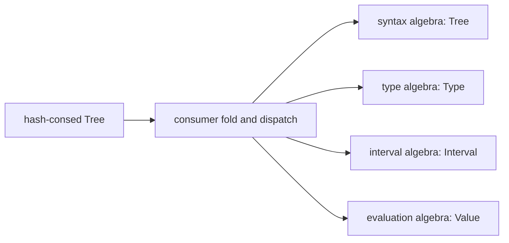

# tlib — a tree library with hash-consing

Standalone version of the tree library used at the heart of the
[Faust](https://faust.grame.fr).

`tlib` provides immutable trees with **maximal sharing** (hash-consing): two
trees with the same content are always the *same* pointer, so structural
equality is pointer equality, and memoization comes for free by attaching
properties to trees. On top of this core it provides symbols, lists, sets,
environments, recursive trees (de Bruijn ↔ symbolic, with alpha-equivalence
by construction), and typed memoization primitives.

## Quick example

```cpp
#include <iostream>

#include "tlib.hh"

int main()
{
    tlib::init();

    // maximal sharing : same content => same pointer
    Tree a = tree(symbol("+"), tree(1), tree(2));
    Tree b = tree(symbol("+"), tree(1), tree(2));
    assert(a == b);

    // lists, sets, environments
    Tree l = list3(tree(1), tree(2), tree(3));
    assert(len(l) == 3 && hd(l) == tree(1));

    // memoization via properties
    property<int> depth;
    depth.set(a, 1);

    // recursive trees : alpha-equivalent recursions are shared
    Tree r1 = rec(tree(symbol("f"), ref(1)));
    Tree r2 = rec(tree(symbol("f"), ref(1)));
    assert(r1 == r2 && isClosed(r1));
    std::cout << toDeBruijnString(r1) << "\n";

    // end of session : frees every tree and symbol in one sweep
    tlib::cleanup();
}
```

## Contents

| Files | Layer |
| :--- | :--- |
| `tlib/tlib.hh` | single entry point: aggregated API + `tlib::init/cleanup` lifecycle |
| `tlib/tree.hh/.cpp` | `CTree`: hash-consing core, properties, aperture |
| `tlib/node.hh/.cpp` | `Node`: tagged union int / int64 / double / symbol / pointer |
| `tlib/symbol.hh/.cpp` | interned symbols and `Signature`: dense, disjoint constructor opcodes — see [SIGNATURE-SPEC.md](SIGNATURE-SPEC.md) |
| `tlib/property.hh` | `property<P>` (unary) and `property2<Tree>` (binary) memoization |
| `tlib/list.hh/.cpp` | lists, sets (canonical ordered lists), environments |
| `tlib/recursive-tree.cpp` | `rec` / `ref`: de Bruijn and symbolic recursive trees |
| `tlib/rewrite.hh` | `treeRewrite` / `treeRewriteInPlace`: bottom-up rewriting over shared and symbolic-recursive trees — see [REWRITE-SPEC.md](REWRITE-SPEC.md) |
| `tlib/dcond.hh/.cpp` | boolean conditions in DNF/CNF (optional module) |
| `tlib/occur.hh/.cpp` | subtree occurrence counting (optional module) |
| `tlib/garbageable.hh/.cpp` | session memory model: allocate freely, free all at cleanup |
| `tlib/tlib-error.hh/.cpp` | pluggable error handler (defaults to `std::runtime_error`) |

## Constructor identities for algebraic folds

Trees are a convenient representation of syntax, but compiler analyses do not
all produce trees. A type analysis produces types, an interval analysis
produces intervals, and an evaluator produces values. These interpretations
can share one traversal expressed as an algebraic **fold**: recursively
interpret the children, then apply the semantic operation corresponding to the
constructor at the current node.



For this fold to be both generic and efficient, a consumer must identify a
constructor directly. Comparing symbol names or trying every historical
`isXXX` predicate in sequence makes dispatch linear in the number of
constructors and leaves no way to verify that the tree and the algebra belong
to the same language. TLIB therefore groups constructor symbols in interned
signatures:

```cpp
using SymbolOpcode = std::uint32_t;
inline constexpr SymbolOpcode kOpcodesPerSignature = 256;

struct SymbolTag {
    Sym          signature;
    SymbolOpcode opcode;

    constexpr std::uint8_t localOpcode() const noexcept;
};
```

Each signature reserves one aligned range of 256 global opcodes, then assigns
its constructors dense local positions from 0 to 255. The signature identity
and global opcode are stored once on the interned symbol, so every hash-consed
tree using that symbol sees the same identity without adding fields to each
`CTree`. A fold checks that the signature is accepted by its algebra, then
dispatches in constant time with `tag.localOpcode()`.

TLIB deliberately provides only this generic identity mechanism. It knows
nothing about Faust signals, type systems, intervals, or any particular
algebra. Client libraries define their signatures and algebra interfaces;
their folds decide how atoms, branches, lists and recursive bindings are
interpreted.

### API and invariants

```cpp
auto signal = signature("Signal");

Sym input  = signal.add("SigInput");
Sym delay1 = signal.add("SigDelay1");
Sym delay  = signal.add("SigDelay");
Sym binop  = signal.add("SigBinOp");

SymbolTag tag;
if (getSymbolTag(input, tag)) {
    assert(tag.signature == signal.identity());
    assert(tag.localOpcode() == 0);
}
```

The API enforces the following invariants:

- signing is optional; ordinary symbols remain unsigned;
- two signatures reserve disjoint 256-opcode ranges;
- first additions allocate a dense local sequence and the 257th distinct
  constructor is rejected;
- adding the same name again is a no-op and returns the same `Sym`;
- adding a symbol owned by another signature is an error, and the original
  identity is preserved;
- `getSymbolTag()` returns `false` for an unsigned symbol and leaves its output
  argument unchanged;
- the tag is distinct from `getUserData()`/`setUserData()`, whose storage and
  behavior remain available to existing clients.

The mechanism is compatible with existing source code: creating, comparing
and printing symbols is unchanged. It is the first infrastructure step toward
generic folds; concrete signatures, algebra interfaces and dispatchers belong
to the libraries that define the corresponding tree languages. Opcodes are
session-local dispatch identities, not persistent values to serialize. The
complete contract and an arithmetic fold example are in
[SIGNATURE-SPEC.md](SIGNATURE-SPEC.md).

## Design notes

- **One session per process.** The library keeps its state in static tables
  (like the Faust compiler does). Start a session with `tlib::init()`;
  `tlib::cleanup()` frees every tree and symbol at once and leaves the library
  ready for a new session. Any `Tree`/`Sym` obtained before cleanup is invalid
  after it.
- **Deterministic ordering.** `std::less<CTree*>` is specialized to compare
  stable serial numbers, not addresses, so anything iterated in tree order is
  reproducible from run to run.
- **Recursive-tree diagnostics.** `toDeBruijnString()` prints recursive trees
  inline with `rec(...)` / `ref(n)`. `toSymbolicString()` prints symbolic
  recursive graphs with bare symbolic names and a `with { ... }` block of
  collected definitions, so shared definitions are emitted once.
- **Growing hash tables.** The CTree/Symbol tables start small and rehash
  when the load factor exceeds 0.7 (tunable with `tlib::setHashLoadFactor`);
  rehashing never moves a tree, so held pointers stay valid.
- **Host-pluggable errors.** Internal errors go through a single handler
  (`tlib::setErrorHandler`); the default throws `std::runtime_error`. A host
  application can throw its own exception type instead.

## Build and test

```bash
cmake -B build -S . -DCMAKE_BUILD_TYPE=Release
cmake --build build
./build/tlib-tests
./build/tlib-benchmark
./build/tlib-recursive-demo
```

`tlib-benchmark` runs a small performance suite inspired by Faust compiler
workloads: low/high-sharing tree construction, logical and unique-node
traversals, occurrence annotations, tree properties, `property2<Tree>`
memoization, reversible tree rewrites, and recursive tree conversion. By
default each scenario is measured once at `scale=1`. Pass a scale factor to
increase the workload and a run count to report the median of several
measurements:

```bash
./build/tlib-benchmark 3
./build/tlib-benchmark 3 7
./build/tlib-benchmark --scale 3 --runs 7
```

The output columns are:

- `work`: number of logical operations for the scenario (usually logical tree
  nodes visited or property operations attempted).
- `median-ms`: median wall-clock time for the measured block. With
  `--runs 1`, this is the single measured time.
- `Mops/s`: `work / median-ms / 1000`, useful for comparing runs on the same
  machine.
- `note`: scenario-specific sanity data, such as number of distinct shared
  nodes, cache hits, or occurrence counts.

Each measured run rebuilds its own setup and calls `tlib::cleanup()` around the
scenario, so repeated measurements do not reuse trees, symbols, properties, or
hash-table state from the previous run.

Benchmark groups:

- `build-low-sharing`: builds a full binary expression tree whose leaves are
  mostly distinct. This stresses raw tree creation, hash-table growth, and the
  low-cache-hit path.
- `build-high-sharing`: builds a much larger logical binary tree from a small
  state space, so many subtrees collapse to the same `Tree`. This measures
  hash-consing under heavy sharing.
- `rebuild-high-sharing`: rebuilds the same high-sharing tree immediately. The
  result should be pointer-identical to the previous one; this measures the
  cache-hit lookup path.
- `walk-logical-occurrences`: recursively walks every logical occurrence in a
  shared tree, revisiting shared subtrees every time they appear.
- `walk-unique-shared-nodes`: walks the same tree but uses `CTree::gVisitTime`
  to visit each shared node once. This approximates compiler passes that avoid
  repeated work on DAGs.
- `Occur-all-visits`: uses `Occur` to count subtree occurrences in a tree with
  extreme sharing. This measures recursive occurrence annotation when every
  logical occurrence is counted.
- `sharing-first-visit-annotate`: annotates a large mostly-unshared tree with a
  fresh property key, visiting each node once. This is close to Faust sharing
  analysis (`shlysis`) first-visit behavior.
- `property-set-many-hosts` / `property-get-many-hosts`: sets and reads one
  property key across many different trees, representative of compiler passes
  that attach one analysis result per node.
- `property-set-one-host` / `property-get-one-host`: sets and reads many
  distinct property keys on the same tree, representative of worst-case
  property-map growth on a hot node.
- `property2-set-one-box` / `property2-get-one-box`: memoizes one tree under
  many environment trees using `property2<Tree>`, matching the Faust
  `eval(box, env)` and pattern-matcher use case.
- `rewrite-negate-shared`: rewrites a shared tree by negating every numeric
  node. The transformation memoizes by `Tree` pointer, so this measures a
  reversible local rewrite over a DAG rather than over the fully expanded
  logical tree.
- `rewrite-negate-shared-rt`: applies the same negation twice and checks that
  hash-consing returns the original root pointer (`roundtrip=yes`).
- `rewrite-negate-symbolic-rec`: applies the negation rewrite to a symbolic
  recursive tree. The traversal follows the body stored by `rec(var, body)`,
  but treats `ref(var)` as a terminal while `var` is bound, avoiding a recursive
  cycle through the definition property.
- `rewrite-negate-symbolic-rt`: applies the symbolic recursive rewrite twice
  and checks both that the root pointer is restored and that the recursive body
  property is back to the original body.
- `build-debruijn-rec`: builds a deep de Bruijn recursive tree and checks that
  the enclosing `rec` closes it.
- `debruijn-to-symbolic`: converts that recursive tree to symbolic form using a
  local per-call memo, exercising substitution and hash-consing without storing
  a persistent conversion property on the tree.
- `debruijn-to-symbolic-repeat`: converts the same tree again with a new local
  memo, so bound symbolic variables are fresh across calls.
- `debruijn-to-symbolic-cached`: converts the recursive tree using the explicit
  persistent tree-property cache.
- `debruijn-to-symbolic-cached-hit`: converts the same tree again and should hit
  the persistent memoized result.
- `symbolic-to-debruijn`: converts the symbolic recursive tree back to de
  Bruijn form and checks that the roundtrip restored the original tree.
- `symbolic-to-debruijn-hit`: converts the same symbolic tree again and should
  hit the memoized result.
- `alpha-equivalence-symbolic`: compares two symbolic recursive trees that only
  differ by their bound variable identities.
- `lift-open-rec-body`: applies `lift` to the open recursive body, measuring
  recursive-tree traversal and memoization for free de Bruijn references.

The library builds as a static library `libtlib.a`; add `tlib/` to your
include path and link against it. Requires C++17, no external dependencies.

## Origin

Detached from `compiler/tlib` in the Faust compiler (Y. Orlarey, GRAME,
2002-2026), following the same approach as
[DirectedGraph](https://github.com/orlarey/DirectedGraph). The standalone
repository removes compiler-global couplings and also serves as the test bed
for generic tree infrastructure, including recursive rewriting and symbol
constructor identities. These evolutions remain independent of Faust-specific
semantics so they can be tested here before synchronization with the compiler.

## License

GNU Lesser General Public License version 2.1 or later — see
[LICENSE](LICENSE).
