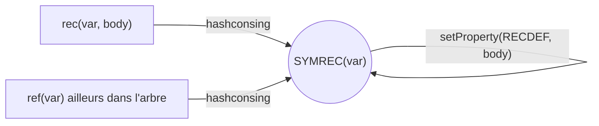

# Tree Rewrite Specification

::: toc+
- **Situation actuelle** — l'existant : `tmap`, `substitute`, le prototype de benchmark.
- **Objectifs** — les garanties que la nouvelle primitive doit tenir.
- **Non-objectifs** — ce qui reste hors perimetre.
- **Rec et ref : un seul cas a traiter** — pourquoi `ref(var)` n'a pas besoin d'un cas separe.
- **API proposee** — signature de `rewrite` et `rewriteInPlace`.
- **Semantique bottom-up** — les deux algorithmes complets, cas ordinaire et cas `rec`.
- **Proprietes** — ce qui survit ou non a une reecriture.
- **Relation avec tmap** — migration de l'usage historique.
- **Exemple** — negation des nombres.
- **Tests attendus** — la checklist de correction.
- **Benchmarks attendus** — la checklist de performance.
- **Questions ouvertes** — les decisions encore a prendre.
:::

Ce document specifie une primitive de reecriture d'arbres pour `tlib`,
volontairement restreinte : arbres **symboliques** uniquement (pas de
representation de Bruijn), traversal **bottom-up** uniquement. L'objectif
reste de remplacer les patterns ad hoc actuels (`tmap`, `substitute`,
`negateNumbersSymbolicRec` dans benchmark.cpp) par une primitive locale et
correcte vis-a-vis du partage et des recursions symboliques.

## Situation actuelle

Il existe deja plusieurs formes de transformation :

- `tmap(key, f, t)` : parcours bottom-up generique avec memoisation par
  propriete persistante sur les arbres.
- `substitute(t, id, val)` : remplacement structurel specialise, memoise par
  une propriete sous cle fraiche a chaque appel. La cle est unique mais les
  entrees, elles, restent attachees aux arbres apres l'appel : le commentaire
  du type `plist` dans `tree.hh` documente un cas reel ou un seul noeud
  accumule des dizaines de milliers de proprietes venant precisement de ce
  schema (`substitute()`/`liftn()`). C'est l'argument le plus concret en
  faveur du memo local.
- `negateNumbersSymbolicRec` dans `benchmark.cpp` : prototype de rewrite local
  avec `std::unordered_map<Tree, Tree>`, qui traite deja `rec(var, body)` en
  un seul cas (`isRec`, jamais `isRef` — voir *Rec et ref* plus bas), mais
  selon l'approche `InPlace`, avec la limite de test que cela implique (voir
  l'avertissement dans *Semantique bottom-up*).

(`lift`, `deBruijn2Sym`, `sym2deBruijn` existent aussi dans la bibliotheque
mais concernent la representation de Bruijn, hors perimetre de cette spec.)

Le besoin commun : parcourir un DAG de `Tree` en preservant le partage,
reconstruire seulement les noeuds modifies, memoiser localement, et traiter
correctement `rec(var, body)`.

## Objectifs

- **Semantique constructive (context-free)** : le resultat de `rule` sur un
  noeud `t` ne depend que de `t` (et de ses branches deja transformees),
  jamais du contexte ou du chemin par lequel `t` est atteint. C'est cette
  propriete qui rend valide le memo `Tree -> Tree`.
- **Memo local par appel** : aucun cache permanent par propriete.
- **Partage preserve** : un sous-arbre vu plusieurs fois pendant un appel est
  transforme une seule fois, le resultat est partage.
- **Reconstruction minimale** : si rien ne change, le resultat est exactement
  le meme pointeur — sauf pour `rewrite` sur un noeud `rec`, ou une variable
  fraiche est toujours creee (voir *Semantique bottom-up*) : la purete y
  prime sur l'identite de pointeur.
- **Recursion symbolique correcte** : traiter `rec(var, body)` sans dupliquer
  le travail ni boucler, avec un choix explicite sur ce qu'il advient de la
  variable et du partage de l'ancienne definition.
- **Compatible hash-consing** : toute reconstruction passe par `tree(...)`,
  `rec(...)`.

## Non-objectifs

- un moteur de reecriture par patterns ;
- une strategie fixe-point ;
- un mode top-down (l'unique benefice identifie, l'elagage, est une
  optimisation de performance et non une capacite semantique — rien
  n'empeche de l'ajouter plus tard sans changer le contrat) ;
- la representation de Bruijn (`rec(body)` / `ref(n)`, aperture, `isClosed`) ;
- un `RewriteContext` expose a l'utilisateur : la regle a exactement la
  signature de `tfun` (`Tree(Tree)`), rien de plus ;
- du calcul d'attributs dependant du contexte (compter des occurrences,
  threader un environnement comme `sym2deBruijnReady`) : ces calculs ont
  besoin d'une memoisation `(Tree, contexte) -> resultat`, hors de portee
  d'un `Tree -> Tree` local.

## Rec et ref : un seul cas a traiter

::: note [`ref(var)` n'est pas un cas separe]
Le hash-consing porte sur `SYMREC(var)` seul : `RECDEF` est une propriete, pas
un critere d'egalite. `rec(var, body)` et tout `ref(var)` construit ailleurs
avec le meme `var` sont **le meme pointeur** `Tree` (`recursive-tree.cpp`,
lignes 162-182). Consequence directe : la traversee n'a besoin que d'un seul
cas, `isRec(t, var, body)` — jamais d'un cas `isRef` separe. La premiere fois
que `t` est rencontre, on le traite comme une definition (on en extrait le
corps via `RECDEF`) ; toute occurrence suivante de ce meme pointeur — qu'elle
soit une reference recursive dans son propre corps ou une autre apparition
partagee ailleurs dans l'arbre — est deja dans le memo local et y est
resolue directement. C'est exactement ce que fait deja
`negateNumbersSymbolicRec` (benchmark.cpp:263), qui n'appelle jamais `isRef`.


:::

## API proposee

Deux fonctions distinctes, pas un flag runtime : reutiliser ou non le nom de
la variable recursive change la nature de l'operation (pure vs destructive
sur le partage), ce n'est pas un simple detail de reglage.

```cpp
// Cree une variable fraiche a chaque rec(var, body) rencontre. Pur : ne
// modifie jamais RECDEF sur l'ancien noeud SYMREC(var) partage.
template <class Rule>
Tree rewrite(Tree root, Rule&& rule);

// Reutilise la meme variable : reecrit RECDEF sur le noeud SYMREC(var)
// partage. Destructif au sens logique (voir l'avertissement plus bas), a
// n'utiliser qu'en connaissance de cause.
template <class Rule>
Tree rewriteInPlace(Tree root, Rule&& rule);
```

Meme signature que `tfun` (`Tree (*)(Tree)`) pour la regle : un template, pas
de `std::function`, pas de `RewriteContext`.

Contrat de la regle :

- elle recoit un arbre ordinaire dont les branches sont deja transformees ;
- elle n'est **jamais appelee sur un noeud `SYMREC`** (definition ou
  reference) : ces noeuds sont geres par la traversee elle-meme (voir
  *Semantique bottom-up*) ;
- elle retourne le `Tree` a utiliser : le meme pointeur pour "pas de
  changement", un autre `Tree` pour "remplacer ce noeud".

## Semantique bottom-up

```algorithm "rewrite (variables fraiches)"
Input: arbre root, regle rule
Output: arbre transforme
memo <- table vide Tree -> Tree, locale a cet appel
return rewriteMemo(root, rule, memo)

function rewriteMemo(t, rule, memo)    // memo passe par reference
  if t in memo then
    return memo[t]
  end
  if isRec(t, var, body) then
    newVar <- variable fraiche
    memo[t] <- ref(newVar)
    newBody <- rewriteMemo(body, rule, memo)
    return rec(newVar, newBody)
  end
  branches <- []
  changed <- false
  for each branch b of t do
    b2 <- rewriteMemo(b, rule, memo)
    branches <- branches + [b2]
    changed <- changed or (b2 != b)
  end
  r <- tree(t.node(), branches) if changed, else t
  result <- rule(r)
  memo[t] <- result
  return result
end
```

```algorithm "rewriteInPlace (meme variable)"
Input: arbre root, regle rule
Output: arbre transforme
memo <- table vide Tree -> Tree, locale a cet appel
return rewriteInPlaceMemo(root, rule, memo)

function rewriteInPlaceMemo(t, rule, memo)    // memo passe par reference
  if t in memo then
    return memo[t]
  end
  if isRec(t, var, body) then
    memo[t] <- t
    newBody <- rewriteInPlaceMemo(body, rule, memo)
    return rec(var, newBody)
  end
  branches <- []
  changed <- false
  for each branch b of t do
    b2 <- rewriteInPlaceMemo(b, rule, memo)
    branches <- branches + [b2]
    changed <- changed or (b2 != b)
  end
  r <- tree(t.node(), branches) if changed, else t
  result <- rule(r)
  memo[t] <- result
  return result
end
```

Invariant sur l'identite (sans mutation de propriete effectuee par la regle
utilisateur) :

- `rewriteInPlace(t, identity) == t` pour tout arbre, pointeur pour pointeur.
  Quand `newBody == body`, `rec(var, newBody)` redonne naturellement le
  pointeur `t` : meme `var`, meme propriete `RECDEF`, meme hash-consing —
  aucun cas particulier a coder.
- Pour `rewrite`, seule l'alpha-equivalence tient : `areEquiv(rewrite(t,
  identity), t)`. `newVar` est toujours differente de `var`, donc
  `rec(newVar, newBody)` ne redonne jamais le pointeur `t`, meme quand rien
  d'autre n'a change. C'est le prix de la purete : ne jamais reutiliser
  l'ancien noeud partage.

Les deux algorithmes ne different que sur deux points : la valeur posee dans
`memo[t]` avant de transformer `body` (`ref(newVar)` fraiche vs `t`
lui-meme), et la variable utilisee pour reconstruire (`newVar` vs `var`). Les
deux reconstructions sont inconditionnelles — comparer `newBody` a `body`
n'est jamais necessaire, le hash-consing s'en charge pour `rewriteInPlace`, et
`rewrite` doit de toute facon toujours reconstruire. `rewrite` est la
fonction recommandee par defaut.

Deux consequences du `return` direct dans le cas `rec` :

- **Pas de mise a jour du memo apres la descente.** L'entree posee avant de
  transformer `body` est deja la valeur finale : `ref(newVar)` et
  `rec(newVar, newBody)` sont le meme pointeur (hash-consing de
  `SYMREC(newVar)`), et de meme `t` et `rec(var, newBody)` pour
  `rewriteInPlace`.
- **`rule` n'est jamais appliquee aux noeuds `SYMREC`.** Ce n'est pas une
  restriction d'implementation mais une impossibilite semantique : une regle
  qui pretendrait remplacer une variable recursive n'est pas bien definie.
  Exemple : avec la definition `X = Foo(X)`, que signifierait "remplacer `X`
  par `3`" ? `X` denote le point fixe de `Foo` ; selon le nombre de
  deroulements consideres, le remplacement donnerait `3`, `Foo(3)`,
  `Foo(Foo(3))`... — aucune reponse canonique n'existe. S'y ajoutent deux
  raisons techniques : `rule` ne peut rien decider de sense sur un `SYMREC`
  (le corps est dans la propriete `RECDEF`, invisible dans les branches), et
  remplacer le noeud `rec` reconstruit serait incoherent (les
  auto-references deja resolues dans `newBody` et les occurrences partagees
  externes de `t` recevraient deux resultats differents, en violation de la
  semantique constructive).

Precondition sur les references pendantes : attention, le `isRec(t, var,
body)` de la bibliotheque retourne vrai pour **tout** noeud `SYMREC`, meme
sans propriete `RECDEF` (le corps est alors nul — voir `isSymbolicRec` dans
`recursive-tree.cpp`). Un `ref(var)` dont la variable n'a jamais ete definie
par un `rec(var, body)` ferait donc entrer l'algorithme dans le cas `rec`
avec un corps nul. C'est une erreur de l'appelant : l'implementation doit la
detecter (`TLIB_ASSERT(body != nullptr)`), comme le fait deja le prototype
(benchmark.cpp:270).

::: warning [`rewriteInPlace` : l'identite de pointeur ne prouve rien]
`rewriteInPlace` reutilise `var`, donc reecrit `RECDEF` sur le noeud
partage — destructif au sens logique, a n'utiliser qu'en connaissance de
cause. Preuve deja disponible dans le prototype : `rewrite-negate-symbolic-rt`
(benchmark.cpp:590-609) compare `restored == root`, et le commentaire du code
admet que cette comparaison est **toujours vraie**, correcte ou non, puisque
le pointeur racine ne change jamais avec cette approche. Toute reecriture qui
passe par `rewriteInPlace` doit comparer le *contenu* du corps (`areEquiv` ou
comparaison structurelle), jamais l'identite du noeud racine.
:::

**Partage maximal apres reecriture.** Une reecriture peut rendre
alpha-equivalentes des definitions recursives qui ne l'etaient pas : avec
`X = Foo(1, X)` et `Y = Foo(2, Y)`, une regle qui remplace `1` et `2` par `0`
produit deux definitions dont les corps sont identiques a renommage pres. La
representation symbolique ne peut pas les fusionner (les variables restent
distinctes), et `rewrite` ne cherche pas a le faire — pas plus qu'il ne
cherche a stabiliser les noms d'une passe a l'autre (chaque appel cree des
variables fraiches). Si l'utilisateur veut retrouver un partage maximal, la
bibliotheque fournit deja l'outil : la double conversion
`deBruijn2Sym(sym2deBruijn(t))`. Le passage par de Bruijn efface les noms
(representation canonique a alpha-equivalence pres), le hash-consing fusionne
alors les definitions devenues identiques, et le retour en symbolique
reconstruit des definitions partagees — c'est exactement le mecanisme
« maximal sharing on recursive trees » documente en tete de `tree.hh`. Les
deux conversions utilisent des memos locaux, conformes a la presente spec
(seule la variante explicite `deBruijn2SymCached` conserve un cache
persistant par propriete). Cette re-canonicalisation est un choix de
l'appelant, pas un travail de `rewrite`.

## Proprietes

- les proprietes utilisateur ne sont pas copiees vers les nouveaux arbres ;
- un noeud inchange retourne le meme pointeur, donc ses proprietes restent
  naturellement disponibles ;
- `RECDEF` est geree via `rec(var, body)`, pas directement par l'utilisateur.

Copier toutes les proprietes serait couteux, et une transformation
structurelle ne sait pas lesquelles restent valides apres reecriture.

## Relation avec tmap

`tmap` devient une primitive historique/legacy. La nouvelle API a exactement
la meme forme d'appelable (`Tree(Tree)`), donc la migration est
syntaxiquement directe :

```cpp
Tree r = rewrite(t, [](Tree x) {
    return f(x);
});
```

Differences : memo local (pas de propriete persistante), et une semantique
explicite pour `rec(var, body)`.

::: caution [La migration n'est pas neutre sur les arbres recursifs]
`tmap` applique `f` aux noeuds `SYMREC` (traites comme des noeuds ordinaires
dont l'unique branche est `var`) et ne descend jamais dans `RECDEF` ;
`rewrite` fait exactement l'inverse (descend dans les definitions, n'applique
jamais la regle aux `SYMREC`). Sur un arbre sans recursion symbolique les deux
coincident ; sur un arbre recursif, migrer un appel `tmap` vers `rewrite`
change le comportement et doit etre verifie au cas par cas.
:::

## Exemple

```cpp
Tree negateNumbers(Tree root)
{
    return rewrite(root, [](Tree t) {
        switch (t->node().type()) {
            case kIntNode:
                return tree(-t->node().getInt());
            case kInt64Node:
                return tree(Node(-t->node().getInt64()));
            case kDoubleNode:
                return tree(-t->node().getDouble());
            default:
                return t;
        }
    });
}
```

## Tests attendus

- [ ] identity rewrite sur arbre ordinaire (sans `rec`) : `rewrite(t, id) ==
      t` et `rewriteInPlace(t, id) == t`, egalite de pointeur ;
- [ ] identity rewrite sur arbre contenant `rec` : `rewriteInPlace(t, id) ==
      t` (pointeur) mais seulement `areEquiv(rewrite(t, id), t)` pour
      `rewrite` (alpha-equivalence — une variable fraiche est toujours
      creee) ;
- [ ] changement de feuille : seuls les ancetres necessaires sont reconstruits ;
- [ ] partage : `foo(a, a)` devient `foo(b, b)` avec `branch(0) == branch(1)` ;
- [ ] deux appels separes ne partagent pas de memo ;
- [ ] `rewrite` avec une regle non-identite sur un `rec` : la `RECDEF` de
      l'ancien `SYMREC(var)` reste inchangee (l'ancien arbre reste valide et
      utilisable), et le nouveau `rec(newVar, ...)` porte bien le corps
      transforme par la regle ;
- [ ] `rewriteInPlace` : corps remplace explicitement, verifie par egalite de
      *contenu*, jamais par identite de pointeur de la racine ;
- [ ] interaction avec hash-consing : double negation numerique restaure le
      pointeur initial sur un arbre sans `rec` ; avec `rec`, `rewrite` ne
      restaure qu'a alpha-equivalence pres (variables fraiches a chaque
      passe) et `rewriteInPlace` restaure le contenu du corps.

## Benchmarks attendus

| Scenario | Statut | A faire |
|:--|:--|:--|
| `rewrite-identity-shared` | nouveau | valider `rewrite(t, id) == t` sur un DAG a forte partage, sans `rec` (avec `rec`, l'egalite de pointeur ne peut pas tenir) |
| `rewrite-negate-shared` | existe deja (`benchmark.cpp:544`) | migrer vers `rewrite()` une fois implemente |
| `rewrite-negate-shared-rt` | existe deja (`benchmark.cpp:557`) | idem, avec round-trip |
| `rewrite-symbolic-rec-pure` | nouveau | premier scenario a exercer reellement `rewrite` (variables fraiches) |
| `rewrite-symbolic-rec-inplace` | proche de `rewrite-negate-symbolic-rec`/`-rt` (`benchmark.cpp:572`, `:590`) | clarifier le nommage — voir question ouverte 2 |

Chaque benchmark reporte le nombre de noeuds logiques, le temps median, et une
note de validation basee sur le contenu (jamais sur l'identite de pointeur
pour `rewriteInPlace`).

## Questions ouvertes

1. Les noms publics doivent-ils etre `rewrite`/`rewriteInPlace`, ou autre
   chose (`rewriteTree`/`rewriteTreeInPlace`, `transform`/`transformInPlace`) ?
2. Les benchmarks `rewrite-negate-shared(-rt)` et
   `rewrite-negate-symbolic-rec(-rt)` existent deja dans `benchmark.cpp`
   contre le prototype `negateNumbersSymbolicRec`. Faut-il les migrer telles
   quelles vers la nouvelle primitive, ou les garder comme reference et
   introduire des noms distincts ?
